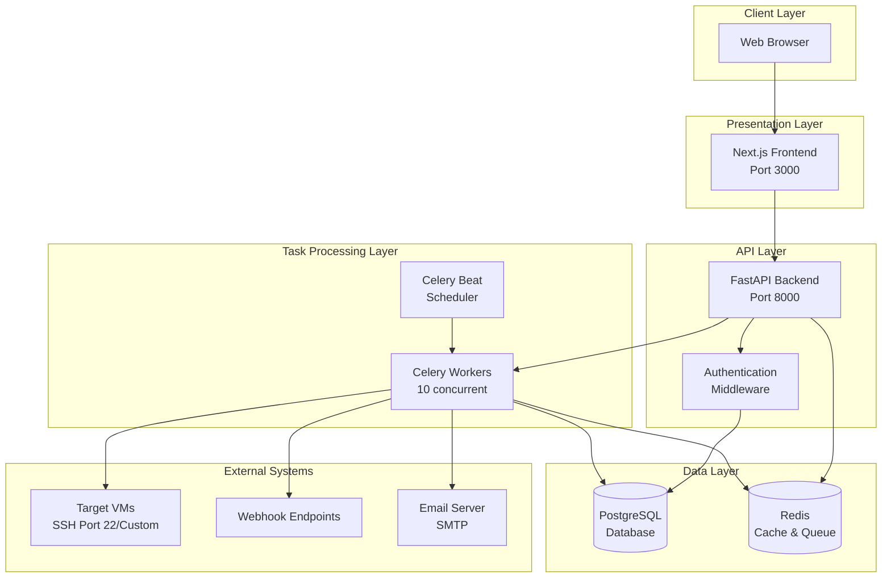
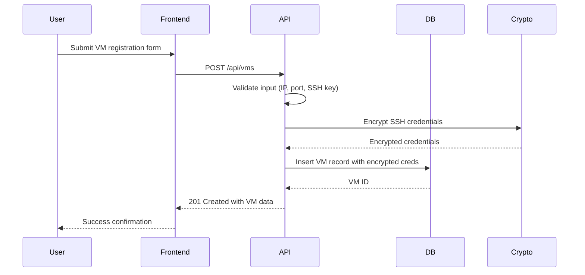
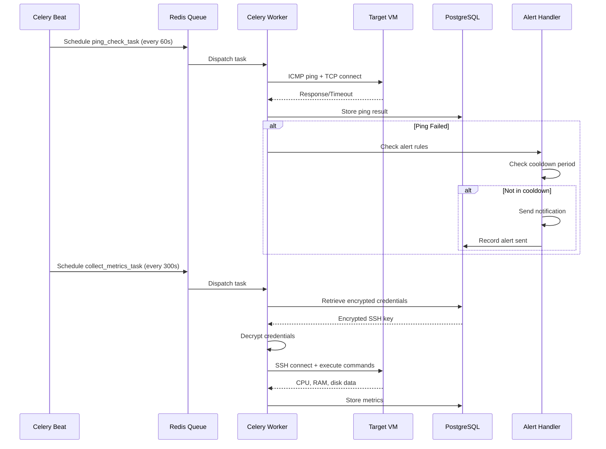

# Design Document: VMLedger

## Overview

VMLedger is a lightweight, agentless CMDB and monitoring system for personal VM infrastructure. The system follows a modern web application architecture with clear separation between presentation, business logic, and data persistence layers.

### Core Design Principles

1. **Agentless Architecture**: All monitoring occurs via SSH without requiring agent installation on target VMs
2. **User Isolation**: Complete data segregation between users at the database and application layers
3. **Security First**: AES-256 encryption for all credentials, bcrypt for passwords, no sensitive data in logs
4. **Asynchronous Processing**: Background workers handle all monitoring tasks to keep the API responsive
5. **Scalability**: Concurrent processing design supports 50+ VMs with sub-5-minute monitoring cycles

### Technology Stack

- **Backend**: FastAPI (Python 3.11+) for high-performance async API
- **Frontend**: Next.js 14 with React for server-side rendering and optimal performance
- **Database**: PostgreSQL 15+ with full-text search extensions
- **Task Queue**: Celery with Redis as message broker
- **Caching**: Redis for session storage and rate limiting
- **SSH Client**: Paramiko for agentless metric collection
- **Encryption**: cryptography library (Fernet) for AES-256-GCM credential encryption

## Architecture

### System Architecture Diagram



### Architectural Layers

#### 1. Presentation Layer (Next.js Frontend)

**Responsibilities:**
- Server-side rendering for optimal initial load performance
- Client-side state management for dashboard real-time updates
- Form validation and user input sanitization
- Markdown rendering for deployment notes
- WebSocket connection for live dashboard updates

**Key Components:**
- Dashboard page with auto-refresh (30s interval)
- VM registration/edit forms with validation
- Search interface with debounced queries
- Alert configuration UI
- Deployment notes editor with Markdown preview

#### 2. API Layer (FastAPI Backend)

**Responsibilities:**
- RESTful API endpoint exposure
- Request validation using Pydantic models
- Authentication and authorization enforcement
- Business logic orchestration
- Task queue job submission
- Response serialization

**Key Features:**
- Async request handling for high concurrency
- JWT-based session management (24-hour expiry)
- Rate limiting per user (100 requests/minute)
- CORS configuration for frontend integration
- OpenAPI documentation auto-generation

#### 3. Task Processing Layer (Celery Workers)

**Responsibilities:**
- Asynchronous monitoring task execution
- SSH connection management and metric collection
- Alert notification dispatch
- Task retry logic with exponential backoff
- Concurrent task processing (10 workers default)

**Task Types:**
- `ping_check_task`: Execute Custom_Ping for a single VM
- `collect_metrics_task`: SSH-based metric collection for a single VM
- `send_alert_task`: Dispatch webhook/email notifications
- `cleanup_old_data_task`: Prune historical data beyond retention limits

#### 4. Data Layer

**PostgreSQL Database:**
- Primary data store for all persistent data
- Full-text search indexes using `tsvector` and GIN indexes
- Connection pooling (min 5, max 20 connections)
- Row-level security policies for user isolation

**Redis Cache:**
- Celery message broker and result backend
- Session token storage with TTL
- Rate limiting counters
- Dashboard data caching (30s TTL)

### Data Flow Patterns

#### VM Registration Flow



#### Monitoring Cycle Flow



## Components and Interfaces

### 1. Authentication Service

**Purpose**: Manage user authentication, session tokens, and account security.

**Interface:**
```python
class AuthService:
    def register_user(username: str, email: str, password: str) -> User
    def authenticate(username: str, password: str) -> SessionToken
    def validate_token(token: str) -> User | None
    def refresh_token(token: str) -> SessionToken
    def logout(token: str) -> bool
    def check_rate_limit(username: str) -> bool
```

**Implementation Details:**
- Password hashing: bcrypt with cost factor 12
- Session tokens: JWT with HS256 signing, 24-hour expiry
- Rate limiting: Redis-based counter (5 failed attempts = 30-minute lockout)
- Token storage: Redis with automatic TTL expiration

### 2. VM Registry Service

**Purpose**: Manage VM CRUD operations with user isolation enforcement.

**Interface:**
```python
class VMRegistryService:
    def create_vm(user_id: int, vm_data: VMCreateSchema) -> VM
    def get_vm(user_id: int, vm_id: int) -> VM | None
    def list_vms(user_id: int, filters: VMFilters) -> List[VM]
    def update_vm(user_id: int, vm_id: int, updates: VMUpdateSchema) -> VM
    def delete_vm(user_id: int, vm_id: int) -> bool
    def check_duplicate(user_id: int, ip: str, port: int) -> bool
```

**Validation Rules:**
- IP address: IPv4/IPv6 format validation using `ipaddress` module
- SSH port: Range 1-65535
- Hostname: Max 255 characters, alphanumeric + hyphens
- Tags: Array of strings, max 20 tags per VM
- Deployment notes: Max 50,000 characters

### 3. Credential Manager

**Purpose**: Securely encrypt, store, and retrieve SSH credentials.

**Interface:**
```python
class CredentialManager:
    def encrypt_ssh_key(user_id: int, private_key: str) -> str
    def encrypt_password(user_id: int, password: str) -> str
    def decrypt_ssh_key(user_id: int, encrypted_key: str) -> str
    def decrypt_password(user_id: int, encrypted_password: str) -> str
    def validate_ssh_key(private_key: str) -> bool
    def delete_credentials(vm_id: int) -> bool
```

**Encryption Strategy:**
- Algorithm: AES-256-GCM via Fernet (cryptography library)
- Key derivation: PBKDF2-HMAC-SHA256 with user-specific salt
- Master key: Stored in environment variable, never in database
- Per-user keys: Derived from master key + user ID salt
- Key rotation: Not implemented in v1 (future enhancement)

**Key Format Validation:**
- Supports RSA, DSA, ECDSA, Ed25519 keys
- Validates using Paramiko's key loading functions
- Rejects encrypted private keys (passphrase-protected)

### 4. Health Check Service

**Purpose**: Execute Custom_Ping checks combining ICMP and TCP connectivity tests.

**Interface:**
```python
class HealthCheckService:
    def execute_ping(vm: VM) -> PingResult
    def check_tcp_port(ip: str, port: int, timeout: int = 5) -> bool
    def check_icmp_ping(ip: str, timeout: int = 5) -> float | None
    def store_ping_result(vm_id: int, result: PingResult) -> None
    def get_ping_history(vm_id: int, limit: int = 100) -> List[PingResult]
```

**Implementation Details:**
- ICMP ping: Uses `ping3` library for cross-platform compatibility
- TCP check: Socket connection with 5-second timeout
- Success criteria: Both ICMP and TCP must succeed
- Response time: Measured in milliseconds
- History retention: Last 100 results per VM (FIFO queue)

**Error Types:**
- `ICMP_TIMEOUT`: Ping packet lost
- `TCP_REFUSED`: Port closed or filtered
- `HOST_UNREACHABLE`: Network routing failure
- `TIMEOUT`: Both ICMP and TCP timed out

### 5. Metric Collector Service

**Purpose**: Agentless SSH-based resource metric collection from target VMs.

**Interface:**
```python
class MetricCollectorService:
    def collect_metrics(vm: VM, credentials: Credentials) -> MetricData
    def get_cpu_usage(ssh_client: SSHClient) -> float
    def get_memory_usage(ssh_client: SSHClient) -> MemoryMetrics
    def get_disk_usage(ssh_client: SSHClient) -> DiskMetrics
    def store_metrics(vm_id: int, metrics: MetricData) -> None
    def get_metric_history(vm_id: int, limit: int = 1000) -> List[MetricData]
```

**SSH Command Strategy:**

| Metric | Linux Command | macOS Command | Parsing Strategy |
|--------|--------------|---------------|------------------|
| CPU Usage | `top -bn1 \| grep "Cpu(s)" \| awk '{print $2}'` | `top -l 1 \| grep "CPU usage" \| awk '{print $3}'` | Extract percentage from output |
| RAM Used/Total | `free -m \| grep Mem \| awk '{print $3,$2}'` | `vm_stat \| grep "Pages active" + calculations` | Parse MB values |
| Disk Usage | `df -h / \| tail -1 \| awk '{print $3,$2,$5}'` | `df -h / \| tail -1 \| awk '{print $3,$2,$5}'` | Extract used, total, percentage |

**Connection Management:**
- Connection timeout: 10 seconds
- Command execution timeout: 30 seconds
- Connection pooling: Not implemented (new connection per task)
- Retry logic: 3 attempts with 5-second delay
- Error handling: Log failure, mark VM unreachable, continue to next VM

**OS Detection:**
- Execute `uname -s` to detect OS type
- Use OS-specific commands based on detection
- Fall back to Linux commands if detection fails

### 6. Search Engine Service

**Purpose**: Full-text search across VM metadata and deployment notes.

**Interface:**
```python
class SearchEngineService:
    def search_vms(user_id: int, query: str) -> List[VMSearchResult]
    def index_vm(vm: VM) -> None
    def update_index(vm_id: int, vm: VM) -> None
    def delete_from_index(vm_id: int) -> None
    def highlight_matches(text: str, query: str) -> str
```

**PostgreSQL Full-Text Search Implementation:**

```sql
-- Add tsvector column for search
ALTER TABLE vms ADD COLUMN search_vector tsvector;

-- Create GIN index for fast search
CREATE INDEX idx_vms_search ON vms USING GIN(search_vector);

-- Update trigger to maintain search_vector
CREATE TRIGGER tsvector_update BEFORE INSERT OR UPDATE
ON vms FOR EACH ROW EXECUTE FUNCTION
tsvector_update_trigger(search_vector, 'pg_catalog.english', 
    ip_address, hostname, domain, tags, deployment_notes);
```

**Search Query Construction:**
```python
# Convert user query to tsquery format
query_terms = query.split()
ts_query = " | ".join(query_terms)  # OR logic

# Execute search with ranking
SELECT vm.*, ts_rank(search_vector, to_tsquery(%s)) as rank
FROM vms vm
WHERE user_id = %s AND search_vector @@ to_tsquery(%s)
ORDER BY rank DESC, hostname ASC
LIMIT 50;
```

**Highlighting Strategy:**
- Use `ts_headline()` function for deployment notes
- Max fragment length: 200 characters
- Highlight tags: `<mark>` HTML elements
- Return top 3 matching fragments per result

### 7. Alert Handler Service

**Purpose**: Dispatch notifications when VMs become unreachable or recover.

**Interface:**
```python
class AlertHandlerService:
    def check_alert_conditions(vm: VM, ping_result: PingResult) -> bool
    def send_alert(vm: VM, alert_type: AlertType) -> None
    def send_webhook(url: str, payload: dict) -> bool
    def send_email(recipient: str, subject: str, body: str) -> bool
    def check_cooldown(vm_id: int) -> bool
    def record_alert_sent(vm_id: int, alert_type: AlertType) -> None
```

**Alert Types:**
- `VM_UNREACHABLE`: Custom_Ping failed
- `VM_RECOVERED`: Custom_Ping succeeded after previous failure
- `METRICS_UNAVAILABLE`: SSH connection failed during metric collection

**Cooldown Logic:**
```python
# Check if alert was sent in last 15 minutes
last_alert = get_last_alert_time(vm_id, alert_type)
if last_alert and (now() - last_alert) < timedelta(minutes=15):
    return False  # Skip alert (in cooldown)
return True  # Send alert
```

**Webhook Payload Format:**
```json
{
  "event": "vm_unreachable",
  "timestamp": "2024-01-15T10:30:00Z",
  "vm": {
    "id": 123,
    "hostname": "web-server-01",
    "ip_address": "192.168.1.100",
    "ssh_port": 22
  },
  "details": {
    "error_type": "TIMEOUT",
    "last_seen": "2024-01-15T10:25:00Z"
  }
}
```

**Email Template:**
```
Subject: [VMLedger Alert] {hostname} is {status}

VM Details:
- Hostname: {hostname}
- IP Address: {ip_address}
- Status: {status}
- Timestamp: {timestamp}
- Error: {error_type}

Last successful check: {last_seen}

View in dashboard: {dashboard_url}
```

### 8. Background Task Orchestrator

**Purpose**: Coordinate Celery task scheduling and execution.

**Celery Beat Schedule:**
```python
CELERY_BEAT_SCHEDULE = {
    'ping-all-vms': {
        'task': 'tasks.schedule_ping_checks',
        'schedule': 60.0,  # Every 60 seconds
    },
    'collect-all-metrics': {
        'task': 'tasks.schedule_metric_collection',
        'schedule': 300.0,  # Every 5 minutes
    },
    'cleanup-old-data': {
        'task': 'tasks.cleanup_historical_data',
        'schedule': crontab(hour=2, minute=0),  # Daily at 2 AM
    },
}
```

**Task Implementation Pattern:**
```python
@celery_app.task(bind=True, max_retries=3)
def ping_check_task(self, vm_id: int):
    try:
        vm = get_vm_by_id(vm_id)
        result = health_check_service.execute_ping(vm)
        health_check_service.store_ping_result(vm_id, result)
        
        if not result.success:
            alert_handler.check_alert_conditions(vm, result)
            
    except Exception as exc:
        logger.error(f"Ping check failed for VM {vm_id}: {exc}")
        raise self.retry(exc=exc, countdown=60)  # Retry after 60s
```

**Concurrency Strategy:**
- Worker pool: Prefork with 10 processes (configurable)
- Task routing: All tasks to default queue
- Rate limiting: 50 tasks/second per worker
- Task timeout: 60 seconds for ping, 120 seconds for metrics
- Result expiration: 1 hour

## Data Models

### Database Schema

#### Users Table

```sql
CREATE TABLE users (
    id SERIAL PRIMARY KEY,
    username VARCHAR(50) UNIQUE NOT NULL,
    email VARCHAR(255) UNIQUE NOT NULL,
    password_hash VARCHAR(255) NOT NULL,
    encryption_salt VARCHAR(64) NOT NULL,  -- For credential encryption
    created_at TIMESTAMP DEFAULT CURRENT_TIMESTAMP,
    updated_at TIMESTAMP DEFAULT CURRENT_TIMESTAMP,
    is_active BOOLEAN DEFAULT TRUE,
    failed_login_attempts INT DEFAULT 0,
    locked_until TIMESTAMP NULL
);

CREATE INDEX idx_users_username ON users(username);
CREATE INDEX idx_users_email ON users(email);
```

#### VMs Table

```sql
CREATE TABLE vms (
    id SERIAL PRIMARY KEY,
    user_id INT NOT NULL REFERENCES users(id) ON DELETE CASCADE,
    ip_address VARCHAR(45) NOT NULL,  -- Supports IPv6
    hostname VARCHAR(255) NOT NULL,
    domain VARCHAR(255),
    ssh_port INT NOT NULL DEFAULT 22,
    tags TEXT[],  -- PostgreSQL array type
    deployment_notes TEXT,
    search_vector tsvector,  -- For full-text search
    created_at TIMESTAMP DEFAULT CURRENT_TIMESTAMP,
    updated_at TIMESTAMP DEFAULT CURRENT_TIMESTAMP,
    last_seen TIMESTAMP,
    is_reachable BOOLEAN DEFAULT NULL,
    
    CONSTRAINT unique_vm_per_user UNIQUE(user_id, ip_address, ssh_port),
    CONSTRAINT valid_ssh_port CHECK (ssh_port >= 1 AND ssh_port <= 65535)
);

CREATE INDEX idx_vms_user_id ON vms(user_id);
CREATE INDEX idx_vms_ip_address ON vms(ip_address);
CREATE INDEX idx_vms_hostname ON vms(hostname);
CREATE INDEX idx_vms_search ON vms USING GIN(search_vector);
CREATE INDEX idx_vms_tags ON vms USING GIN(tags);
```

#### Credentials Table

```sql
CREATE TABLE credentials (
    id SERIAL PRIMARY KEY,
    vm_id INT UNIQUE NOT NULL REFERENCES vms(id) ON DELETE CASCADE,
    auth_type VARCHAR(20) NOT NULL,  -- 'ssh_key' or 'password'
    encrypted_credential TEXT NOT NULL,  -- AES-256 encrypted
    ssh_username VARCHAR(100) NOT NULL DEFAULT 'root',
    created_at TIMESTAMP DEFAULT CURRENT_TIMESTAMP,
    updated_at TIMESTAMP DEFAULT CURRENT_TIMESTAMP,
    
    CONSTRAINT valid_auth_type CHECK (auth_type IN ('ssh_key', 'password'))
);

CREATE INDEX idx_credentials_vm_id ON credentials(vm_id);
```

#### Ping Results Table

```sql
CREATE TABLE ping_results (
    id SERIAL PRIMARY KEY,
    vm_id INT NOT NULL REFERENCES vms(id) ON DELETE CASCADE,
    timestamp TIMESTAMP DEFAULT CURRENT_TIMESTAMP,
    success BOOLEAN NOT NULL,
    response_time_ms FLOAT,  -- NULL if failed
    error_type VARCHAR(50),  -- NULL if success
    icmp_success BOOLEAN,
    tcp_success BOOLEAN
);

CREATE INDEX idx_ping_results_vm_id ON ping_results(vm_id);
CREATE INDEX idx_ping_results_timestamp ON ping_results(timestamp DESC);

-- Partition by month for better performance (optional optimization)
-- CREATE TABLE ping_results_2024_01 PARTITION OF ping_results
-- FOR VALUES FROM ('2024-01-01') TO ('2024-02-01');
```

#### Metrics Table

```sql
CREATE TABLE metrics (
    id SERIAL PRIMARY KEY,
    vm_id INT NOT NULL REFERENCES vms(id) ON DELETE CASCADE,
    timestamp TIMESTAMP DEFAULT CURRENT_TIMESTAMP,
    cpu_usage_percent FLOAT,
    ram_used_mb INT,
    ram_total_mb INT,
    disk_used_gb FLOAT,
    disk_total_gb FLOAT,
    disk_usage_percent FLOAT,
    collection_success BOOLEAN NOT NULL,
    error_message TEXT
);

CREATE INDEX idx_metrics_vm_id ON metrics(vm_id);
CREATE INDEX idx_metrics_timestamp ON metrics(timestamp DESC);
CREATE INDEX idx_metrics_vm_timestamp ON metrics(vm_id, timestamp DESC);
```

#### Alerts Table

```sql
CREATE TABLE alerts (
    id SERIAL PRIMARY KEY,
    vm_id INT NOT NULL REFERENCES vms(id) ON DELETE CASCADE,
    alert_type VARCHAR(50) NOT NULL,
    sent_at TIMESTAMP DEFAULT CURRENT_TIMESTAMP,
    notification_method VARCHAR(20),  -- 'webhook' or 'email'
    success BOOLEAN NOT NULL,
    error_message TEXT
);

CREATE INDEX idx_alerts_vm_id ON alerts(vm_id);
CREATE INDEX idx_alerts_sent_at ON alerts(sent_at DESC);
```

#### Alert Configurations Table

```sql
CREATE TABLE alert_configs (
    id SERIAL PRIMARY KEY,
    vm_id INT NOT NULL REFERENCES vms(id) ON DELETE CASCADE,
    enabled BOOLEAN DEFAULT TRUE,
    webhook_url TEXT,
    email_recipient VARCHAR(255),
    cooldown_minutes INT DEFAULT 15,
    created_at TIMESTAMP DEFAULT CURRENT_TIMESTAMP,
    updated_at TIMESTAMP DEFAULT CURRENT_TIMESTAMP,
    
    CONSTRAINT at_least_one_method CHECK (
        webhook_url IS NOT NULL OR email_recipient IS NOT NULL
    )
);

CREATE INDEX idx_alert_configs_vm_id ON alert_configs(vm_id);
```

### Data Retention Policies

**Ping Results:**
- Retain last 100 results per VM
- Implement using PostgreSQL window functions:
```sql
DELETE FROM ping_results
WHERE id IN (
    SELECT id FROM (
        SELECT id, ROW_NUMBER() OVER (
            PARTITION BY vm_id ORDER BY timestamp DESC
        ) as rn
        FROM ping_results
    ) t WHERE rn > 100
);
```

**Metrics:**
- Retain last 1000 data points per VM
- Cleanup task runs daily at 2 AM
- Similar window function approach as ping results

**Alerts:**
- Retain for 90 days
- Cleanup based on `sent_at` timestamp

### API Data Models (Pydantic Schemas)

#### VM Schemas

```python
from pydantic import BaseModel, Field, IPvAnyAddress
from typing import List, Optional
from datetime import datetime

class VMCreateSchema(BaseModel):
    ip_address: IPvAnyAddress
    hostname: str = Field(min_length=1, max_length=255)
    domain: Optional[str] = Field(None, max_length=255)
    ssh_port: int = Field(default=22, ge=1, le=65535)
    tags: List[str] = Field(default_factory=list, max_items=20)
    deployment_notes: Optional[str] = Field(None, max_length=50000)
    
    # Credentials (one of these required)
    ssh_username: str = Field(default="root")
    ssh_private_key: Optional[str] = None
    ssh_password: Optional[str] = None

class VMUpdateSchema(BaseModel):
    ip_address: Optional[IPvAnyAddress] = None
    hostname: Optional[str] = Field(None, min_length=1, max_length=255)
    domain: Optional[str] = Field(None, max_length=255)
    ssh_port: Optional[int] = Field(None, ge=1, le=65535)
    tags: Optional[List[str]] = Field(None, max_items=20)
    deployment_notes: Optional[str] = Field(None, max_length=50000)
    ssh_username: Optional[str] = None
    ssh_private_key: Optional[str] = None
    ssh_password: Optional[str] = None

class VMResponseSchema(BaseModel):
    id: int
    ip_address: str
    hostname: str
    domain: Optional[str]
    ssh_port: int
    tags: List[str]
    deployment_notes: Optional[str]
    created_at: datetime
    updated_at: datetime
    last_seen: Optional[datetime]
    is_reachable: Optional[bool]
    
    # Latest metrics (joined from metrics table)
    latest_cpu: Optional[float]
    latest_ram_used: Optional[int]
    latest_ram_total: Optional[int]
    latest_disk_percent: Optional[float]
    
    class Config:
        from_attributes = True
```

#### Metric Schemas

```python
class MetricDataSchema(BaseModel):
    cpu_usage_percent: float
    ram_used_mb: int
    ram_total_mb: int
    disk_used_gb: float
    disk_total_gb: float
    disk_usage_percent: float

class MetricResponseSchema(BaseModel):
    id: int
    vm_id: int
    timestamp: datetime
    cpu_usage_percent: Optional[float]
    ram_used_mb: Optional[int]
    ram_total_mb: Optional[int]
    disk_used_gb: Optional[float]
    disk_total_gb: Optional[float]
    disk_usage_percent: Optional[float]
    collection_success: bool
    error_message: Optional[str]
```

#### Alert Schemas

```python
class AlertConfigSchema(BaseModel):
    enabled: bool = True
    webhook_url: Optional[str] = None
    email_recipient: Optional[str] = None
    cooldown_minutes: int = Field(default=15, ge=1, le=1440)

class AlertResponseSchema(BaseModel):
    id: int
    vm_id: int
    alert_type: str
    sent_at: datetime
    notification_method: str
    success: bool
    error_message: Optional[str]
```

### REST API Endpoints

#### Authentication Endpoints

```
POST   /api/auth/register          - Register new user
POST   /api/auth/login             - Authenticate and get token
POST   /api/auth/logout            - Invalidate session token
POST   /api/auth/refresh           - Refresh session token
```

#### VM Management Endpoints

```
GET    /api/vms                    - List all user's VMs
POST   /api/vms                    - Register new VM
GET    /api/vms/{vm_id}            - Get VM details
PUT    /api/vms/{vm_id}            - Update VM
DELETE /api/vms/{vm_id}            - Delete VM
GET    /api/vms/search?q={query}   - Search VMs
```

#### Monitoring Data Endpoints

```
GET    /api/vms/{vm_id}/metrics    - Get metric history
GET    /api/vms/{vm_id}/ping       - Get ping history
GET    /api/vms/{vm_id}/status     - Get current status
```

#### Alert Configuration Endpoints

```
GET    /api/vms/{vm_id}/alerts/config    - Get alert config
PUT    /api/vms/{vm_id}/alerts/config    - Update alert config
GET    /api/vms/{vm_id}/alerts/history   - Get alert history
```

#### Dashboard Endpoint

```
GET    /api/dashboard              - Get dashboard summary (all VMs with latest data)
```

### API Response Formats

**Success Response:**
```json
{
  "success": true,
  "data": { ... },
  "timestamp": "2024-01-15T10:30:00Z"
}
```

**Error Response:**
```json
{
  "success": false,
  "error": {
    "code": "VALIDATION_ERROR",
    "message": "Invalid IP address format",
    "details": {
      "field": "ip_address",
      "value": "invalid"
    }
  },
  "timestamp": "2024-01-15T10:30:00Z"
}
```

**Pagination Response:**
```json
{
  "success": true,
  "data": [ ... ],
  "pagination": {
    "page": 1,
    "per_page": 50,
    "total": 150,
    "pages": 3
  },
  "timestamp": "2024-01-15T10:30:00Z"
}
```


## Correctness Properties

*A property is a characteristic or behavior that should hold true across all valid executions of a system—essentially, a formal statement about what the system should do. Properties serve as the bridge between human-readable specifications and machine-verifiable correctness guarantees.*

### Property 1: IP Address Validation

*For any* string input, the IP address validation SHALL accept the input if and only if it is a valid IPv4 or IPv6 address format.

**Validates: Requirements 1.2**

### Property 2: SSH Port Range Validation

*For any* integer input, the SSH port validation SHALL accept the input if and only if it is within the range 1 to 65535 (inclusive).

**Validates: Requirements 1.3**

### Property 3: SSH Key Format Validation

*For any* string input, the SSH key validation SHALL accept the input if and only if it is a valid RSA, DSA, ECDSA, or Ed25519 private key format that can be loaded by Paramiko.

**Validates: Requirements 2.5**

### Property 4: Credential Encryption Round-Trip

*For any* valid credential (SSH private key or password) and any user, encrypting then decrypting the credential SHALL produce a value identical to the original credential.

**Validates: Requirements 2.1, 2.2, 11.2**

### Property 5: User Isolation Enforcement

*For any* user A and any VM owned by user B (where A ≠ B), all operations (read, update, delete, access monitoring data, access deployment notes) attempted by user A on that VM SHALL be rejected by the system.

**Validates: Requirements 3.1, 3.2, 3.3, 3.4, 3.5**

### Property 6: Data Retention Policy

*For any* VM with more than N historical records (where N is 100 for ping results or 1000 for metrics), the system SHALL retain only the N most recent records ordered by timestamp descending.

**Validates: Requirements 4.6, 5.7**

### Property 7: Markdown Preservation

*For any* valid Markdown-formatted text up to 50,000 characters, storing the text as deployment notes and then retrieving it SHALL produce text identical to the original input.

**Validates: Requirements 6.2**

### Property 8: Partial Search Matching

*For any* search query substring and any VM field value containing that substring, the search engine SHALL return that VM in the search results.

**Validates: Requirements 7.3**

### Property 9: Search Result Ranking

*For any* search query, VMs with exact matches in any field SHALL rank higher than VMs with only partial matches in the search results.

**Validates: Requirements 7.4**

### Property 10: Search Highlighting

*For any* search query term and any deployment notes containing that term, the search results SHALL include the term wrapped in highlight markers.

**Validates: Requirements 7.5**

### Property 11: Search Boolean OR Logic

*For any* multi-term search query, the search results SHALL include all VMs that match at least one of the search terms.

**Validates: Requirements 7.6**

### Property 12: Alert Payload Completeness

*For any* VM that triggers an alert, the alert payload SHALL contain the VM's hostname, IP address, and failure timestamp.

**Validates: Requirements 8.4**

### Property 13: Alert Cooldown Prevention

*For any* VM that has triggered an alert within the last 15 minutes, subsequent alert triggers for the same VM SHALL be suppressed until the cooldown period expires.

**Validates: Requirements 8.5**

### Property 14: Unauthenticated Request Rejection

*For any* API endpoint request without a valid authentication token, the system SHALL reject the request with an authentication error.

**Validates: Requirements 10.1**

### Property 15: Token Expiry Enforcement

*For any* session token that has exceeded its 24-hour validity period, the system SHALL reject authentication attempts using that token and require re-authentication.

**Validates: Requirements 10.4**

### Property 16: Password Complexity Validation

*For any* password input, the validation SHALL accept the password if and only if it contains at least 12 characters with at least one uppercase letter, one lowercase letter, one number, and one special character.

**Validates: Requirements 10.5**

### Property 17: Authentication Attempt Logging

*For any* authentication attempt (successful or failed), the system SHALL create a log entry containing the username, timestamp, and outcome.

**Validates: Requirements 14.4**

## Error Handling

### Error Categories

VMLedger implements structured error handling across four categories:

#### 1. Validation Errors (HTTP 400)

**Triggers:**
- Invalid IP address format
- SSH port out of range (< 1 or > 65535)
- Invalid SSH key format
- Password complexity requirements not met
- Deployment notes exceeding 50,000 characters
- Duplicate VM registration (same IP + port for user)

**Response Format:**
```json
{
  "success": false,
  "error": {
    "code": "VALIDATION_ERROR",
    "message": "Invalid IP address format",
    "details": {
      "field": "ip_address",
      "value": "invalid-ip",
      "constraint": "Must be valid IPv4 or IPv6 address"
    }
  }
}
```

**Handling Strategy:**
- Validate all inputs at API boundary using Pydantic models
- Return detailed field-level errors to help users correct input
- Log validation failures at INFO level (not errors)
- Never expose sensitive data in error messages

#### 2. Authentication/Authorization Errors (HTTP 401/403)

**Triggers:**
- Missing or invalid session token (401)
- Expired session token (401)
- Account locked due to failed login attempts (401)
- Attempting to access VM owned by another user (403)
- Attempting to modify/delete VM owned by another user (403)

**Response Format:**
```json
{
  "success": false,
  "error": {
    "code": "UNAUTHORIZED",
    "message": "Session token has expired",
    "details": {
      "expired_at": "2024-01-15T10:30:00Z"
    }
  }
}
```

**Handling Strategy:**
- Validate authentication on every API request via middleware
- Check authorization before any data access or modification
- Log all authentication failures with username and IP address
- Implement rate limiting to prevent brute force attacks
- Return generic messages to avoid leaking user existence

#### 3. External Service Errors

**SSH Connection Failures:**
- Connection timeout (10 seconds)
- Authentication failure (invalid credentials)
- Host unreachable (network error)
- Command execution timeout (30 seconds)

**Handling Strategy:**
```python
try:
    ssh_client = paramiko.SSHClient()
    ssh_client.connect(
        hostname=vm.ip_address,
        port=vm.ssh_port,
        username=credentials.username,
        pkey=decrypted_key,
        timeout=10
    )
    # Execute commands...
except paramiko.AuthenticationException:
    logger.error(f"SSH auth failed for VM {vm.id}")
    mark_vm_unreachable(vm.id, "AUTH_FAILED")
except paramiko.SSHException as e:
    logger.error(f"SSH error for VM {vm.id}: {e}")
    mark_vm_unreachable(vm.id, "SSH_ERROR")
except socket.timeout:
    logger.error(f"SSH timeout for VM {vm.id}")
    mark_vm_unreachable(vm.id, "TIMEOUT")
finally:
    ssh_client.close()
```

**Webhook/Email Failures:**
- HTTP request timeout (30 seconds)
- Non-2xx response codes
- Network errors
- SMTP connection failures

**Handling Strategy:**
- Retry failed notifications 3 times with exponential backoff
- Log all notification failures with full error details
- Store failed notification attempts in alerts table
- Continue processing other alerts even if one fails
- Do not block monitoring tasks on notification failures

#### 4. Database Errors (HTTP 500)

**Triggers:**
- Connection pool exhausted
- Query timeout
- Constraint violations (unexpected)
- Deadlocks
- Disk full

**Response Format:**
```json
{
  "success": false,
  "error": {
    "code": "INTERNAL_ERROR",
    "message": "An unexpected error occurred. Please try again.",
    "request_id": "req_abc123"
  }
}
```

**Handling Strategy:**
- Use connection pooling with health checks
- Set query timeouts (30 seconds for complex queries)
- Implement automatic retry for transient errors (deadlocks)
- Log full error details with stack traces
- Return generic error messages to users (no SQL exposure)
- Include request ID for support troubleshooting

### Error Logging Standards

**Log Levels:**
- **DEBUG**: SSH command output, query execution details
- **INFO**: Successful operations, validation failures
- **WARNING**: Retryable errors, rate limit hits
- **ERROR**: Failed operations, external service errors
- **CRITICAL**: Database connection failures, system-wide issues

**Log Format:**
```python
{
    "timestamp": "2024-01-15T10:30:00.123Z",
    "level": "ERROR",
    "logger": "vmledger.metrics",
    "message": "SSH connection failed",
    "context": {
        "vm_id": 123,
        "ip_address": "192.168.1.100",
        "error_type": "TIMEOUT",
        "user_id": 456
    },
    "request_id": "req_abc123",
    "exception": "socket.timeout: timed out"
}
```

**Sensitive Data Protection:**
- Never log passwords, SSH keys, or session tokens
- Redact credential fields in error messages
- Use placeholders: `"ssh_key": "[REDACTED]"`
- Sanitize user input before logging
- Implement log scrubbing for accidental credential leaks

### Retry Strategies

**SSH Operations:**
- Max retries: 3
- Backoff: 5 seconds between attempts
- Fail fast on authentication errors (no retry)
- Retry on timeout and connection errors

**Webhook Notifications:**
- Max retries: 3
- Backoff: Exponential (5s, 15s, 45s)
- Retry on timeout and 5xx errors
- Do not retry on 4xx errors (client errors)

**Database Operations:**
- Max retries: 2
- Backoff: 1 second between attempts
- Retry only on deadlocks and connection errors
- Do not retry on constraint violations

**Celery Tasks:**
- Max retries: 3
- Backoff: Exponential (60s, 180s, 540s)
- Retry on all exceptions except validation errors
- Dead letter queue for permanently failed tasks

## Testing Strategy

### Testing Approach Overview

VMLedger requires a multi-layered testing strategy combining property-based tests for pure logic, example-based unit tests for specific scenarios, integration tests for external dependencies, and end-to-end tests for critical workflows.

### 1. Property-Based Testing

**Framework:** Hypothesis (Python)

**Configuration:**
- Minimum 100 iterations per property test
- Deadline: 5 seconds per test case
- Database: Use in-memory SQLite for fast test execution
- Shrinking: Enabled for minimal failing examples

**Test Organization:**
```
tests/
  properties/
    test_validation_properties.py
    test_encryption_properties.py
    test_authorization_properties.py
    test_search_properties.py
    test_retention_properties.py
```

**Property Test Template:**
```python
from hypothesis import given, strategies as st
import pytest

# Feature: vmledger-app, Property 1: IP Address Validation
@given(ip_string=st.text())
def test_ip_validation_accepts_only_valid_addresses(ip_string):
    """
    For any string input, IP validation accepts if and only if
    it's a valid IPv4 or IPv6 address.
    """
    result = validate_ip_address(ip_string)
    is_valid_ip = is_valid_ipv4(ip_string) or is_valid_ipv6(ip_string)
    assert result.is_valid == is_valid_ip
```

**Custom Generators:**
```python
# Generate valid SSH private keys
@st.composite
def ssh_keys(draw):
    key_type = draw(st.sampled_from(['rsa', 'dsa', 'ecdsa', 'ed25519']))
    key = generate_ssh_key(key_type)
    return key.private_bytes()

# Generate valid VM data
@st.composite
def vms(draw):
    return {
        'ip_address': draw(st.ip_addresses().map(str)),
        'hostname': draw(st.text(min_size=1, max_size=255, alphabet=st.characters(whitelist_categories=('L', 'N'), whitelist_characters='-'))),
        'ssh_port': draw(st.integers(min_value=1, max_value=65535)),
        'tags': draw(st.lists(st.text(min_size=1, max_size=50), max_size=20))
    }
```

**Properties to Implement:**

| Property | Test File | Generator Strategy |
|----------|-----------|-------------------|
| IP Address Validation | test_validation_properties.py | Random strings + valid IPs |
| SSH Port Validation | test_validation_properties.py | Random integers |
| SSH Key Validation | test_validation_properties.py | Valid keys + random strings |
| Credential Round-Trip | test_encryption_properties.py | SSH keys + passwords |
| User Isolation | test_authorization_properties.py | Multiple users + VMs |
| Retention Policy | test_retention_properties.py | Large datasets (>1000 records) |
| Markdown Preservation | test_validation_properties.py | Markdown text |
| Search Matching | test_search_properties.py | Random strings + VMs |
| Search Ranking | test_search_properties.py | Exact + partial matches |
| Alert Cooldown | test_alert_properties.py | Time-based scenarios |
| Token Expiry | test_authorization_properties.py | Expired + valid tokens |
| Password Complexity | test_validation_properties.py | Random passwords |

### 2. Unit Testing

**Framework:** pytest

**Coverage Target:** 80% code coverage minimum

**Test Organization:**
```
tests/
  unit/
    test_auth_service.py
    test_vm_registry_service.py
    test_credential_manager.py
    test_health_check_service.py
    test_metric_collector_service.py
    test_search_engine_service.py
    test_alert_handler_service.py
```

**Unit Test Examples:**

```python
# Example-based test for specific scenario
def test_duplicate_vm_registration_rejected():
    """Requirement 1.6: Prevent duplicate VM registrations"""
    user = create_test_user()
    vm_data = {
        'ip_address': '192.168.1.100',
        'hostname': 'test-vm',
        'ssh_port': 22
    }
    
    # First registration succeeds
    vm1 = vm_registry.create_vm(user.id, vm_data)
    assert vm1.id is not None
    
    # Second registration with same IP+port fails
    with pytest.raises(DuplicateVMError):
        vm_registry.create_vm(user.id, vm_data)

# Edge case test
def test_deployment_notes_at_max_length():
    """Requirement 6.4: Allow notes up to 50,000 characters"""
    user = create_test_user()
    vm = create_test_vm(user.id)
    
    # Exactly 50,000 characters should succeed
    notes = 'a' * 50000
    vm_registry.update_deployment_notes(vm.id, notes)
    assert len(vm.deployment_notes) == 50000
    
    # 50,001 characters should fail
    notes = 'a' * 50001
    with pytest.raises(ValidationError):
        vm_registry.update_deployment_notes(vm.id, notes)
```

**Mocking Strategy:**
- Mock SSH connections using `unittest.mock`
- Mock external HTTP requests using `responses` library
- Mock email sending using `pytest-mock`
- Use in-memory SQLite for database tests
- Mock Redis using `fakeredis`

### 3. Integration Testing

**Framework:** pytest with Docker Compose

**Test Environment:**
- PostgreSQL 15 container
- Redis 7 container
- Mock SSH server (using `paramiko` server mode)
- Mock webhook endpoint (using `httpretty`)

**Test Organization:**
```
tests/
  integration/
    test_ssh_metric_collection.py
    test_database_operations.py
    test_celery_tasks.py
    test_alert_notifications.py
    test_full_monitoring_cycle.py
```

**Integration Test Examples:**

```python
@pytest.mark.integration
def test_ssh_metric_collection_with_real_connection():
    """Requirement 5.1-5.3: Collect metrics via SSH"""
    # Start mock SSH server
    with MockSSHServer(port=2222) as ssh_server:
        vm = create_test_vm(ip='localhost', port=2222)
        credentials = create_test_credentials(vm.id)
        
        # Execute metric collection
        metrics = metric_collector.collect_metrics(vm, credentials)
        
        # Verify metrics were collected
        assert metrics.cpu_usage_percent is not None
        assert metrics.ram_used_mb is not None
        assert metrics.disk_usage_percent is not None
        assert metrics.collection_success is True

@pytest.mark.integration
def test_full_monitoring_cycle():
    """Requirement 9.3: Complete monitoring cycle within 5 minutes"""
    # Register 50 VMs
    vms = [create_test_vm(user.id) for _ in range(50)]
    
    # Trigger monitoring cycle
    start_time = time.time()
    trigger_monitoring_cycle()
    
    # Wait for completion
    wait_for_monitoring_completion(timeout=300)
    elapsed = time.time() - start_time
    
    # Verify completion time
    assert elapsed < 300  # 5 minutes
    
    # Verify all VMs were monitored
    for vm in vms:
        assert has_recent_ping_result(vm.id)
        assert has_recent_metrics(vm.id)
```

### 4. End-to-End Testing

**Framework:** Playwright (for frontend) + pytest (for API)

**Test Scenarios:**
1. User registration → VM registration → Dashboard view
2. VM registration → Monitoring cycle → Alert triggered → Webhook received
3. Search VMs by deployment notes → View details → Update notes
4. Failed login attempts → Account lockout → Unlock after timeout
5. Register 50 VMs → Concurrent monitoring → Verify all complete

**E2E Test Example:**

```python
@pytest.mark.e2e
def test_vm_registration_to_alert_workflow(page):
    """Complete workflow from registration to alert"""
    # 1. Register user and login
    register_user(page, "testuser", "TestPass123!")
    login(page, "testuser", "TestPass123!")
    
    # 2. Register VM with webhook alert
    register_vm(page, {
        'ip': '192.168.1.100',
        'hostname': 'test-vm',
        'webhook_url': 'http://webhook.site/test'
    })
    
    # 3. Simulate VM becoming unreachable
    make_vm_unreachable('192.168.1.100')
    
    # 4. Wait for monitoring cycle
    wait_for_monitoring_cycle()
    
    # 5. Verify alert was sent
    assert webhook_received('http://webhook.site/test')
    
    # 6. Verify dashboard shows red status
    assert vm_status_is_red(page, 'test-vm')
```

### 5. Performance Testing

**Framework:** Locust

**Test Scenarios:**
1. **API Load Test**: 100 concurrent users, 1000 requests/second
2. **Dashboard Load Test**: 50 concurrent users refreshing dashboard
3. **Monitoring Scalability**: 100 VMs monitored concurrently
4. **Search Performance**: 500ms response time for 1000 VMs

**Performance Test Example:**

```python
from locust import HttpUser, task, between

class VMLedgerUser(HttpUser):
    wait_time = between(1, 3)
    
    def on_start(self):
        # Login and get token
        response = self.client.post("/api/auth/login", json={
            "username": "testuser",
            "password": "TestPass123!"
        })
        self.token = response.json()["data"]["token"]
    
    @task(3)
    def list_vms(self):
        """Requirement 13.1: List VMs within 200ms"""
        with self.client.get(
            "/api/vms",
            headers={"Authorization": f"Bearer {self.token}"},
            catch_response=True
        ) as response:
            if response.elapsed.total_seconds() > 0.2:
                response.failure(f"Response time {response.elapsed.total_seconds()}s > 200ms")
    
    @task(1)
    def search_vms(self):
        """Requirement 7.2: Search within 500ms"""
        with self.client.get(
            "/api/vms/search?q=nginx",
            headers={"Authorization": f"Bearer {self.token}"},
            catch_response=True
        ) as response:
            if response.elapsed.total_seconds() > 0.5:
                response.failure(f"Search time {response.elapsed.total_seconds()}s > 500ms")
```

### 6. Security Testing

**Manual Security Checklist:**
- [ ] SQL injection attempts on all input fields
- [ ] XSS attempts in deployment notes and search queries
- [ ] CSRF token validation on state-changing operations
- [ ] Session token tampering attempts
- [ ] Credential encryption key rotation testing
- [ ] Rate limiting bypass attempts
- [ ] User isolation boundary testing (access other users' VMs)
- [ ] Sensitive data in logs audit
- [ ] HTTPS enforcement verification
- [ ] Password complexity bypass attempts

**Automated Security Tests:**

```python
@pytest.mark.security
def test_sql_injection_prevention():
    """Verify SQL injection is prevented"""
    malicious_inputs = [
        "'; DROP TABLE vms; --",
        "1' OR '1'='1",
        "admin'--",
        "' UNION SELECT * FROM users--"
    ]
    
    for malicious_input in malicious_inputs:
        response = client.get(f"/api/vms/search?q={malicious_input}")
        # Should not cause error or return unauthorized data
        assert response.status_code in [200, 400]
        assert "users" not in response.text.lower()

@pytest.mark.security
def test_user_isolation_boundary():
    """Requirement 3.1-3.5: Verify user isolation"""
    user_a = create_test_user("user_a")
    user_b = create_test_user("user_b")
    
    vm_a = create_test_vm(user_a.id)
    
    # User B should not be able to access User A's VM
    with pytest.raises(AuthorizationError):
        vm_registry.get_vm(user_b.id, vm_a.id)
    
    # User B should not be able to modify User A's VM
    with pytest.raises(AuthorizationError):
        vm_registry.update_vm(user_b.id, vm_a.id, {'hostname': 'hacked'})
    
    # User B should not be able to delete User A's VM
    with pytest.raises(AuthorizationError):
        vm_registry.delete_vm(user_b.id, vm_a.id)
```

### Test Execution Strategy

**Local Development:**
```bash
# Run property tests only
pytest tests/properties/ -v

# Run unit tests with coverage
pytest tests/unit/ --cov=vmledger --cov-report=html

# Run integration tests (requires Docker)
docker-compose -f docker-compose.test.yml up -d
pytest tests/integration/ -v
docker-compose -f docker-compose.test.yml down
```

**CI/CD Pipeline:**
1. **Commit Stage**: Property tests + unit tests (< 2 minutes)
2. **Integration Stage**: Integration tests with Docker (< 10 minutes)
3. **Performance Stage**: Load tests with Locust (< 15 minutes)
4. **E2E Stage**: End-to-end tests with Playwright (< 20 minutes)

**Test Data Management:**
- Use factories (factory_boy) for test data generation
- Reset database between tests using transactions
- Use fixtures for common test setup
- Implement test data builders for complex scenarios

### Continuous Testing

**Pre-commit Hooks:**
- Run property tests on changed files
- Run unit tests on changed modules
- Check code coverage (fail if < 80%)
- Run linters (flake8, mypy, black)

**Nightly Tests:**
- Full test suite execution
- Performance regression tests
- Security vulnerability scans
- Dependency update checks

---

## Implementation Notes

### Development Phases

**Phase 1: Core Infrastructure (Weeks 1-2)**
- Database schema setup with migrations
- Authentication service with JWT
- Basic CRUD API for VM registry
- User isolation enforcement

**Phase 2: Monitoring Foundation (Weeks 3-4)**
- Health check service (Custom_Ping)
- Celery worker setup
- Basic metric collection via SSH
- Data retention policies

**Phase 3: Search and Alerts (Week 5)**
- Full-text search implementation
- Alert handler service
- Webhook and email notifications
- Alert cooldown logic

**Phase 4: Frontend and Polish (Week 6)**
- Next.js dashboard
- Real-time updates
- Deployment notes editor
- Search interface

**Phase 5: Testing and Optimization (Week 7)**
- Property-based test suite
- Integration tests
- Performance optimization
- Security hardening

### Deployment Architecture

**Production Environment:**
```
Load Balancer (Nginx)
    ↓
FastAPI (3 instances, Gunicorn + Uvicorn workers)
    ↓
PostgreSQL (Primary + Read Replica)
Redis (Sentinel for HA)
Celery Workers (10 processes across 2 servers)
Celery Beat (1 instance with leader election)
```

**Monitoring and Observability:**
- Application metrics: Prometheus + Grafana
- Log aggregation: ELK stack or Loki
- Error tracking: Sentry
- Uptime monitoring: UptimeRobot
- APM: New Relic or DataDog

### Security Hardening

**Production Security Checklist:**
- [ ] HTTPS only (TLS 1.3)
- [ ] HSTS headers enabled
- [ ] CSP headers configured
- [ ] Rate limiting on all endpoints
- [ ] Database connection encryption
- [ ] Redis password authentication
- [ ] Celery message signing
- [ ] Environment variable encryption at rest
- [ ] Regular security audits
- [ ] Dependency vulnerability scanning
- [ ] Backup encryption
- [ ] Audit logging for sensitive operations

### Scalability Considerations

**Horizontal Scaling:**
- FastAPI instances: Scale to 10+ behind load balancer
- Celery workers: Scale to 50+ for 500+ VMs
- Database: Read replicas for query distribution
- Redis: Cluster mode for high availability

**Vertical Scaling:**
- Database: 16GB RAM minimum for 1000+ VMs
- Redis: 8GB RAM for session storage and caching
- Celery workers: 4GB RAM per worker process

**Performance Optimizations:**
- Database query optimization with EXPLAIN ANALYZE
- Connection pooling tuning (pgBouncer)
- Redis caching for dashboard data (30s TTL)
- Lazy loading for metric history
- Pagination for large result sets
- Database partitioning for metrics table (monthly)
- Celery task result expiration (1 hour)

---

**Design Document Version:** 1.0  
**Last Updated:** 2024-01-15  
**Status:** Ready for Implementation
