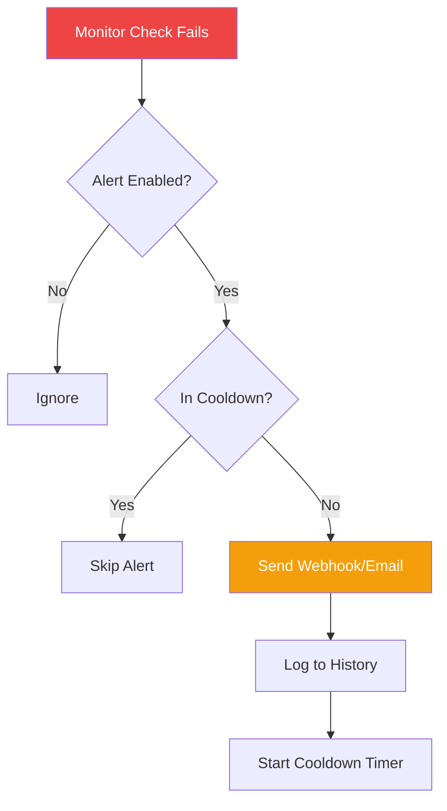

## Overview

The Alerts API manages alert configurations and provides access to alert history for your VMs.



## Get Alert Configuration

<api method="GET" endpoint="/api/vms/{vm_id}/alerts/config" />

### Response (200 OK)

```json
{
  "success": true,
  "data": {
    "id": 1,
    "vm_id": 123,
    "enabled": true,
    "webhook_url": "https://hooks.slack.com/services/T00/B00/XXX",
    "email_recipient": "admin@example.com",
    "cooldown_minutes": 15,
    "created_at": "2026-05-08T10:30:00Z",
    "updated_at": "2026-05-08T10:30:00Z"
  }
}
```

---

## Update Alert Configuration

<api method="PUT" endpoint="/api/vms/{vm_id}/alerts/config" />

### Request Body

```json
{
  "enabled": true,
  "webhook_url": "https://hooks.slack.com/services/T00/B00/XXX",
  "email_recipient": "admin@example.com",
  "cooldown_minutes": 15
}
```

### Code Examples

<CodeGroup>

```bash cURL
curl -X PUT http://localhost:8000/api/vms/123/alerts/config \
  -H "Authorization: Bearer YOUR_TOKEN" \
  -H "Content-Type: application/json" \
  -d '{
    "enabled": true,
    "webhook_url": "https://hooks.slack.com/services/T00/B00/XXX",
    "cooldown_minutes": 30
  }'
```

```python Python
response = requests.put(
    f"http://localhost:8000/api/vms/{vm_id}/alerts/config",
    headers={"Authorization": f"Bearer {token}"},
    json={
        "enabled": True,
        "webhook_url": "https://hooks.slack.com/services/T00/B00/XXX",
        "email_recipient": "admin@example.com",
        "cooldown_minutes": 15
    }
)
```

```javascript JavaScript
await fetch(`http://localhost:8000/api/vms/${vmId}/alerts/config`, {
  method: 'PUT',
  headers: {
    'Authorization': `Bearer ${token}`,
    'Content-Type': 'application/json'
  },
  body: JSON.stringify({
    enabled: true,
    webhook_url: 'https://hooks.slack.com/services/T00/B00/XXX',
    cooldown_minutes: 30
  })
});
```

</CodeGroup>

---

## Get Alert History

<api method="GET" endpoint="/api/vms/{vm_id}/alerts/history" />

### Response (200 OK)

```json
{
  "success": true,
  "data": [
    {
      "id": 456,
      "vm_id": 123,
      "alert_type": "vm_unreachable",
      "sent_at": "2026-05-08T10:30:00Z",
      "notification_method": "webhook",
      "success": true,
      "error_message": null
    }
  ]
}
```

## Next Steps

<CardGroup cols={2}>
  <Card title="Alerting Guide" icon="bell" href="/features/alerting">
    Learn about alerting concepts
  </Card>
  
  <Card title="Configure Alerts" icon="gear" href="/guides/configuring-alerts">
    Step-by-step alert setup
  </Card>
</CardGroup>
