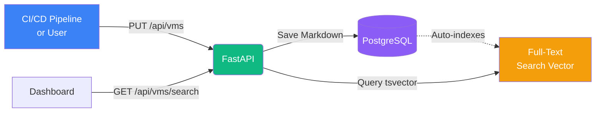

## Overview

Deployment notes are managed through the VM API. This page provides specific guidance for working with deployment documentation.



## Get Deployment Notes

Use the VM details endpoint to retrieve deployment notes:

```bash
curl http://localhost:8000/api/vms/123 \
  -H "Authorization: Bearer YOUR_TOKEN" \
  | jq -r '.data.deployment_notes'
```

## Update Deployment Notes

Use the VM update endpoint to modify deployment notes:

```bash
curl -X PUT http://localhost:8000/api/vms/123 \
  -H "Authorization: Bearer YOUR_TOKEN" \
  -H "Content-Type: application/json" \
  -d '{
    "deployment_notes": "# Web Server\n\n## Installed Software\n- Nginx 1.24.0\n- Node.js 20.11.0"
  }'
```

### Markdown Support

Deployment notes support full Markdown syntax:

- **Headers**: `# H1`, `## H2`, `### H3`
- **Formatting**: `**bold**`, `*italic*`, `` `code` ``
- **Lists**: Bullet and numbered lists
- **Code blocks**: ` ```language ` 
- **Tables**: Markdown tables
- **Links**: `[text](url)`

### Character Limit

Maximum 50,000 characters per VM.

## Search Deployment Notes

Use the search API to find VMs by deployment notes content:

```bash
curl "http://localhost:8000/api/vms/search?q=nginx+1.24" \
  -H "Authorization: Bearer YOUR_TOKEN"
```

## Next Steps

<CardGroup cols={2}>
  <Card title="Deployment Tracking" icon="rocket" href="/features/deployment-tracking">
    Learn about deployment documentation
  </Card>
  
  <Card title="VM API" icon="server" href="/api-reference/virtual-machines">
    Complete VM API reference
  </Card>
</CardGroup>
