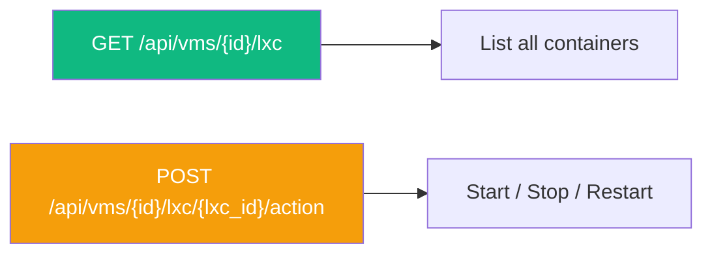
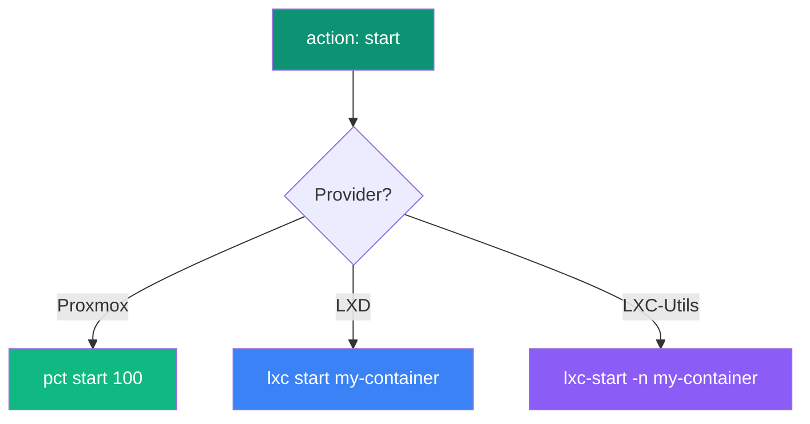

## Overview

The LXC API lets you discover and manage LXC containers running on your VMs. VMLedger auto-detects the LXC provider (Proxmox, LXD, or LXC-Utils) and adapts its commands accordingly.



---

## List LXC Containers

Discover all LXC containers running on a VM by auto-detecting the installed provider.

```
GET /api/vms/{vm_id}/lxc
```

<ParamField path="vm_id" type="integer" required>
  The ID of the VM to query for LXC containers.
</ParamField>

### Example Request

<CodeGroup>

```bash cURL
curl http://localhost:8000/api/vms/1/lxc \
  -H "Authorization: Bearer YOUR_TOKEN"
```

```python Python
import requests

response = requests.get(
    "http://localhost:8000/api/vms/1/lxc",
    headers={"Authorization": "Bearer YOUR_TOKEN"}
)
print(response.json())
```

</CodeGroup>

### Response (LXC Host Found)

```json
{
  "is_proxmox": true,
  "provider": "pct",
  "containers": [
    {
      "vmid": "100",
      "status": "running",
      "name": "nginx-proxy"
    },
    {
      "vmid": "101",
      "status": "stopped",
      "name": "test-env"
    }
  ]
}
```

### Response (No LXC Provider)

```json
{
  "is_proxmox": false,
  "provider": "none",
  "containers": []
}
```

### Response Fields

| Field | Type | Description |
|-------|------|-------------|
| `is_proxmox` | boolean | `true` if any LXC provider was detected |
| `provider` | string | Detected provider: `pct`, `lxd`, `lxc-utils`, or `none` |
| `containers` | array | List of container objects |
| `containers[].vmid` | string | Container ID (numeric for Proxmox, name for LXD/LXC-Utils) |
| `containers[].status` | string | Current status: `running`, `stopped`, etc. |
| `containers[].name` | string | Container name |

### Error Responses

| Status | Condition |
|--------|-----------|
| `400` | No SSH credentials found for the VM |
| `404` | VM not found or not owned by user |
| `500` | SSH connection failed |

---

## Perform Container Action

Execute a lifecycle action (start, stop, restart) on a specific LXC container.

```
POST /api/vms/{vm_id}/lxc/{lxc_id}/action
```

<ParamField path="vm_id" type="integer" required>
  The ID of the host VM.
</ParamField>

<ParamField path="lxc_id" type="string" required>
  The VMID (Proxmox) or container name (LXD/LXC-Utils). Must match `^[a-zA-Z0-9_-]+$`.
</ParamField>

<ParamField body="action" type="string" required>
  The action to perform. Must be one of: `start`, `stop`, `restart`.
</ParamField>

### Example Requests

<CodeGroup>

```bash Start
curl -X POST http://localhost:8000/api/vms/1/lxc/100/action \
  -H "Authorization: Bearer YOUR_TOKEN" \
  -H "Content-Type: application/json" \
  -d '{"action": "start"}'
```

```bash Stop
curl -X POST http://localhost:8000/api/vms/1/lxc/100/action \
  -H "Authorization: Bearer YOUR_TOKEN" \
  -H "Content-Type: application/json" \
  -d '{"action": "stop"}'
```

```bash Restart
curl -X POST http://localhost:8000/api/vms/1/lxc/100/action \
  -H "Authorization: Bearer YOUR_TOKEN" \
  -H "Content-Type: application/json" \
  -d '{"action": "restart"}'
```

</CodeGroup>

### Response

```json
{
  "success": true,
  "message": "Container 100 started successfully."
}
```

### How Actions Map to Provider Commands



### Error Responses

| Status | Condition |
|--------|-----------|
| `400` | Invalid action (not start/stop/restart) |
| `400` | Invalid LXC ID format (fails regex check) |
| `400` | No LXC provider found on the host |
| `404` | VM not found or not owned by user |
| `500` | SSH connection failed or command execution failed |
