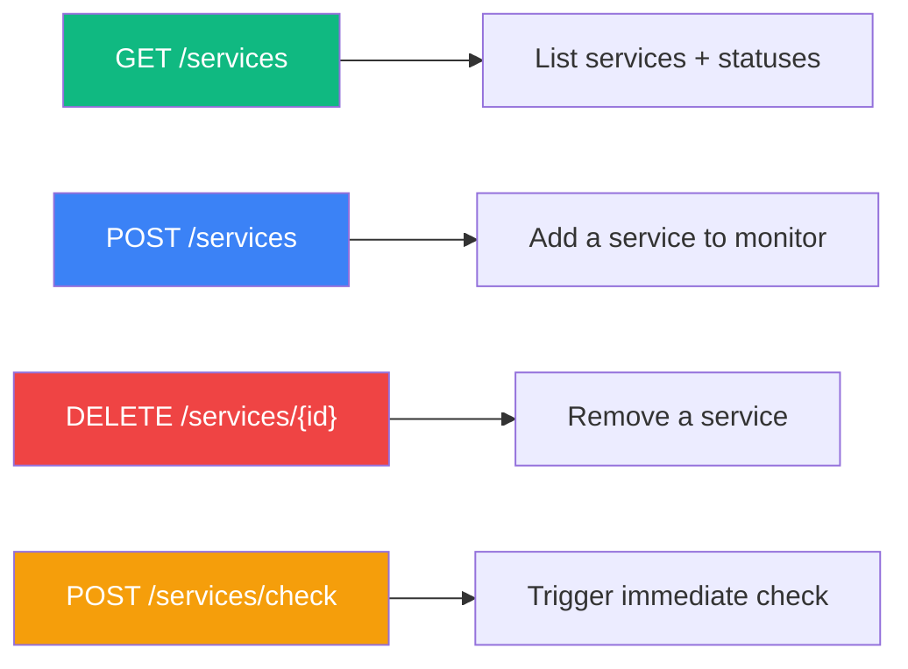
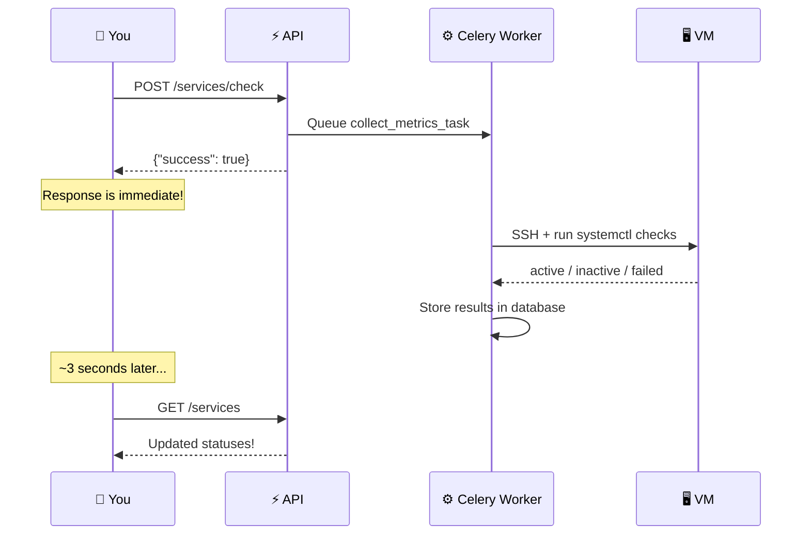

## Overview

The Services API lets you configure which systemd services to monitor on each VM, retrieve their latest status, and trigger on-demand health checks.



---

## List Configured Services

Get all configured services and their latest health status for a VM.

```
GET /api/vms/{vm_id}/services
```

<ParamField path="vm_id" type="integer" required>
  The ID of the VM.
</ParamField>

### Example Request

<CodeGroup>

```bash cURL
curl http://localhost:8000/api/vms/1/services \
  -H "Authorization: Bearer YOUR_TOKEN"
```

```python Python
import requests

response = requests.get(
    "http://localhost:8000/api/vms/1/services",
    headers={"Authorization": "Bearer YOUR_TOKEN"}
)
for svc in response.json():
    print(f"{svc['display_name'] or svc['service_name']}: {svc['status']}")
```

</CodeGroup>

### Response

```json
[
  {
    "id": 1,
    "vm_id": 1,
    "service_name": "nginx",
    "display_name": "Web Server",
    "check_command": null,
    "enabled": true,
    "status": "active"
  },
  {
    "id": 2,
    "vm_id": 1,
    "service_name": "postgresql",
    "display_name": "Database",
    "check_command": null,
    "enabled": true,
    "status": "active"
  },
  {
    "id": 3,
    "vm_id": 1,
    "service_name": "redis-server",
    "display_name": null,
    "check_command": null,
    "enabled": true,
    "status": "inactive"
  }
]
```

### Response Fields

| Field | Type | Description |
|-------|------|-------------|
| `id` | integer | Service configuration ID (use this for DELETE) |
| `vm_id` | integer | Parent VM ID |
| `service_name` | string | systemd unit name (e.g., `nginx`) |
| `display_name` | string \| null | Human-readable label |
| `check_command` | string \| null | Custom check command (null = use `systemctl is-active`) |
| `enabled` | boolean | Whether the service is actively being checked |
| `status` | string \| null | Latest status: `active`, `inactive`, `failed`, `unknown`, `error` |

---

## Add Service to Monitor

Configure a new service to monitor on a VM.

```
POST /api/vms/{vm_id}/services
```

<ParamField path="vm_id" type="integer" required>
  The ID of the VM.
</ParamField>

<ParamField body="service_name" type="string" required>
  The systemd unit name. Examples: `nginx`, `postgresql`, `docker`, `redis-server`.
</ParamField>

<ParamField body="display_name" type="string">
  Optional human-readable name shown in the dashboard. Examples: "Web Server", "Database".
</ParamField>

<ParamField body="check_command" type="string">
  Optional custom command to check the service. If omitted, VMLedger uses `systemctl is-active {service_name}`.

  **Example custom command:**
  ```bash
  curl -sf http://localhost:3000/health || echo inactive
  ```
</ParamField>

### Example Request

<CodeGroup>

```bash Basic
curl -X POST http://localhost:8000/api/vms/1/services \
  -H "Authorization: Bearer YOUR_TOKEN" \
  -H "Content-Type: application/json" \
  -d '{
    "service_name": "nginx",
    "display_name": "Web Server"
  }'
```

```bash With custom check
curl -X POST http://localhost:8000/api/vms/1/services \
  -H "Authorization: Bearer YOUR_TOKEN" \
  -H "Content-Type: application/json" \
  -d '{
    "service_name": "myapp",
    "display_name": "My Application",
    "check_command": "curl -sf http://localhost:3000/health || echo inactive"
  }'
```

</CodeGroup>

### Response

```json
{
  "id": 1,
  "vm_id": 1,
  "service_name": "nginx",
  "display_name": "Web Server",
  "check_command": null,
  "enabled": true,
  "status": "unknown"
}
```

<Info>
The service starts with `status: "unknown"` because it hasn't been checked yet. It will be checked on the next metric collection cycle (~5 minutes), or you can trigger an immediate check.
</Info>

### Error Responses

| Status | Condition |
|--------|-----------|
| `400` | Service with that name is already configured for this VM |
| `404` | VM not found or not owned by user |

---

## Remove Service

Remove a service from monitoring. This deletes both the configuration and the stored status data.

```
DELETE /api/vms/{vm_id}/services/{service_id}
```

<ParamField path="vm_id" type="integer" required>
  The ID of the VM.
</ParamField>

<ParamField path="service_id" type="integer" required>
  The ID of the service configuration to remove (from the `id` field in the list response).
</ParamField>

### Example Request

```bash
curl -X DELETE http://localhost:8000/api/vms/1/services/3 \
  -H "Authorization: Bearer YOUR_TOKEN"
```

### Response

```json
{
  "success": true
}
```

### Error Responses

| Status | Condition |
|--------|-----------|
| `404` | VM or service configuration not found |

---

## Trigger On-Demand Check

Trigger an immediate service health check for all enabled services on a VM. This is useful when you don't want to wait for the next 5-minute metric collection cycle.

```
POST /api/vms/{vm_id}/services/check
```

<ParamField path="vm_id" type="integer" required>
  The ID of the VM.
</ParamField>

### Example Request

```bash
curl -X POST http://localhost:8000/api/vms/1/services/check \
  -H "Authorization: Bearer YOUR_TOKEN"
```

### Response

```json
{
  "success": true,
  "message": "Service check triggered"
}
```

### How It Works



<Warning>
**Asynchronous**: This endpoint returns immediately after queuing the task. The actual checks happen in the background. Poll `GET /api/vms/{vm_id}/services` after ~3 seconds to see the updated statuses.
</Warning>
