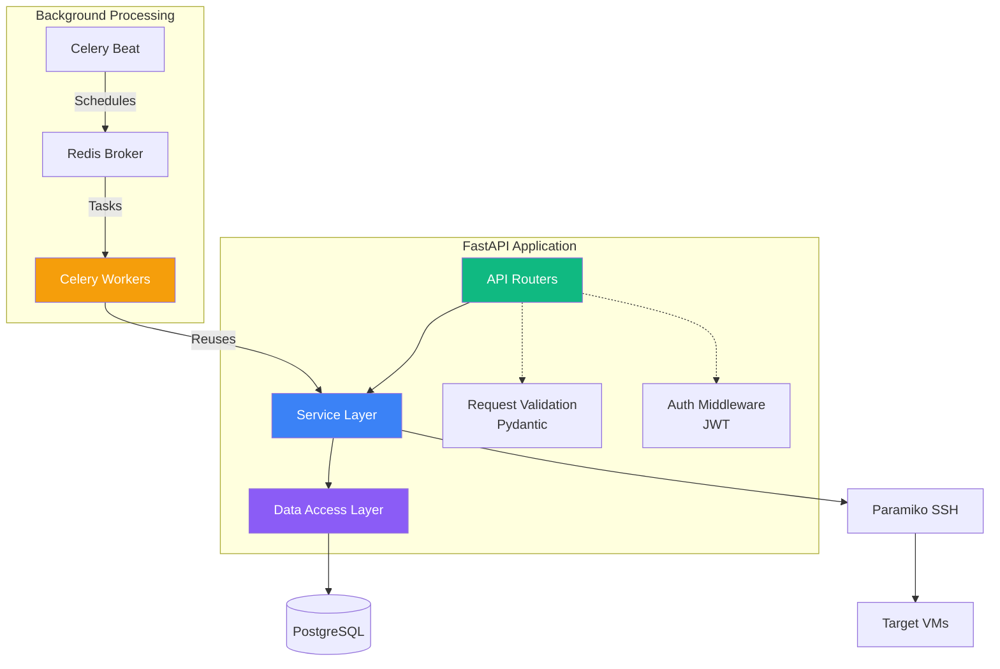

## Overview

VMLedger's backend is built with FastAPI, providing a high-performance async API for VM management and monitoring.



## Technology Stack

<CardGroup cols={3}>
  <Card title="FastAPI" icon="bolt">
    Python 3.11+ async web framework
  </Card>
  
  <Card title="SQLAlchemy" icon="database">
    ORM for PostgreSQL
  </Card>
  
  <Card title="Pydantic" icon="check">
    Request/response validation
  </Card>
  
  <Card title="Paramiko" icon="key">
    SSH client for metrics, terminal, logs, and LXC management
  </Card>
  
  <Card title="Cryptography" icon="lock">
    AES-256 encryption
  </Card>
  
  <Card title="Bcrypt" icon="shield">
    Password hashing
  </Card>
</CardGroup>

## Project Structure

```
vmledger/
├── api/                    # API endpoints
│   ├── auth.py            # Authentication routes
│   ├── vms.py             # VM management routes
│   ├── ssh.py             # SSH terminal & log streaming (WebSocket)
│   ├── services.py        # Service health monitoring routes
│   ├── lxc.py             # LXC container management routes
│   ├── monitoring.py      # Monitoring routes
│   └── alerts.py          # Alert routes
├── services/              # Business logic
│   ├── auth_service.py
│   ├── vm_service.py
│   ├── credential_manager.py
│   ├── ssh_utils.py
│   ├── health_check_service.py
│   ├── metric_collector_service.py
│   ├── search_engine_service.py
│   └── alert_handler_service.py
├── models/                # SQLAlchemy models
│   ├── user.py
│   ├── vm.py
│   ├── credential.py
│   ├── ping_result.py
│   ├── metric.py
│   ├── alert.py
│   ├── service_config.py  # Service monitoring configuration
│   └── service_status.py  # Service health check results
├── schemas/               # Pydantic schemas
│   ├── auth.py
│   ├── vm.py
│   ├── monitoring.py
│   └── alert.py
├── tasks/                 # Celery tasks
│   ├── ping_tasks.py
│   ├── metric_tasks.py
│   └── alert_tasks.py
└── main.py               # FastAPI application
```

## Key Components

### Authentication Middleware

```python
from fastapi import Depends, HTTPException
from fastapi.security import HTTPBearer

security = HTTPBearer()

async def get_current_user(token: str = Depends(security)):
    user = auth_service.validate_token(token.credentials)
    if not user:
        raise HTTPException(status_code=401, detail="Invalid token")
    return user
```

### Request Validation

```python
from pydantic import BaseModel, Field, IPvAnyAddress

class VMCreateSchema(BaseModel):
    ip_address: IPvAnyAddress
    hostname: str = Field(min_length=1, max_length=255)
    ssh_port: int = Field(default=22, ge=1, le=65535)
    tags: List[str] = Field(default_factory=list, max_items=20)
```

### Error Handling

```python
@app.exception_handler(ValidationError)
async def validation_exception_handler(request, exc):
    return JSONResponse(
        status_code=400,
        content={
            "success": False,
            "error": {
                "code": "VALIDATION_ERROR",
                "message": str(exc),
                "details": exc.errors()
            }
        }
    )
```

## Performance Optimizations

<CardGroup cols={2}>
  <Card title="Async I/O" icon="bolt">
    All endpoints use async/await for non-blocking operations
  </Card>
  
  <Card title="Connection Pooling" icon="database">
    PostgreSQL connection pool (5-20 connections)
  </Card>
  
  <Card title="Redis Caching" icon="gauge-high">
    Dashboard data cached for 30 seconds
  </Card>
  
  <Card title="Database Indexes" icon="magnifying-glass">
    Optimized queries with proper indexing
  </Card>
</CardGroup>

## Security Features

- **JWT Authentication**: HS256 signing, 24-hour expiry
- **Password Hashing**: Bcrypt with cost factor 12
- **Credential Encryption**: AES-256-GCM for SSH keys
- **Rate Limiting**: 100 requests/minute per user
- **User Isolation**: Row-level security in queries

## Next Steps

<CardGroup cols={2}>
  <Card title="Frontend Architecture" icon="window" href="/architecture/frontend">
    Next.js frontend design
  </Card>
  
  <Card title="Database Schema" icon="database" href="/architecture/database">
    PostgreSQL schema details
  </Card>
  
  <Card title="Security" icon="shield" href="/architecture/security">
    Security implementation
  </Card>
  
  <Card title="API Reference" icon="code" href="/api-reference/introduction">
    Complete API documentation
  </Card>
</CardGroup>
