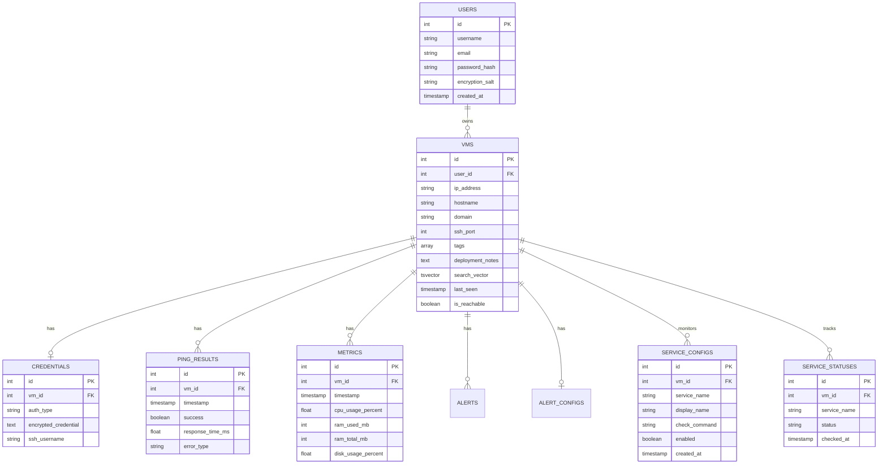

## Overview

VMLedger uses PostgreSQL 15+ with full-text search extensions for efficient data storage and retrieval.

## Schema Diagram



## Key Tables

### Users
- Stores user accounts
- Password hashed with bcrypt
- Encryption salt for credential encryption

### VMs
- Core VM registry
- Full-text search vector for instant search
- User isolation via user_id foreign key

### Credentials
- Encrypted SSH credentials (AES-256)
- Separate table for security
- One-to-one relationship with VMs

### Ping Results
- Health check history (last 100 per VM)
- Response times and error types

### Metrics
- Resource usage history (last 1000 per VM)
- CPU, RAM, disk metrics

### Service Configs
- Per-VM service monitoring configuration
- Stores systemd unit names and optional custom check commands
- One-to-many relationship with VMs

### Service Statuses
- Latest health check result for each configured service
- Status values: `active`, `inactive`, `failed`, `unknown`, `error`
- Updated during each metric collection cycle

## Indexes

```sql
-- Performance indexes
CREATE INDEX idx_vms_user_id ON vms(user_id);
CREATE INDEX idx_vms_search ON vms USING GIN(search_vector);
CREATE INDEX idx_ping_results_vm_timestamp ON ping_results(vm_id, timestamp DESC);
CREATE INDEX idx_metrics_vm_timestamp ON metrics(vm_id, timestamp DESC);
```

## Data Retention

- **Ping Results**: Last 100 per VM
- **Metrics**: Last 1000 per VM
- **Alerts**: 90 days

## Next Steps

<CardGroup cols={2}>
  <Card title="Caching Strategy" icon="gauge-high" href="/architecture/caching">
    Redis caching implementation
  </Card>
  
  <Card title="Backend Architecture" icon="server" href="/architecture/backend">
    Backend design
  </Card>
</CardGroup>
