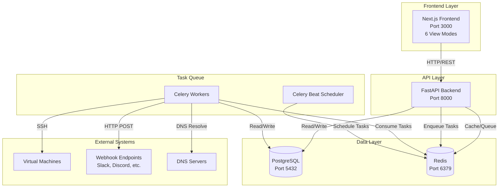
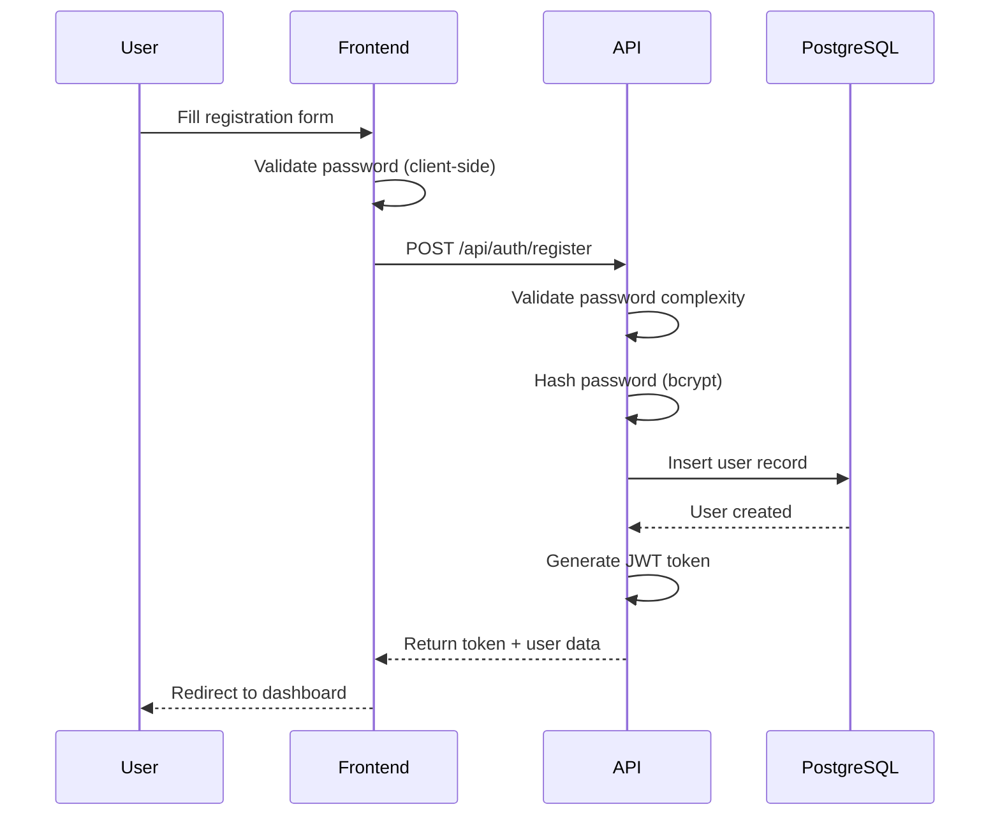
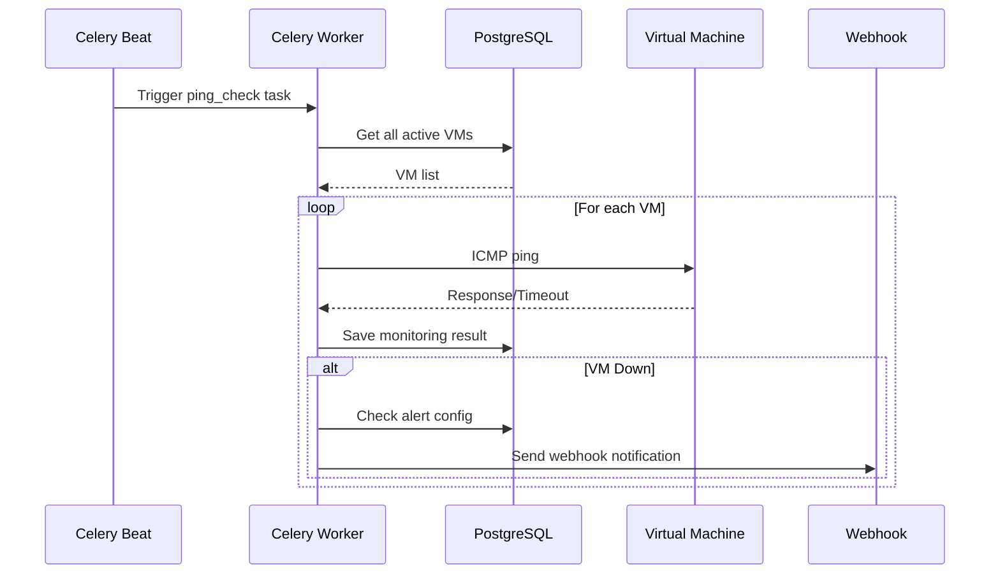
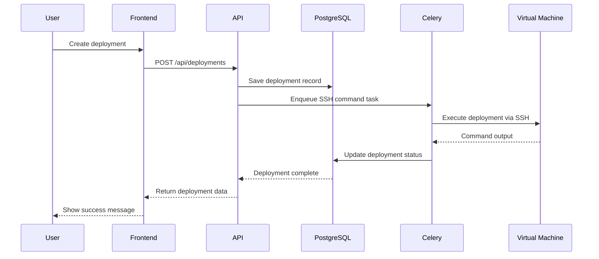
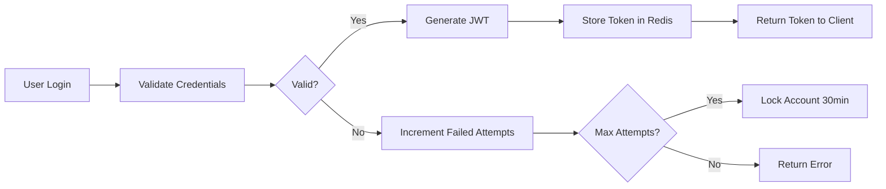
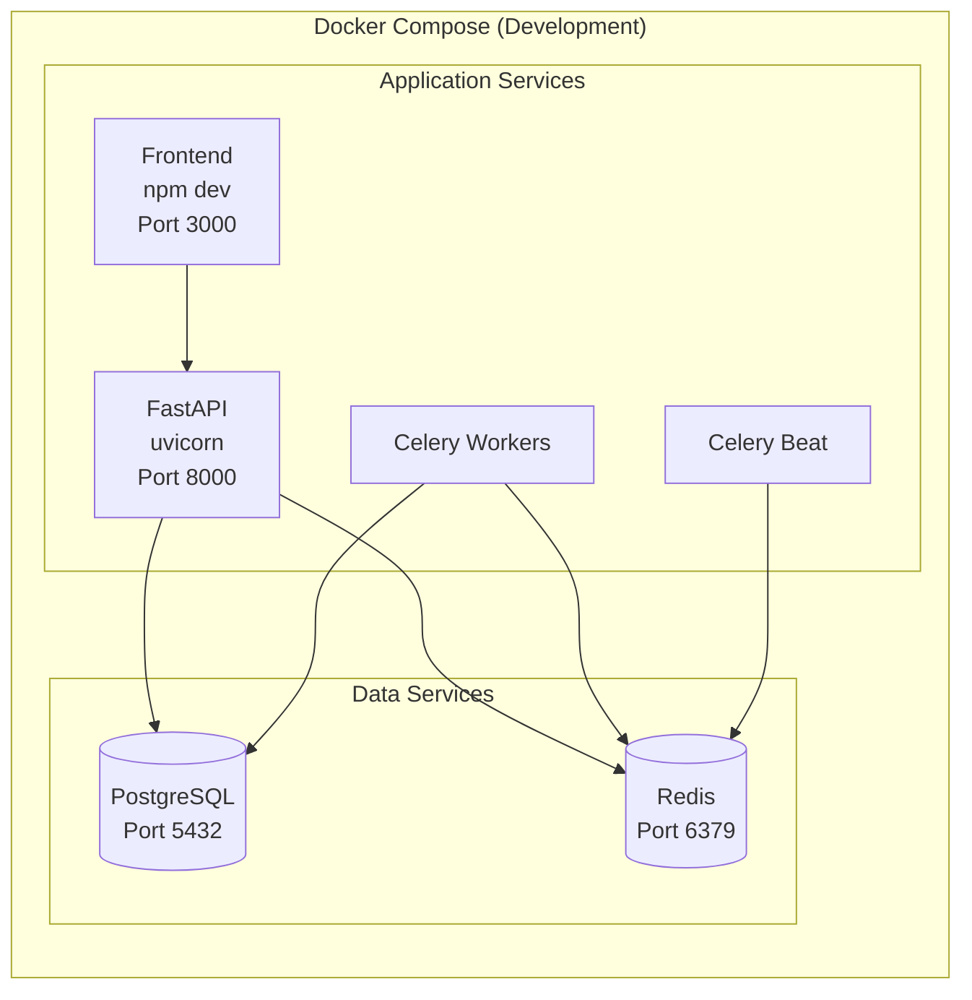
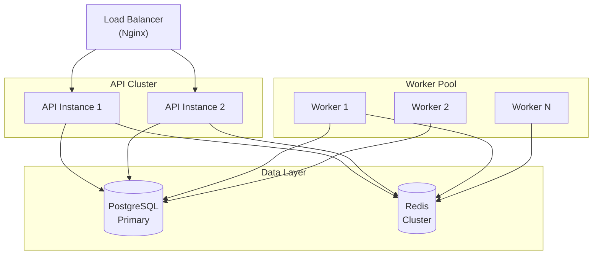

## System Architecture

VMLedger follows a modern microservices-inspired architecture with clear separation of concerns.

## Core Components

### Frontend (Next.js)

<Card title="Technology Stack" icon="react">
  - **Framework**: Next.js 14 with App Router
  - **UI**: React 18 + TailwindCSS
  - **State**: React Query (TanStack Query)
  - **API Client**: Axios with interceptors
</Card>

**Responsibilities:**
- User interface and interactions
- Client-side validation
- API communication
- State management
- Real-time updates via polling

**Key Features:**
- Server-side rendering (SSR)
- Static site generation (SSG)
- API route handlers
- Optimized image loading
- Code splitting

### Backend API (FastAPI)

<Card title="Technology Stack" icon="python">
  - **Framework**: FastAPI (Python 3.11+)
  - **ORM**: SQLAlchemy 2.0
  - **Validation**: Pydantic v2
  - **Authentication**: JWT with python-jose
</Card>

**Responsibilities:**
- RESTful API endpoints
- Request validation
- Authentication & authorization
- Business logic
- Database operations
- Task enqueueing

**Key Features:**
- Automatic OpenAPI documentation
- Type hints and validation
- Async/await support
- Dependency injection
- CORS middleware

### Task Queue (Celery)

<Card title="Technology Stack" icon="gears">
  - **Framework**: Celery 5.3+
  - **Broker**: Redis
  - **Backend**: Redis
  - **Scheduler**: Celery Beat
</Card>

**Responsibilities:**
- Background task execution
- Scheduled monitoring tasks
- SSH operations
- Webhook notifications
- Metrics collection

**Task Types:**
1. **Periodic Tasks** (Celery Beat):
   - VM ping checks (every 60s)
   - Metrics collection (every 5min)
   
2. **On-Demand Tasks**:
   - SSH command execution
   - Webhook delivery
   - Alert processing

### Database (PostgreSQL)

<Card title="Schema Design" icon="database">
  - **Version**: PostgreSQL 15
  - **ORM**: SQLAlchemy 2.0
  - **Migrations**: Alembic
</Card>

**Tables:**
- `users` - User accounts and authentication
- `virtual_machines` - VM inventory
- `vm_credentials` - Encrypted SSH credentials
- `monitoring_data` - Health check results
- `vm_metrics` - System metrics (CPU, memory, etc.)
- `deployments` - Deployment history
- `alerts` - Alert configurations
- `alert_history` - Alert event log

**Key Features:**
- Foreign key constraints
- Indexes on frequently queried columns
- Timestamps (created_at, updated_at)
- Soft deletes where applicable

### Cache & Message Broker (Redis)

<Card title="Use Cases" icon="bolt">
  - **Cache**: Query results, session data
  - **Broker**: Celery task queue
  - **Rate Limiting**: Login attempts
  - **Token Storage**: JWT invalidation
</Card>

**Redis Keys:**
- `rate_limit:login:{username}` - Login attempt tracking
- `token:{user_id}:{token}` - Valid JWT tokens
- `celery:*` - Celery task queue
- `cache:*` - Application cache

## Data Flow

### User Registration Flow

### VM Monitoring Flow

### Deployment Tracking Flow

## Security Architecture

### Authentication Flow

### Security Layers

<AccordionGroup>
  <Accordion title="1. Authentication Layer">
    - JWT tokens with 24-hour expiration
    - Bcrypt password hashing (cost factor 12)
    - Rate limiting (5 attempts per 15 minutes)
    - Account lockout (30 minutes after 5 failed attempts)
  </Accordion>
  
  <Accordion title="2. Authorization Layer">
    - User-based resource isolation
    - JWT token validation on every request
    - Token invalidation on logout
    - Redis-based token blacklist
  </Accordion>
  
  <Accordion title="3. Data Protection Layer">
    - AES-256 encryption for SSH credentials
    - Master key + user-specific salts
    - Encrypted at rest in PostgreSQL
    - Decrypted only when needed
  </Accordion>
  
  <Accordion title="4. Network Layer">
    - CORS configuration
    - HTTPS in production
    - SSH key-based authentication
    - Webhook signature verification (planned)
  </Accordion>
</AccordionGroup>

## Scalability Considerations

### Horizontal Scaling

<CardGroup cols={2}>
  <Card title="API Servers" icon="server">
    - Stateless design
    - Load balancer ready
    - Shared Redis cache
    - Database connection pooling
  </Card>
  
  <Card title="Celery Workers" icon="gears">
    - Multiple worker instances
    - Task distribution via Redis
    - Concurrent task execution
    - Auto-scaling support
  </Card>
</CardGroup>

### Performance Optimizations

1. **Database**:
   - Indexes on foreign keys
   - Query result caching
   - Connection pooling
   - Batch operations

2. **API**:
   - Response caching
   - Pagination for large datasets
   - Async database queries
   - Lazy loading relationships

3. **Frontend**:
   - Code splitting
   - Image optimization
   - Static page generation
   - Client-side caching

## Monitoring & Observability

### Logging

<Tabs>
  <Tab title="Application Logs">
    - Structured JSON logging
    - Log levels: DEBUG, INFO, WARNING, ERROR
    - Request/response logging
    - Authentication attempt logging
  </Tab>
  
  <Tab title="Task Logs">
    - Celery task execution logs
    - SSH operation logs
    - Webhook delivery logs
    - Error stack traces
  </Tab>
  
  <Tab title="System Logs">
    - Docker container logs
    - PostgreSQL query logs
    - Redis operation logs
    - Nginx access logs (production)
  </Tab>
</Tabs>

### Metrics

- VM health status
- API response times
- Task queue length
- Database connection pool usage
- Cache hit/miss rates
- Alert delivery success rates

## Deployment Architecture

### Development

### Production

## Technology Choices

### Why FastAPI?

<Check>
  - **Performance**: Async support, fast execution
  - **Developer Experience**: Auto-generated docs, type hints
  - **Modern**: Built on Starlette and Pydantic
  - **Ecosystem**: Large community, many integrations
</Check>

### Why Next.js?

<Check>
  - **SEO**: Server-side rendering support
  - **Performance**: Automatic code splitting, image optimization
  - **Developer Experience**: Hot reload, TypeScript support
  - **Flexibility**: SSR, SSG, and CSR in one framework
</Check>

### Why PostgreSQL?

<Check>
  - **Reliability**: ACID compliance, data integrity
  - **Features**: JSON support, full-text search, extensions
  - **Performance**: Efficient indexing, query optimization
  - **Scalability**: Replication, partitioning support
</Check>

### Why Redis?

<Check>
  - **Speed**: In-memory data store, microsecond latency
  - **Versatility**: Cache, message broker, rate limiting
  - **Reliability**: Persistence options, replication
  - **Integration**: Native Celery support
</Check>

## Future Enhancements

<CardGroup cols={2}>
  <Card title="WebSocket Support" icon="plug">
    Real-time updates without polling
  </Card>
  
  <Card title="Multi-tenancy" icon="users">
    Organization-based resource isolation
  </Card>
  
  <Card title="Kubernetes Deployment" icon="dharmachakra">
    Container orchestration for production
  </Card>
  
  <Card title="Metrics Dashboard" icon="chart-line">
    Grafana integration for visualization
  </Card>
</CardGroup>

## Related Documentation

<CardGroup cols={3}>
  <Card title="Backend" icon="python" href="/architecture/backend">
    Deep dive into FastAPI backend
  </Card>
  
  <Card title="Frontend" icon="react" href="/architecture/frontend">
    Next.js frontend architecture
  </Card>
  
  <Card title="Security" icon="shield" href="/architecture/security">
    Security implementation details
  </Card>
</CardGroup>
