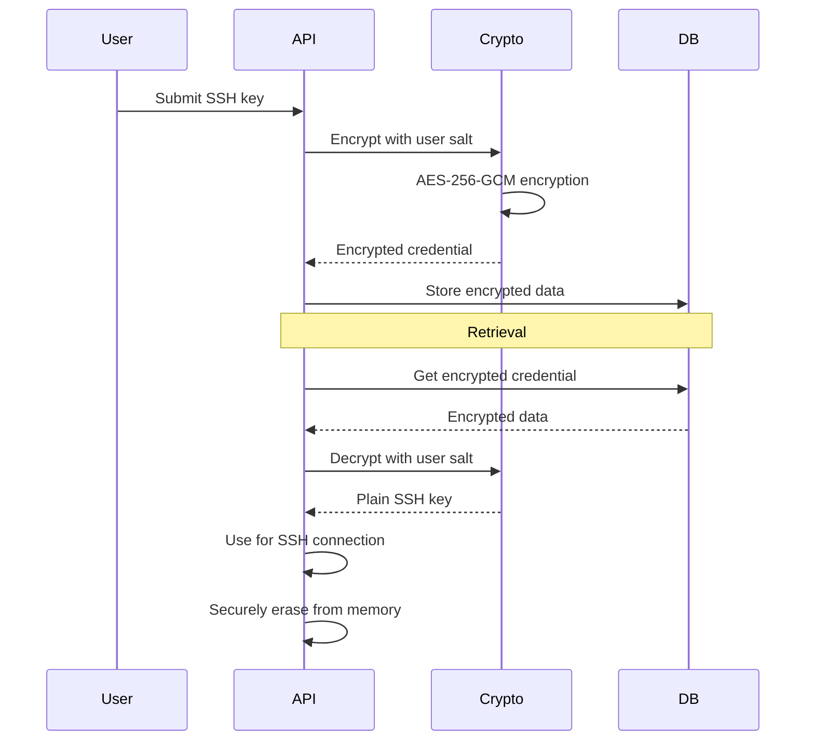

## Overview

VMLedger implements multiple security layers to protect your VM credentials and data.

## Security Features

<CardGroup cols={2}>
  <Card title="Password Hashing" icon="lock">
    Bcrypt with cost factor 12
  </Card>
  
  <Card title="Credential Encryption" icon="key">
    AES-256-GCM for SSH keys
  </Card>
  
  <Card title="JWT Authentication" icon="id-card">
    HS256 signing, 24-hour expiry
  </Card>
  
  <Card title="User Isolation" icon="users">
    Row-level security in queries
  </Card>
  
  <Card title="Rate Limiting" icon="gauge">
    100 requests/minute per user
  </Card>
  
  <Card title="Account Lockout" icon="ban">
    5 failed attempts = 30-min lock
  </Card>
</CardGroup>

## Credential Encryption

### Encryption Flow



### Key Derivation

```python
# Master key from environment
MASTER_KEY = os.environ.get('ENCRYPTION_KEY')

# Per-user key derivation
user_key = PBKDF2(
    password=MASTER_KEY,
    salt=user.encryption_salt,
    iterations=100000,
    key_length=32
)

# Encrypt credential
fernet = Fernet(base64.urlsafe_b64encode(user_key))
encrypted = fernet.encrypt(ssh_key.encode())
```

## Authentication Security

### Password Requirements
- Minimum 12 characters
- Mixed case (A-Z, a-z)
- Numbers (0-9)
- Special characters (!@#$%^&*)

### Token Security
- JWT with HS256 signing
- 24-hour expiration
- Stored in Redis with TTL
- Invalidated on logout

### Rate Limiting
- 100 requests/minute per user
- 5 failed login attempts = 30-minute lockout
- Lockout tracked in Redis

## User Isolation

All queries enforce user ownership:

```python
# Example: Get VM
vm = db.query(VM).filter(
    VM.id == vm_id,
    VM.user_id == current_user.id  # User isolation
).first()

if not vm:
    raise HTTPException(status_code=404, detail="VM not found")
```

## Production Security Checklist

<AccordionGroup>
  <Accordion title="HTTPS Only">
    - Enable TLS 1.3
    - Add HSTS headers
    - Redirect HTTP to HTTPS
  </Accordion>
  
  <Accordion title="Database Security">
    - Enable connection encryption
    - Use strong passwords
    - Restrict network access
  </Accordion>
  
  <Accordion title="Redis Security">
    - Enable password authentication
    - Bind to localhost only
    - Use TLS for connections
  </Accordion>
  
  <Accordion title="Environment Variables">
    - Never commit .env files
    - Use secrets management
    - Rotate keys regularly
  </Accordion>
</AccordionGroup>

## Next Steps

<CardGroup cols={2}>
  <Card title="Authentication" icon="key" href="/concepts/authentication">
    Authentication concepts
  </Card>
  
  <Card title="Deployment" icon="rocket" href="/deployment/production">
    Production deployment
  </Card>
</CardGroup>
