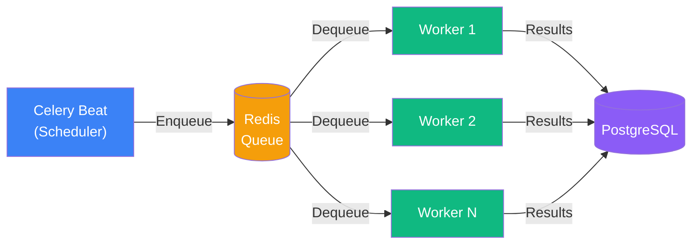
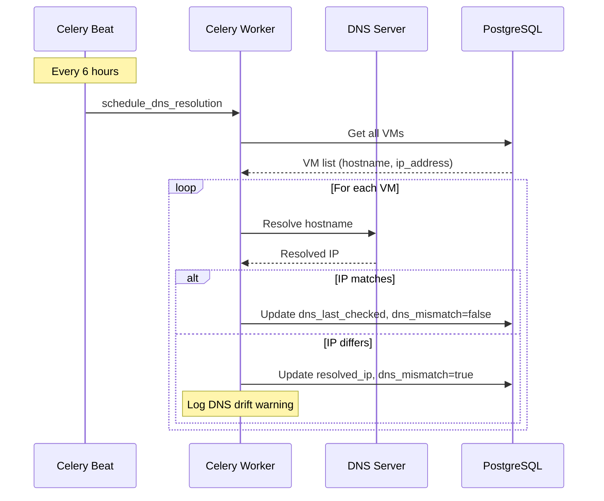
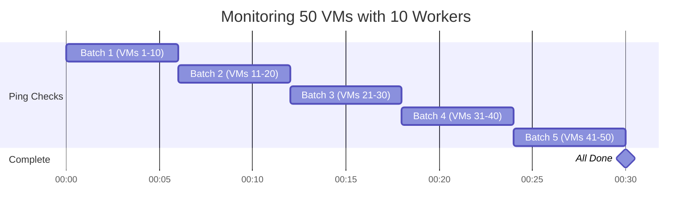

## Overview

VMLedger uses Celery with Redis as the message broker for asynchronous background tasks. The task queue powers all automated monitoring, DNS resolution, alerting, and data cleanup operations.

## Components

<CardGroup cols={3}>
  <Card title="Celery Beat" icon="clock">
    Task scheduler (cron-like). Dispatches periodic jobs on configurable intervals.
  </Card>
  
  <Card title="Celery Workers" icon="users">
    Task executors (10 concurrent by default). Execute ping checks, metrics collection, DNS resolution, and alerts.
  </Card>
  
  <Card title="Redis Queue" icon="list">
    Message broker and result backend. Manages task distribution and stores results.
  </Card>
</CardGroup>

## Task Flow



## Task Schedule

```python
CELERY_BEAT_SCHEDULE = {
    'ping-all-vms': {
        'task': 'vmledger.tasks.schedule_ping_checks',
        'schedule': 60.0,  # Every 60 seconds
    },
    'collect-all-metrics': {
        'task': 'vmledger.tasks.schedule_metric_collection',
        'schedule': 300.0,  # Every 5 minutes
    },
    'cleanup-old-data': {
        'task': 'vmledger.tasks.cleanup_historical_data',
        'schedule': crontab(hour=2, minute=0),  # Daily at 2 AM UTC
    },
    'dns-resolve-all-vms': {
        'task': 'vmledger.tasks.schedule_dns_resolution',
        'schedule': crontab(hour='*/6', minute=15),  # Every 6 hours
    },
}
```

## Task Types

### Ping Check Task
- Executes ICMP ping + TCP port check
- Runs every 60 seconds per VM
- Timeout: 60 seconds
- Retries: 3 attempts

### Metrics Collection Task
- SSH-based resource metrics (CPU, RAM, Disk)
- Runs every 5 minutes per VM
- Timeout: 120 seconds
- Retries: 3 attempts

### DNS Resolution Task
- Resolves VM hostname to IP via `socket.getaddrinfo`
- Compares resolved IP against the stored (registered) IP
- Flags `dns_mismatch = True` when the IP has drifted
- Runs every 6 hours for all VMs
- Timeout: 60 seconds
- Retries: 2 attempts



### Alert Task
- Sends webhook/email notifications
- Triggered by ping failures
- Timeout: 30 seconds
- Retries: 3 attempts with exponential backoff

### Data Cleanup Task
- Removes old ping results (>100 per VM)
- Removes old metrics (>1000 per VM)
- Removes old alerts (>100 per VM)
- Runs daily at 2 AM UTC

## Concurrency



**Performance Characteristics:**
- **50 VMs**: Complete cycle in ~30 seconds
- **100 VMs**: Complete cycle in ~60 seconds
- **200 VMs**: Complete cycle in ~120 seconds

## Scaling Workers

```yaml
# docker-compose.yml
celery-worker:
  command: celery -A vmledger.celery_app worker --concurrency=20
```

<Warning>
When scaling workers, ensure your PostgreSQL connection pool and Redis connections can handle the increased load. Rule of thumb: 1 worker per 5-10 VMs.
</Warning>

## Next Steps

<CardGroup cols={2}>
  <Card title="Backend Architecture" icon="server" href="/architecture/backend">
    FastAPI backend design
  </Card>
  
  <Card title="Monitoring" icon="heart-pulse" href="/features/health-monitoring">
    Monitoring features and dashboard views
  </Card>
</CardGroup>
