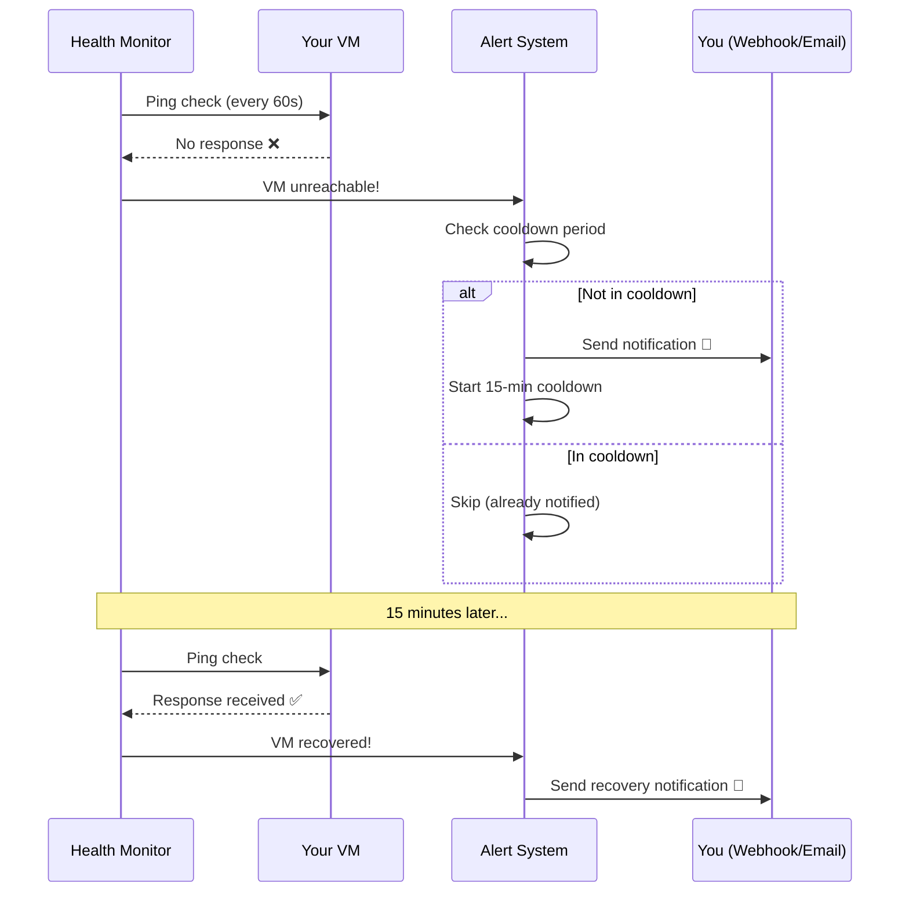
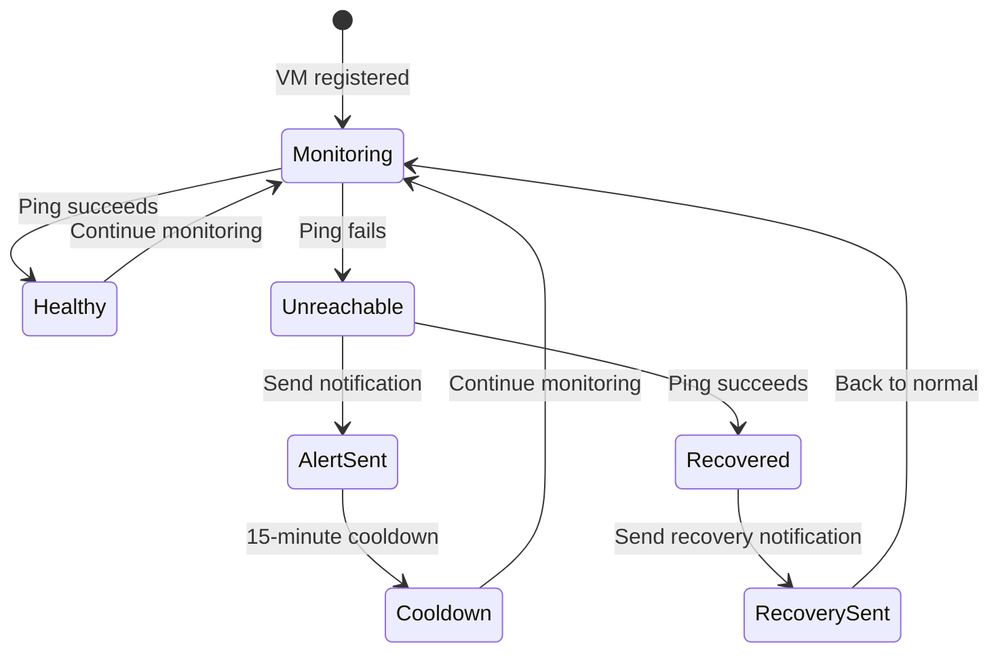
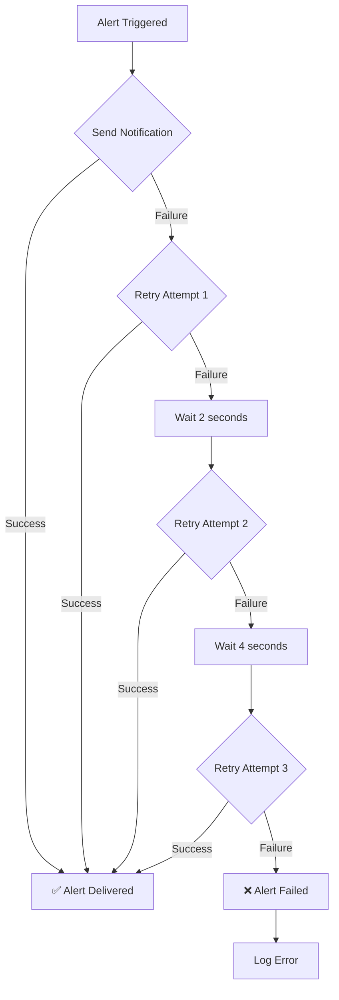

## What Are Alerts?

Alerts are automatic notifications that VMLedger sends when something goes wrong with your VMs. Think of them like smoke detectors in your home—they watch for problems 24/7 and immediately notify you when they detect an issue.

<Info>
**Real-World Analogy**: Imagine you have a security guard watching your building. When they notice a door left open or a broken window, they immediately call you. VMLedger alerts work the same way—constantly monitoring your VMs and notifying you the moment something goes wrong.
</Info>

## How Alerts Work

VMLedger's alert system follows a simple but powerful workflow:



### Alert Lifecycle



## Alert Types

VMLedger sends three types of alerts:

<CardGroup cols={3}>
  <Card title="VM Unreachable" icon="circle-xmark" color="#ef4444">
    Sent when a VM fails health checks (ICMP ping or TCP port check fails)
  </Card>
  
  <Card title="VM Recovered" icon="circle-check" color="#22c55e">
    Sent when a previously unreachable VM becomes reachable again
  </Card>
  
  <Card title="Metrics Unavailable" icon="chart-line-down" color="#f59e0b">
    Sent when SSH connection fails during metric collection
  </Card>
</CardGroup>

## Notification Methods

VMLedger supports two notification methods that you can use individually or together:

### 1. Webhook Notifications

Webhooks send HTTP POST requests to a URL you specify. Perfect for integrating with:
- **Slack** - Post messages to channels
- **Discord** - Send notifications to servers
- **PagerDuty** - Create incidents
- **Custom systems** - Your own monitoring dashboard

**Webhook Payload Example:**
```json
{
  "event": "vm_unreachable",
  "timestamp": "2026-05-08T10:30:00Z",
  "vm": {
    "id": 123,
    "hostname": "web-server-01",
    "ip_address": "192.168.1.100",
    "ssh_port": 22
  },
  "details": {
    "error_type": "TIMEOUT",
    "last_seen": "2026-05-08T10:25:00Z"
  }
}
```

### 2. Email Notifications

Traditional email alerts sent to any email address you specify.

**Email Example:**
```
Subject: [VMLedger Alert] web-server-01 is UNREACHABLE

VM Details:
- Hostname: web-server-01
- IP Address: 192.168.1.100
- Status: UNREACHABLE
- Timestamp: 2026-05-08 10:30:00 UTC
- Error: TIMEOUT

Last successful check: 2026-05-08 10:25:00 UTC

View in dashboard: https://vmledger.example.com/vms/123
```

## Alert Cooldown

To prevent notification spam, VMLedger implements a **15-minute cooldown period**:

```mermaid
gantt
    title Alert Cooldown Timeline
    dateFormat HH:mm
    axisFormat %H:%M
    
    section VM Status
    VM Unreachable     :crit, 10:00, 15m
    
    section Alerts
    First Alert Sent   :milestone, 10:00, 0m
    Cooldown Period    :active, 10:00, 15m
    Alerts Suppressed  :10:01, 14m
    Cooldown Ends      :milestone, 10:15, 0m
    Can Send Again     :10:15, 1m
```



<Warning>
**Why Cooldown?** Without cooldown, you'd receive an alert every 60 seconds while a VM is down. With a 15-minute cooldown, you get one alert when the problem starts, then silence until either:
1. The VM recovers (you get a recovery notification)
2. 15 minutes pass (you get another alert if still down)
</Warning>

## Alert Configuration

You can configure alerts per VM with these options:

<AccordionGroup>
  <Accordion title="Enable/Disable Alerts" icon="toggle-on">
    Turn alerts on or off for specific VMs. Useful for:
    - **Maintenance windows** - Disable alerts during planned downtime
    - **Test VMs** - Don't alert for non-critical systems
    - **Decommissioned VMs** - Temporarily disable before deletion
    
    ```bash
    # Disable alerts for a VM
    curl -X PUT http://localhost:8000/api/vms/123/alerts/config \
      -H "Authorization: Bearer YOUR_TOKEN" \
      -d '{"enabled": false}'
    ```
  </Accordion>
  
  <Accordion title="Webhook URL" icon="link">
    The HTTP endpoint where webhook notifications are sent.
    
    **Requirements:**
    - Must be a valid HTTPS URL (HTTP allowed for localhost)
    - Must respond within 30 seconds
    - Should return 2xx status code for success
    
    **Example:**
    ```bash
    curl -X PUT http://localhost:8000/api/vms/123/alerts/config \
      -H "Authorization: Bearer YOUR_TOKEN" \
      -d '{
        "enabled": true,
        "webhook_url": "https://hooks.slack.com/services/YOUR/WEBHOOK/URL"
      }'
    ```
  </Accordion>
  
  <Accordion title="Email Recipient" icon="envelope">
    The email address where notifications are sent.
    
    **Requirements:**
    - Must be a valid email format
    - SMTP server must be configured in VMLedger settings
    
    **Example:**
    ```bash
    curl -X PUT http://localhost:8000/api/vms/123/alerts/config \
      -H "Authorization: Bearer YOUR_TOKEN" \
      -d '{
        "enabled": true,
        "email_recipient": "admin@example.com"
      }'
    ```
  </Accordion>
  
  <Accordion title="Cooldown Period" icon="clock">
    How long to wait between repeated alerts (default: 15 minutes).
    
    **Valid Range:** 1 to 1440 minutes (1 minute to 24 hours)
    
    **Example:**
    ```bash
    # Set 30-minute cooldown
    curl -X PUT http://localhost:8000/api/vms/123/alerts/config \
      -H "Authorization: Bearer YOUR_TOKEN" \
      -d '{
        "enabled": true,
        "cooldown_minutes": 30
      }'
    ```
  </Accordion>
</AccordionGroup>

## Alert Delivery Guarantees

VMLedger implements retry logic to ensure alerts are delivered:



**Retry Strategy:**
- **Attempts:** 3 total attempts
- **Backoff:** Exponential (2s, 4s, 8s)
- **Timeout:** 30 seconds per attempt
- **Logging:** All failures are logged for troubleshooting

## Alert History

VMLedger maintains a complete history of all alerts sent:

```bash
# Get alert history for a VM
curl http://localhost:8000/api/vms/123/alerts/history \
  -H "Authorization: Bearer YOUR_TOKEN"
```

**Response:**
```json
{
  "success": true,
  "data": [
    {
      "id": 456,
      "vm_id": 123,
      "alert_type": "vm_unreachable",
      "sent_at": "2026-05-08T10:30:00Z",
      "notification_method": "webhook",
      "success": true,
      "error_message": null
    },
    {
      "id": 457,
      "vm_id": 123,
      "alert_type": "vm_recovered",
      "sent_at": "2026-05-08T10:45:00Z",
      "notification_method": "webhook",
      "success": true,
      "error_message": null
    }
  ]
}
```

## Best Practices

<CardGroup cols={2}>
  <Card title="Use Both Methods" icon="layer-group">
    Configure both webhook and email for critical VMs. If one fails, the other provides backup notification.
  </Card>
  
  <Card title="Test Your Webhooks" icon="flask">
    Before relying on webhooks, test them by temporarily making a VM unreachable to verify notifications work.
  </Card>
  
  <Card title="Adjust Cooldown" icon="sliders">
    For critical VMs, use shorter cooldowns (5-10 minutes). For less critical VMs, use longer cooldowns (30-60 minutes).
  </Card>
  
  <Card title="Monitor Alert History" icon="clock-rotate-left">
    Regularly review alert history to identify VMs with frequent issues that need attention.
  </Card>
</CardGroup>

## Common Alert Scenarios

### Scenario 1: Network Outage

```mermaid
gantt
    title Network Outage Alert Timeline
    dateFormat HH:mm
    axisFormat %H:%M
    
    section Network
    Normal Operation   :done, 10:00, 5m
    Network Down       :crit, 10:05, 20m
    Network Restored   :done, 10:25, 5m
    
    section Alerts
    First Alert        :milestone, 10:05, 0m
    Cooldown           :active, 10:05, 15m
    Second Alert       :milestone, 10:20, 0m
    Recovery Alert     :milestone, 10:25, 0m
```



**What Happens:**
1. **10:05** - Network goes down, first alert sent
2. **10:06-10:19** - Cooldown period, no alerts sent
3. **10:20** - Cooldown expires, second alert sent (VM still down)
4. **10:25** - Network restored, recovery alert sent

### Scenario 2: Planned Maintenance

```bash
# Before maintenance: Disable alerts
curl -X PUT http://localhost:8000/api/vms/123/alerts/config \
  -H "Authorization: Bearer YOUR_TOKEN" \
  -d '{"enabled": false}'

# Perform maintenance...

# After maintenance: Re-enable alerts
curl -X PUT http://localhost:8000/api/vms/123/alerts/config \
  -H "Authorization: Bearer YOUR_TOKEN" \
  -d '{"enabled": true}'
```

### Scenario 3: Webhook Integration with Slack

```bash
# Configure Slack webhook
curl -X PUT http://localhost:8000/api/vms/123/alerts/config \
  -H "Authorization: Bearer YOUR_TOKEN" \
  -d '{
    "enabled": true,
    "webhook_url": "https://hooks.slack.com/services/T00000000/B00000000/XXXXXXXXXXXXXXXXXXXX"
  }'
```

**Slack Message Example:**
```
🚨 VMLedger Alert

VM: web-server-01 (192.168.1.100)
Status: UNREACHABLE
Time: 2026-05-08 10:30:00 UTC
Error: TIMEOUT

Last seen: 2026-05-08 10:25:00 UTC
```

## Troubleshooting

<AccordionGroup>
  <Accordion title="Not Receiving Alerts" icon="circle-question">
    **Check these items:**
    
    1. **Alerts enabled?**
       ```bash
       curl http://localhost:8000/api/vms/123/alerts/config \
         -H "Authorization: Bearer YOUR_TOKEN"
       ```
    
    2. **Webhook URL correct?**
       - Test the URL manually with curl
       - Check for typos in the URL
       - Verify the endpoint is accessible from VMLedger server
    
    3. **Email configured?**
       - Check SMTP settings in `.env`
       - Verify email recipient address is correct
       - Check spam folder
    
    4. **In cooldown period?**
       - Check alert history to see when last alert was sent
       - Wait for cooldown to expire
  </Accordion>
  
  <Accordion title="Too Many Alerts" icon="bell-slash">
    **Solutions:**
    
    1. **Increase cooldown period:**
       ```bash
       curl -X PUT http://localhost:8000/api/vms/123/alerts/config \
         -H "Authorization: Bearer YOUR_TOKEN" \
         -d '{"cooldown_minutes": 60}'
       ```
    
    2. **Fix underlying issues:**
       - Check VM network connectivity
       - Verify firewall rules
       - Ensure VM is actually running
    
    3. **Disable alerts temporarily:**
       ```bash
       curl -X PUT http://localhost:8000/api/vms/123/alerts/config \
         -H "Authorization: Bearer YOUR_TOKEN" \
         -d '{"enabled": false}'
       ```
  </Accordion>
  
  <Accordion title="Webhook Failures" icon="link-slash">
    **Common causes:**
    
    1. **Timeout (30s limit)**
       - Webhook endpoint taking too long to respond
       - Solution: Optimize webhook endpoint or use async processing
    
    2. **Invalid SSL certificate**
       - Self-signed certificates not trusted
       - Solution: Use valid SSL certificate or configure trust
    
    3. **Network connectivity**
       - Webhook endpoint not accessible from VMLedger server
       - Solution: Check firewall rules and network routing
    
    **Check alert history for error details:**
    ```bash
    curl http://localhost:8000/api/vms/123/alerts/history \
      -H "Authorization: Bearer YOUR_TOKEN"
    ```
  </Accordion>
  
  <Accordion title="Email Not Delivered" icon="envelope-open-text">
    **Check SMTP configuration:**
    
    ```bash
    # In .env file
    SMTP_HOST=smtp.gmail.com
    SMTP_PORT=587
    SMTP_USERNAME=your-email@gmail.com
    SMTP_PASSWORD=your-app-password
    SMTP_FROM=vmledger@example.com
    ```
    
    **Common issues:**
    - Wrong SMTP credentials
    - SMTP port blocked by firewall
    - Email marked as spam
    - SMTP server requires TLS/SSL
    
    **Test SMTP manually:**
    ```python
    import smtplib
    from email.mime.text import MIMEText
    
    msg = MIMEText("Test email from VMLedger")
    msg['Subject'] = 'Test'
    msg['From'] = 'vmledger@example.com'
    msg['To'] = 'admin@example.com'
    
    with smtplib.SMTP('smtp.gmail.com', 587) as server:
        server.starttls()
        server.login('your-email@gmail.com', 'your-app-password')
        server.send_message(msg)
    ```
  </Accordion>
</AccordionGroup>

## Next Steps

<CardGroup cols={2}>
  <Card title="Configure Alerts" icon="gear" href="/guides/configuring-alerts">
    Step-by-step guide to setting up alerts for your VMs
  </Card>
  
  <Card title="API Reference" icon="code" href="/api-reference/alerts">
    Complete API documentation for alert endpoints
  </Card>
  
  <Card title="Monitoring" icon="chart-line" href="/concepts/monitoring">
    Learn how health checks and metrics work
  </Card>
  
  <Card title="Webhooks" icon="webhook" href="/guides/webhook-integrations">
    Integrate with Slack, Discord, PagerDuty, and more
  </Card>
</CardGroup>
