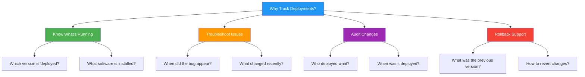
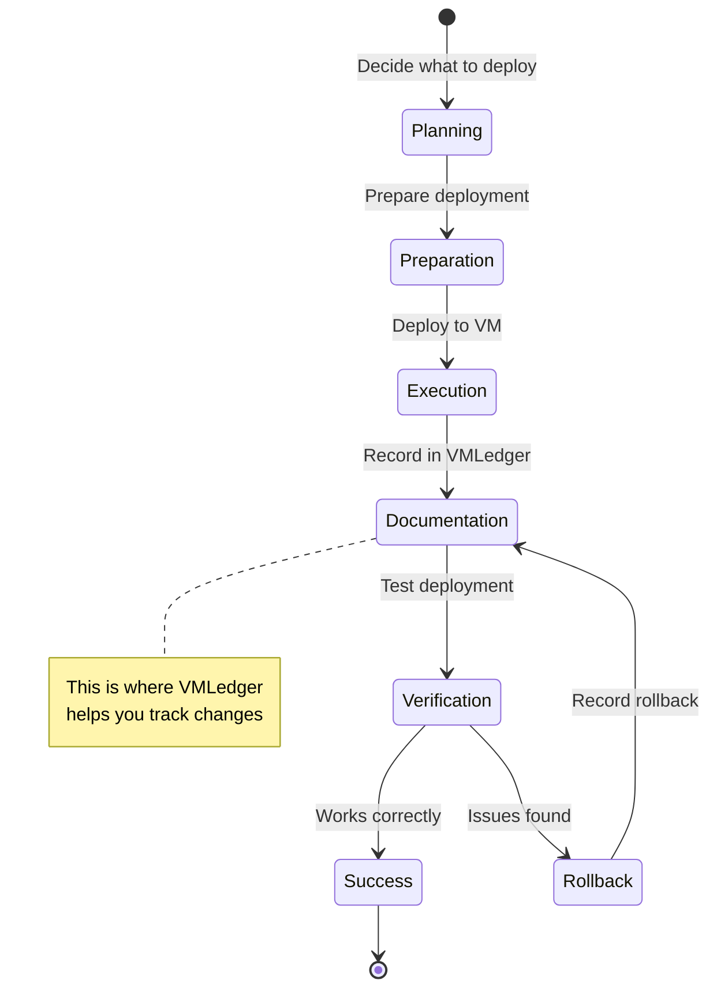
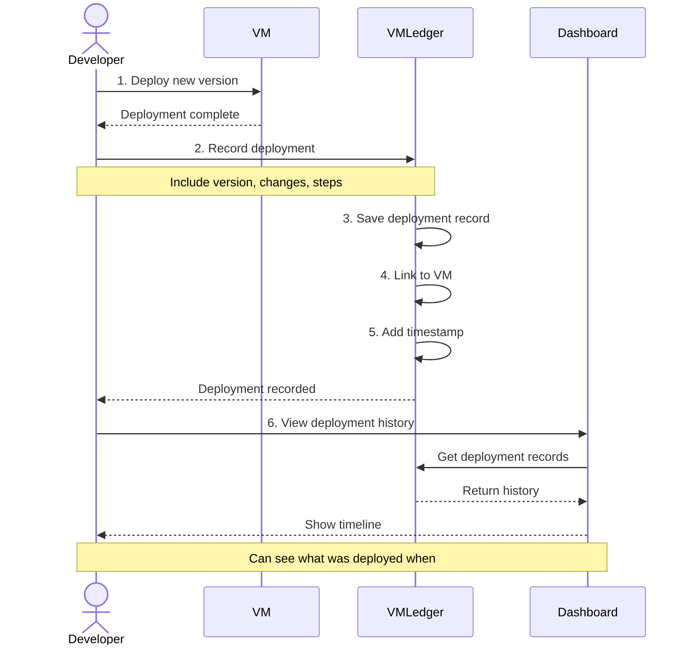
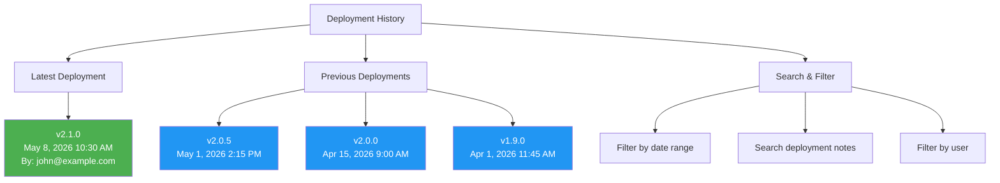
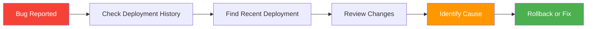
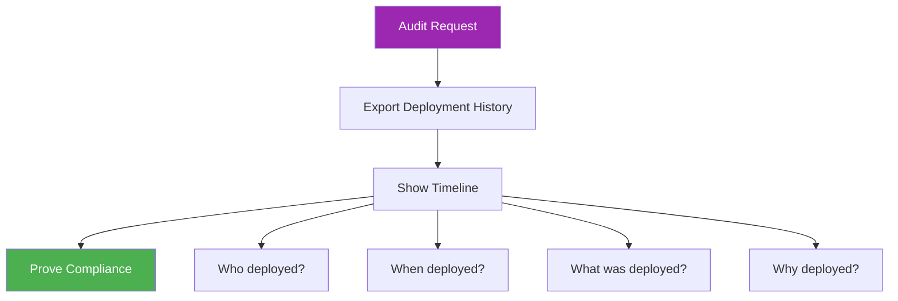
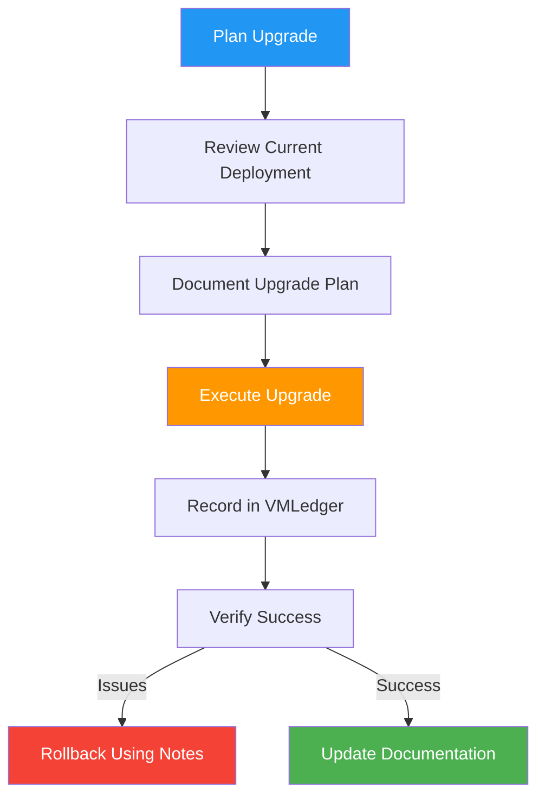
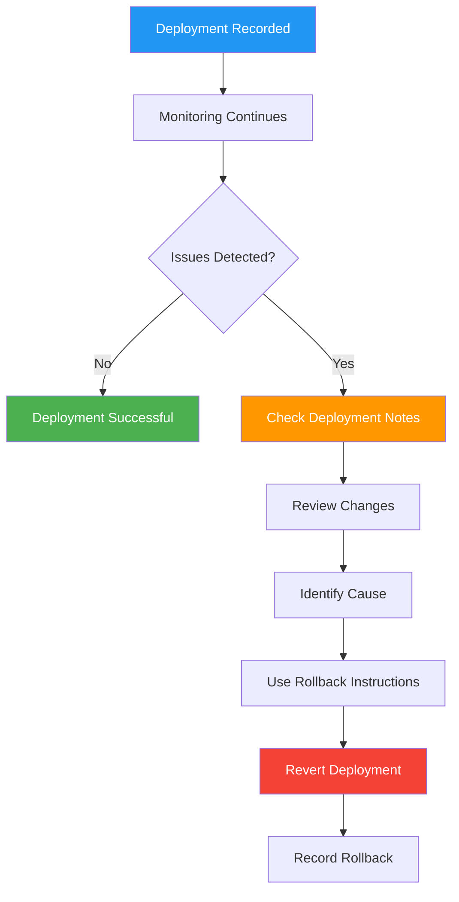

## What are Deployments?

**Deployments** are records of software changes, configurations, or updates made to your VMs. Think of them as a logbook for your infrastructure.

<Info>
  **Real-world analogy**: Like a ship's log that records every journey, deployments track every change to your VMs.
</Info>

## Why Track Deployments?



## Deployment Lifecycle



## Deployment Notes

VMLedger allows you to document deployments using **Markdown-formatted notes**.

### What to Include

<CardGroup cols={2}>
  <Card title="Software Versions" icon="code-branch">
    Document what was deployed
    
    **Example**:
    - Application v2.1.0
    - Node.js 18.16.0
    - PostgreSQL 15.3
  </Card>
  
  <Card title="Configuration Changes" icon="gear">
    Record config modifications
    
    **Example**:
    - Increased memory limit to 4GB
    - Changed port from 3000 to 8080
    - Updated environment variables
  </Card>
  
  <Card title="Deployment Steps" icon="list-check">
    Document the process
    
    **Example**:
    1. Stopped application
    2. Pulled latest code
    3. Ran migrations
    4. Restarted services
  </Card>
  
  <Card title="Rollback Instructions" icon="rotate-left">
    How to undo if needed
    
    **Example**:
    - Previous version: v2.0.5
    - Rollback command: `git checkout v2.0.5`
    - Restart required: Yes
  </Card>
</CardGroup>

### Markdown Support

VMLedger supports full Markdown formatting:

<Tabs>
  <Tab title="Headers">
    ```markdown
    # Main Deployment
    ## Software Installed
    ### Version Details
    ```
    
    Renders as:
    # Main Deployment
    ## Software Installed
    ### Version Details
  </Tab>
  
  <Tab title="Lists">
    ```markdown
    **Installed Software:**
    - Nginx 1.24.0
    - Node.js 18.16.0
    - PM2 5.3.0
    
    **Steps:**
    1. Stop services
    2. Update code
    3. Restart services
    ```
    
    **Installed Software:**
    - Nginx 1.24.0
    - Node.js 18.16.0
    - PM2 5.3.0
    
    **Steps:**
    1. Stop services
    2. Update code
    3. Restart services
  </Tab>
  
  <Tab title="Code Blocks">
    ````markdown
    **Configuration:**
    ```nginx
    server {
        listen 80;
        server_name example.com;
    }
    ```
    ````
    
    **Configuration:**
    ```nginx
    server {
        listen 80;
        server_name example.com;
    }
    ```
  </Tab>
  
  <Tab title="Tables">
    ```markdown
    | Service | Version | Status |
    |---------|---------|--------|
    | Nginx   | 1.24.0  | ✓ Running |
    | Node.js | 18.16.0 | ✓ Running |
    | Redis   | 7.0.11  | ✓ Running |
    ```
    
    | Service | Version | Status |
    |---------|---------|--------|
    | Nginx   | 1.24.0  | ✓ Running |
    | Node.js | 18.16.0 | ✓ Running |
    | Redis   | 7.0.11  | ✓ Running |
  </Tab>
</Tabs>

### Character Limit

<Warning>
  Deployment notes are limited to **50,000 characters**. This is enough for very detailed documentation!
</Warning>

**What 50,000 characters means**:
- ~8,000 words
- ~20 pages of text
- Plenty of space for detailed documentation

## Deployment Workflow

### Complete Deployment Process



### Step-by-Step Guide

<Steps>
  <Step title="Deploy to Your VM">
    First, make your changes to the VM:
    ```bash
    # SSH into VM
    ssh user@192.168.1.100
    
    # Deploy your application
    git pull origin main
    npm install
    npm run build
    pm2 restart app
    ```
  </Step>
  
  <Step title="Open VMLedger Dashboard">
    Navigate to your VM in VMLedger:
    1. Go to http://localhost:3000
    2. Click on your VM
    3. Go to "Deployments" tab
  </Step>
  
  <Step title="Create Deployment Record">
    Click "Add Deployment" and document:
    
    ```markdown
    # Deployment: v2.1.0
    
    ## Changes
    - Fixed login bug (#123)
    - Added user profile page
    - Updated dependencies
    
    ## Deployed Software
    - Application: v2.1.0
    - Node.js: 18.16.0
    - Database: PostgreSQL 15.3
    
    ## Steps Taken
    1. Pulled latest code from main branch
    2. Installed dependencies: `npm install`
    3. Built application: `npm run build`
    4. Restarted PM2: `pm2 restart app`
    
    ## Verification
    - ✓ Application starts successfully
    - ✓ Login works correctly
    - ✓ All tests pass
    
    ## Rollback
    Previous version: v2.0.5
    Command: `git checkout v2.0.5 && npm install && npm run build && pm2 restart app`
    ```
  </Step>
  
  <Step title="Save and Verify">
    - Click "Save Deployment"
    - Verify it appears in deployment history
    - Check timestamp is correct
  </Step>
</Steps>

## Deployment History

### Viewing Deployment Timeline



**What You Can See**:

<AccordionGroup>
  <Accordion title="Deployment Timeline">
    Chronological list of all deployments:
    - Most recent first
    - Timestamp for each
    - Who deployed it
    - Quick preview of changes
  </Accordion>
  
  <Accordion title="Deployment Details">
    Click any deployment to see:
    - Full deployment notes (Markdown rendered)
    - Exact timestamp
    - User who created the record
    - Link to VM
  </Accordion>
  
  <Accordion title="Search Deployments">
    Find specific deployments:
    - Search by version number
    - Search by software name
    - Search in deployment notes
    - Filter by date range
  </Accordion>
</AccordionGroup>

## Use Cases

### 1. Troubleshooting

**Scenario**: Application started crashing after recent deployment



**How VMLedger Helps**:
1. View deployment history
2. See what changed recently
3. Check deployment notes for clues
4. Find rollback instructions
5. Revert to previous version

### 2. Compliance & Auditing

**Scenario**: Need to prove what was deployed when



**What You Can Prove**:
- Complete deployment history
- Who made each change
- When changes were made
- What was deployed
- Why it was deployed (from notes)

### 3. Knowledge Sharing

**Scenario**: New team member needs to understand infrastructure


**What They Learn**:
- What software is installed
- How deployments are done
- Common issues and solutions
- Rollback procedures

### 4. Change Management

**Scenario**: Planning a major upgrade



## Best Practices

### Documentation Standards

<Tabs>
  <Tab title="Good Example">
    ```markdown
    # Deployment: Application v2.1.0
    
    **Date**: May 8, 2026 10:30 AM
    **Deployed by**: john@example.com
    **Environment**: Production
    
    ## Summary
    Deployed application version 2.1.0 with bug fixes and new features.
    
    ## Changes
    - Fixed critical login bug (#123)
    - Added user profile page (#145)
    - Updated Node.js to 18.16.0
    - Updated all npm dependencies
    
    ## Deployed Components
    | Component | Version | Previous |
    |-----------|---------|----------|
    | Application | 2.1.0 | 2.0.5 |
    | Node.js | 18.16.0 | 18.15.0 |
    | Nginx | 1.24.0 | 1.24.0 |
    
    ## Deployment Steps
    1. Created backup: `pg_dump mydb > backup.sql`
    2. Stopped application: `pm2 stop app`
    3. Pulled code: `git pull origin main`
    4. Installed deps: `npm install`
    5. Built app: `npm run build`
    6. Ran migrations: `npm run migrate`
    7. Started app: `pm2 start app`
    
    ## Verification
    - ✓ Application starts without errors
    - ✓ Login functionality works
    - ✓ All automated tests pass
    - ✓ Health check returns 200 OK
    
    ## Rollback Instructions
    If issues occur:
    ```bash
    git checkout v2.0.5
    npm install
    npm run build
    pm2 restart app
    psql mydb < backup.sql  # If needed
    ```
    
    ## Notes
    - Database migration added new `user_profiles` table
    - No downtime during deployment
    - Monitoring shows normal performance
    ```
    
    ✅ **Why this is good**:
    - Clear structure
    - Complete information
    - Easy to understand
    - Includes rollback steps
    - Documents verification
  </Tab>
  
  <Tab title="Bad Example">
    ```markdown
    deployed new version
    ```
    
    ❌ **Why this is bad**:
    - No version number
    - No details about changes
    - No deployment steps
    - No rollback instructions
    - Not useful for troubleshooting
  </Tab>
</Tabs>

### Deployment Note Template

```markdown
# Deployment: [Application Name] [Version]

**Date**: [Date and Time]
**Deployed by**: [Your Email]
**Environment**: [Production/Staging/Development]

## Summary
[Brief description of what was deployed and why]

## Changes
- [Change 1]
- [Change 2]
- [Change 3]

## Deployed Components
| Component | Version | Previous Version |
|-----------|---------|------------------|
| [Name] | [New] | [Old] |

## Deployment Steps
1. [Step 1]
2. [Step 2]
3. [Step 3]

## Verification
- [ ] [Check 1]
- [ ] [Check 2]
- [ ] [Check 3]

## Rollback Instructions
If issues occur:
```bash
[Rollback commands]
```

## Notes
[Any additional information, warnings, or observations]
```

### When to Create Deployment Records

<CardGroup cols={2}>
  <Card title="Always Record" icon="check">
    **Create deployment record for**:
    - Application version updates
    - Configuration changes
    - Software installations
    - Security patches
    - Database migrations
    - Infrastructure changes
  </Card>
  
  <Card title="Optional" icon="circle-question">
    **Consider recording for**:
    - Minor config tweaks
    - Log file rotations
    - Temporary debugging changes
    - Routine maintenance
    
    *Use your judgment based on importance*
  </Card>
</CardGroup>

## Integration with Monitoring

Deployments and monitoring work together:



**How They Connect**:
1. Deploy changes to VM
2. Record deployment in VMLedger
3. Monitoring detects issues (if any)
4. Check deployment notes for context
5. Use rollback instructions if needed

## API Integration

Automate deployment tracking:

<CodeGroup>
```bash cURL
# Create deployment record
curl -X POST http://localhost:8000/api/deployments \
  -H "Authorization: Bearer $TOKEN" \
  -H "Content-Type: application/json" \
  -d '{
    "vm_id": 1,
    "notes": "# Deployment: v2.1.0\n\n## Changes\n- Fixed bug #123"
  }'
```

```python Python
import requests

# After deploying to VM
deployment = {
    "vm_id": 1,
    "notes": """
# Deployment: v2.1.0

## Changes
- Fixed bug #123
- Updated dependencies

## Steps
1. git pull
2. npm install
3. pm2 restart
    """
}

response = requests.post(
    "http://localhost:8000/api/deployments",
    headers={"Authorization": f"Bearer {token}"},
    json=deployment
)
```

```javascript JavaScript
// In your deployment script
async function recordDeployment(vmId, version, changes) {
  const notes = `
# Deployment: ${version}

## Changes
${changes.map(c => `- ${c}`).join('\n')}

## Deployed at
${new Date().toISOString()}
  `;
  
  await fetch('http://localhost:8000/api/deployments', {
    method: 'POST',
    headers: {
      'Authorization': `Bearer ${token}`,
      'Content-Type': 'application/json'
    },
    body: JSON.stringify({ vm_id: vmId, notes })
  });
}
```
</CodeGroup>

## Troubleshooting

<AccordionGroup>
  <Accordion title="Cannot save deployment notes">
    **Possible causes**:
    1. Notes exceed 50,000 characters
    2. Invalid Markdown syntax
    3. Network error
    
    **Solutions**:
    - Check character count
    - Validate Markdown syntax
    - Try saving again
    - Shorten notes if too long
  </Accordion>
  
  <Accordion title="Markdown not rendering correctly">
    **Possible causes**:
    1. Invalid Markdown syntax
    2. Unsupported Markdown features
    
    **Solutions**:
    - Check Markdown syntax
    - Use standard Markdown features
    - Preview before saving
    - Test with simple Markdown first
  </Accordion>
  
  <Accordion title="Cannot find old deployment">
    **Possible causes**:
    1. Deployment was deleted
    2. Wrong VM selected
    3. Search filters too restrictive
    
    **Solutions**:
    - Check you're viewing correct VM
    - Clear search filters
    - Check date range
    - Verify deployment wasn't deleted
  </Accordion>
</AccordionGroup>

## Next Steps

<CardGroup cols={2}>
  <Card title="Deployment API" icon="code" href="/api-reference/deployments">
    Complete deployment API documentation
  </Card>
  
  <Card title="Deployment Guide" icon="book" href="/guides/managing-deployments">
    Step-by-step deployment workflow
  </Card>
  
  <Card title="Monitoring" icon="heart-pulse" href="/concepts/monitoring">
    How monitoring relates to deployments
  </Card>
  
  <Card title="Search" icon="magnifying-glass" href="/features/search-engine">
    Search deployment notes
  </Card>
</CardGroup>
