## What is Monitoring?

**Monitoring** means continuously checking if your VMs are healthy and collecting information about their performance.

<Info>
  Think of monitoring like a doctor checking your vital signs (heart rate, blood pressure, temperature) to make sure you're healthy!
</Info>

## Types of Monitoring

VMLedger performs two types of monitoring:

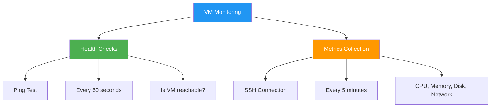

### 1. Health Checks (Ping)

**Purpose**: Quickly check if VM is online

**How it works**:
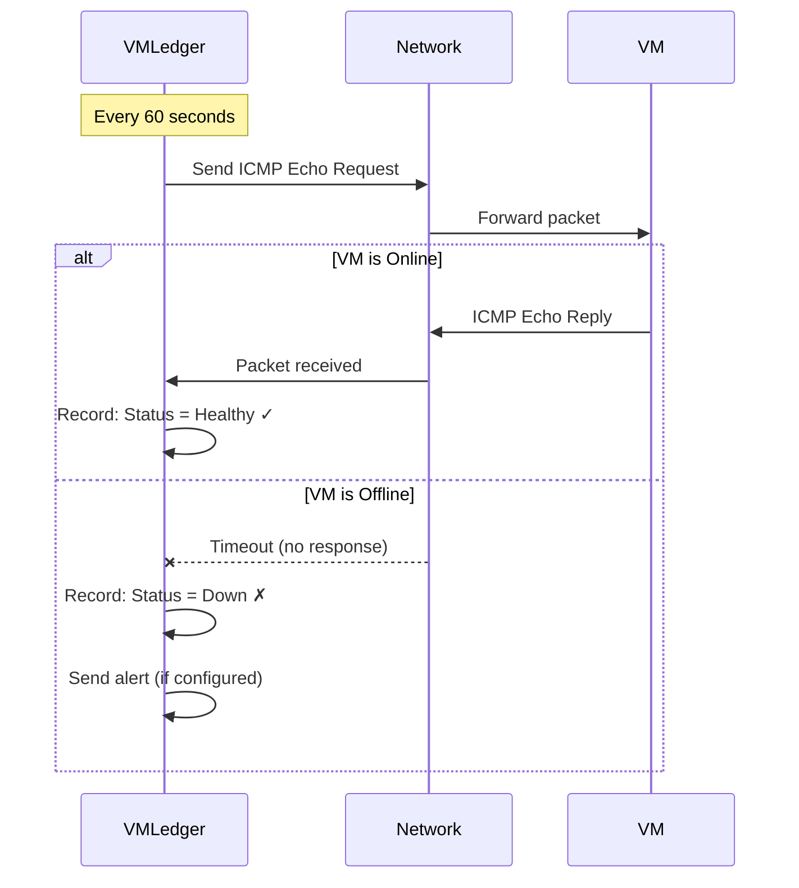

<Accordion title="What is ICMP Ping?">
  **ICMP (Internet Control Message Protocol)** is like sending a "Hello?" message to your VM.
  
  **How it works**:
  1. VMLedger sends: "Are you there?"
  2. VM responds: "Yes, I'm here!"
  3. VMLedger records: "VM is healthy"
  
  **If no response**: VM might be down, network issue, or firewall blocking
</Accordion>

### 2. Metrics Collection (SSH)

**Purpose**: Collect detailed system information

**How it works**:
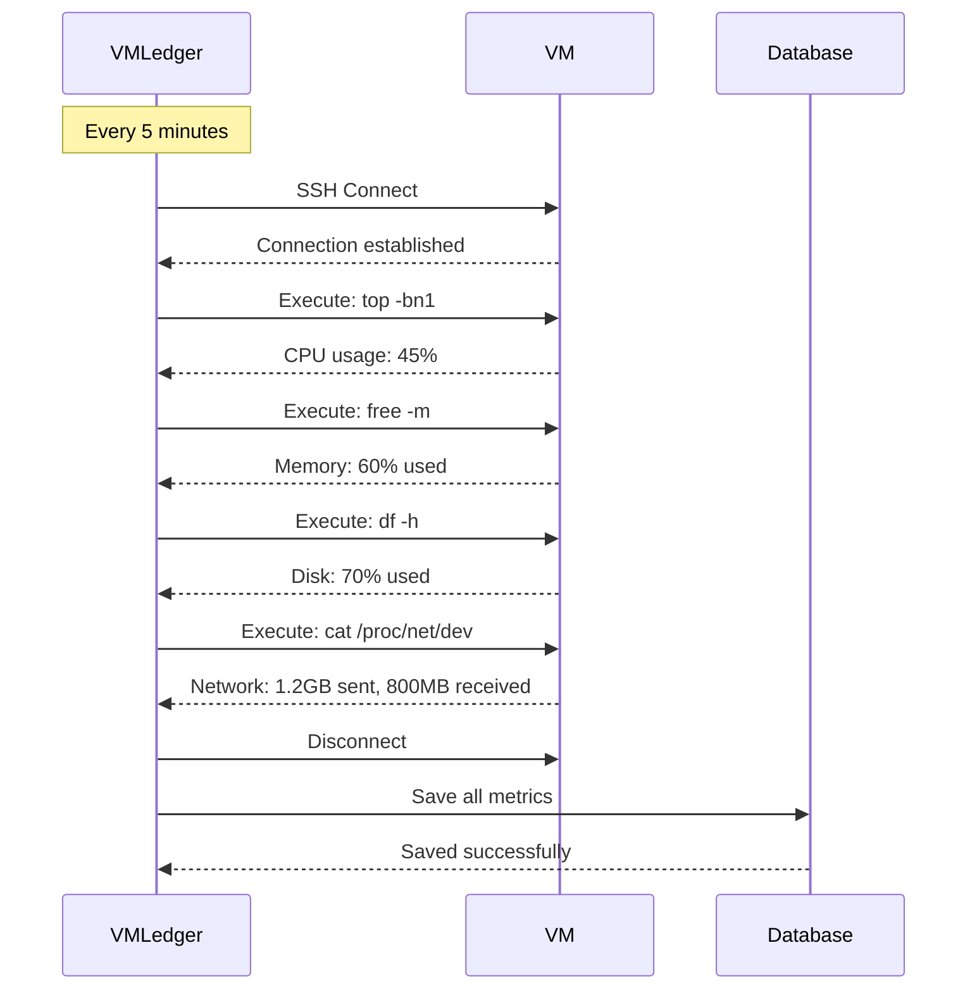

## Monitoring Intervals

```mermaid
gantt
    title Monitoring Timeline
    dateFormat  ss
    axisFormat  %S sec
    
    section Health Checks
    Ping Check 1    :done, 00, 1s
    Wait           :active, 01, 59s
    Ping Check 2    :done, 60, 1s
    Wait           :active, 61, 59s
    Ping Check 3    :done, 120, 1s
    
    section Metrics
    Collect Metrics 1 :crit, 00, 5s
    Wait             :active, 05, 295s
    Collect Metrics 2 :crit, 300, 5s
```

<CardGroup cols={2}>
  <Card title="Health Checks" icon="heart-pulse">
    **Frequency**: Every 60 seconds
    
    **Duration**: < 1 second
    
    **Purpose**: Quick availability check
    
    **Impact**: Minimal (tiny network packet)
  </Card>
  
  <Card title="Metrics Collection" icon="chart-line">
    **Frequency**: Every 5 minutes (300 seconds)
    
    **Duration**: 2-5 seconds
    
    **Purpose**: Detailed performance data
    
    **Impact**: Low (brief SSH connection)
  </Card>
</CardGroup>

## Collected Metrics

### CPU Usage

**What it measures**: How much processing power is being used

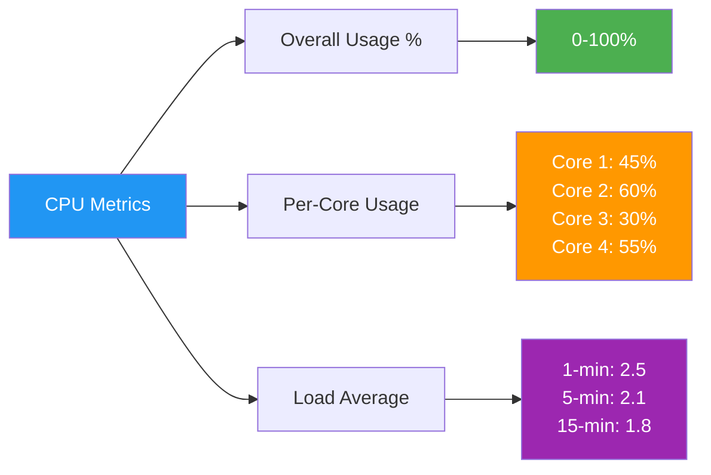

**Interpretation**:

<Tabs>
  <Tab title="0-50% (Normal)">
    **Status**: ✓ Healthy
    
    **Meaning**: VM has plenty of CPU capacity
    
    **Action**: None needed
    
    **Example**: Web server handling normal traffic
  </Tab>
  
  <Tab title="50-80% (Busy)">
    **Status**: ⚠️ Elevated
    
    **Meaning**: VM is working hard but managing
    
    **Action**: Monitor closely, consider scaling if sustained
    
    **Example**: Database during peak hours
  </Tab>
  
  <Tab title="80-100% (Overloaded)">
    **Status**: ⚠️ Critical
    
    **Meaning**: VM is at maximum capacity
    
    **Action**: Investigate immediately, scale up or optimize
    
    **Example**: Application under heavy load or runaway process
  </Tab>
</Tabs>

### Memory Usage

**What it measures**: How much RAM is being used

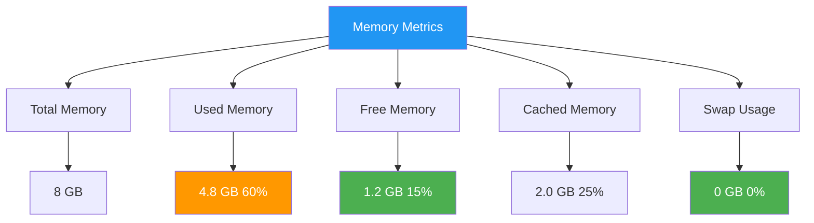

**Interpretation**:

<AccordionGroup>
  <Accordion title="0-60% Used (Normal)">
    **Status**: ✓ Healthy
    
    **What it means**: Plenty of memory available
    
    **Linux note**: Linux uses "free" memory for caching, so high cache is normal!
  </Accordion>
  
  <Accordion title="60-85% Used (High)">
    **Status**: ⚠️ Elevated
    
    **What it means**: Memory is getting tight
    
    **Action**: Monitor applications, consider adding RAM
  </Accordion>
  
  <Accordion title="85-100% Used (Critical)">
    **Status**: ⚠️ Critical
    
    **What it means**: Running out of memory
    
    **Symptoms**: Slow performance, applications crashing
    
    **Action**: Restart services, add RAM, or optimize applications
  </Accordion>
  
  <Accordion title="Swap Usage > 0">
    **Status**: ⚠️ Warning
    
    **What it means**: System is using disk as "virtual memory"
    
    **Impact**: Significant performance degradation
    
    **Action**: Add more RAM or reduce memory usage
  </Accordion>
</AccordionGroup>

### Disk Usage

**What it measures**: How much storage space is used

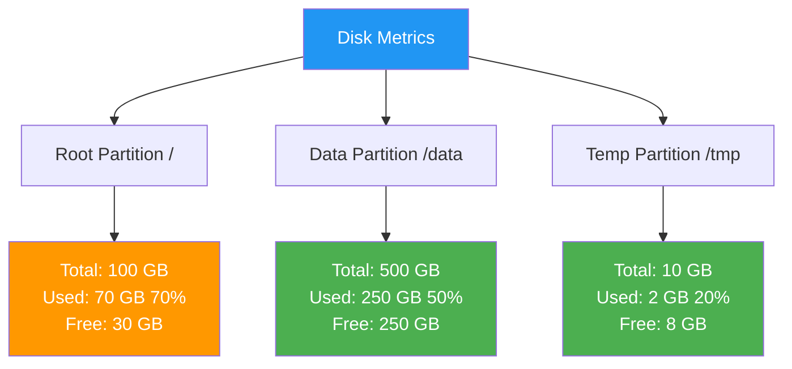

**Interpretation**:

| Usage | Status | Action |
|-------|--------|--------|
| 0-70% | ✓ Normal | None needed |
| 70-90% | ⚠️ High | Plan cleanup or expansion |
| 90-95% | ⚠️ Critical | Clean up immediately |
| 95-100% | ⚠️ Emergency | System may fail, clean up now! |

<Warning>
  **Disk full = System failure!** When disk reaches 100%, applications crash, logs stop writing, and system becomes unstable.
</Warning>

### Network Traffic

**What it measures**: Data sent and received over network

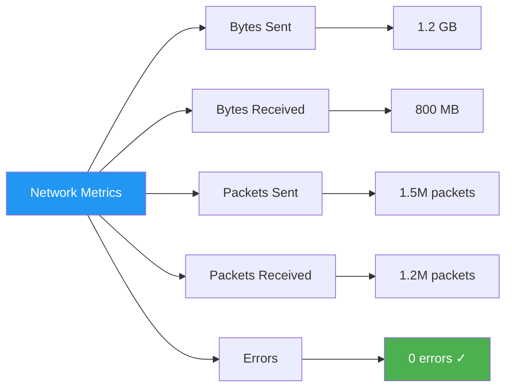

**What to watch for**:

<CardGroup cols={2}>
  <Card title="High Traffic" icon="arrow-up">
    **Normal**: Web server, database, file server
    
    **Abnormal**: Sudden spike (DDoS attack, data breach)
  </Card>
  
  <Card title="Network Errors" icon="triangle-exclamation">
    **Causes**: Bad network cable, faulty NIC, network congestion
    
    **Action**: Check physical connections, replace hardware
  </Card>
</CardGroup>

## Monitoring Workflow

### Complete Monitoring Cycle

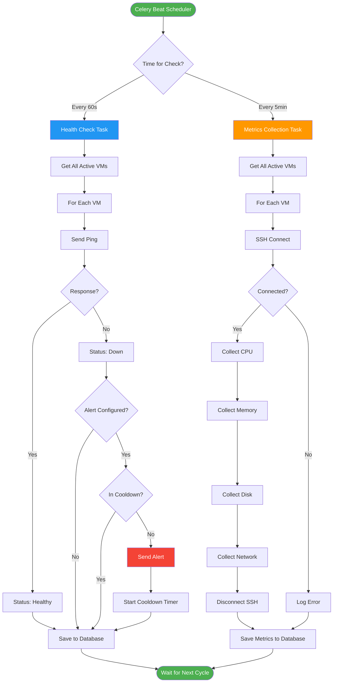

### Data Storage

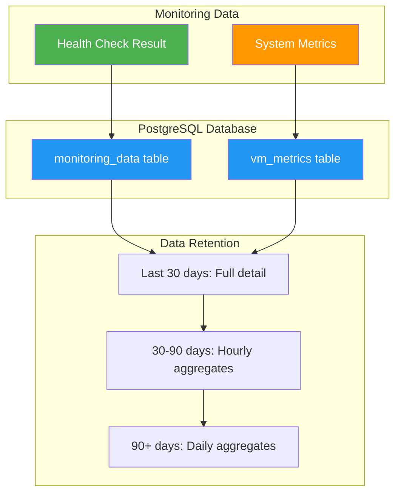

<Info>
  **Data retention** helps manage database size while keeping historical trends available.
</Info>

## Monitoring Dashboard

### What You See

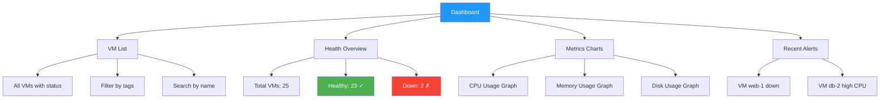

### Real-Time Updates

The dashboard updates automatically:

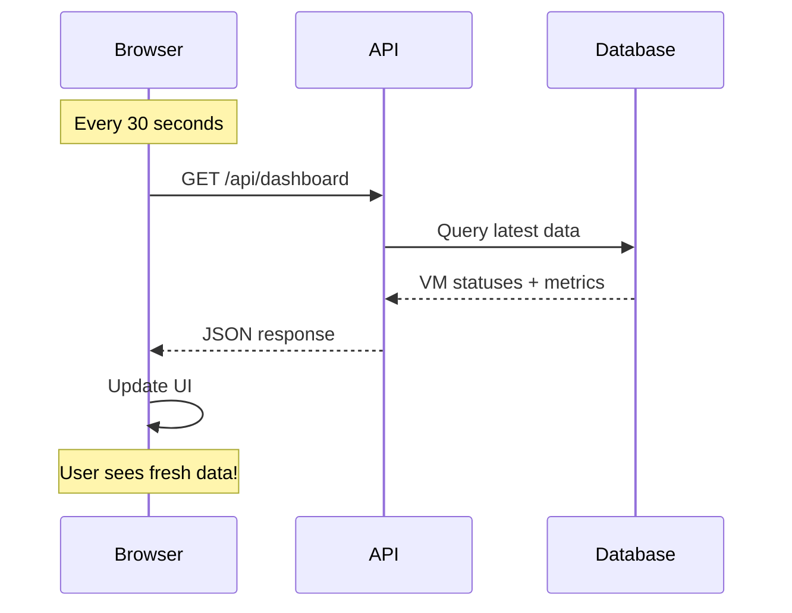

## Monitoring Best Practices

### 1. Set Appropriate Intervals

<Tabs>
  <Tab title="Critical Systems">
    **Health Checks**: Every 30 seconds
    **Metrics**: Every 2 minutes
    
    **Use for**: Production databases, payment systems, critical APIs
  </Tab>
  
  <Tab title="Standard Systems">
    **Health Checks**: Every 60 seconds (default)
    **Metrics**: Every 5 minutes (default)
    
    **Use for**: Most production systems
  </Tab>
  
  <Tab title="Development Systems">
    **Health Checks**: Every 5 minutes
    **Metrics**: Every 15 minutes
    
    **Use for**: Development, testing environments
  </Tab>
</Tabs>

### 2. Configure Alerts Wisely

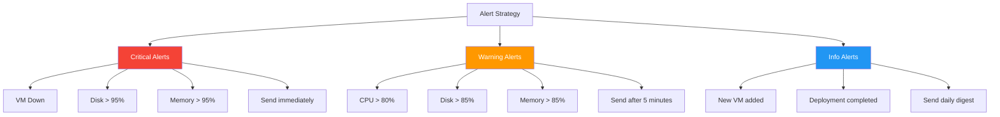

### 3. Use Tags for Organization

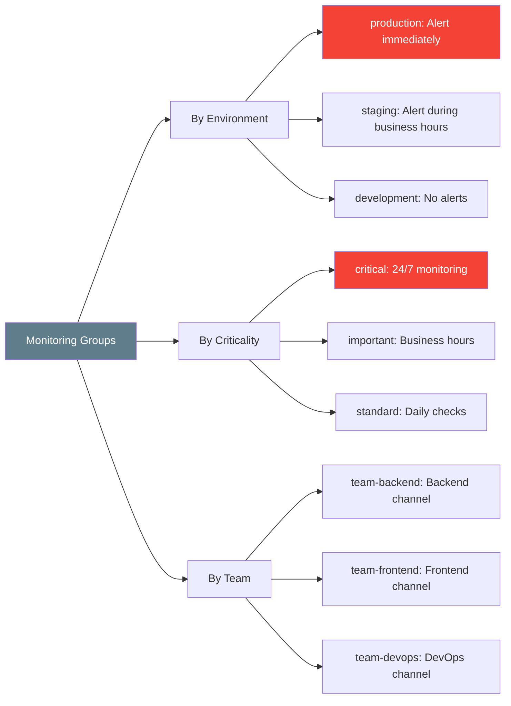

## Troubleshooting Monitoring Issues

<AccordionGroup>
  <Accordion title="Health checks always fail">
    **Symptoms**: VM shows as "Down" but it's actually running
    
    **Possible causes**:
    1. **Firewall blocking ICMP**: Allow ping from VMLedger server
    2. **ICMP disabled on VM**: Enable ICMP echo replies
    3. **Network routing issue**: Check network path
    
    **Test manually**:
    ```bash
    # From VMLedger server
    ping -c 4 <vm-ip-address>
    ```
    
    **Fix**:
    ```bash
    # On VM (Ubuntu/Debian)
    sudo ufw allow from <vmledger-ip> to any proto icmp
    
    # On VM (CentOS/RHEL)
    sudo firewall-cmd --add-rich-rule='rule family="ipv4" source address="<vmledger-ip>" protocol value="icmp" accept' --permanent
    sudo firewall-cmd --reload
    ```
  </Accordion>
  
  <Accordion title="Metrics not collecting">
    **Symptoms**: No CPU/memory/disk data shown
    
    **Possible causes**:
    1. **SSH connection failed**: Wrong credentials
    2. **SSH port blocked**: Firewall issue
    3. **Commands not found**: Missing system tools
    
    **Test manually**:
    ```bash
    # Test SSH connection
    ssh -i /path/to/key username@<vm-ip> -p <port>
    
    # Test commands
    top -bn1 | head -5
    free -m
    df -h
    ```
    
    **Fix**:
    - Verify SSH credentials in VMLedger
    - Check firewall allows SSH from VMLedger server
    - Install missing tools: `sudo apt-get install procps sysstat`
  </Accordion>
  
  <Accordion title="Metrics delayed or missing">
    **Symptoms**: Metrics are old or gaps in data
    
    **Possible causes**:
    1. **Celery workers overloaded**: Too many VMs
    2. **Database slow**: Performance issue
    3. **Network latency**: Slow SSH connections
    
    **Check Celery workers**:
    ```bash
    docker-compose logs celery-worker
    ```
    
    **Fix**:
    - Add more Celery workers
    - Increase monitoring intervals
    - Optimize database queries
  </Accordion>
  
  <Accordion title="High CPU on VMLedger server">
    **Symptoms**: VMLedger itself using too much CPU
    
    **Possible causes**:
    1. **Too many VMs**: Monitoring hundreds of VMs
    2. **Intervals too short**: Checking too frequently
    3. **Inefficient queries**: Database performance
    
    **Solutions**:
    - Increase monitoring intervals
    - Add more Celery workers
    - Optimize database with indexes
    - Scale VMLedger horizontally
  </Accordion>
</AccordionGroup>

## Next Steps

<CardGroup cols={2}>
  <Card title="Alerts" icon="bell" href="/features/alerting">
    Set up notifications for monitoring events
  </Card>
  
  <Card title="Metrics API" icon="code" href="/api-reference/monitoring">
    Access monitoring data programmatically
  </Card>
  
  <Card title="Dashboards" icon="chart-line" href="/features/health-monitoring">
    Visualize your monitoring data
  </Card>
  
  <Card title="Troubleshooting" icon="wrench" href="/development/troubleshooting">
    Common monitoring issues and solutions
  </Card>
</CardGroup>
