## What is VMLedger?

VMLedger is a **centralized platform** for managing and monitoring virtual machines (VMs). Think of it as a control center where you can:

- 📋 Keep track of all your VMs in one place
- 💓 Monitor their health automatically
- 🔔 Get notified when something goes wrong
- 🚀 Track deployments and changes
- 🔍 Search and filter your VM inventory
- 📦 Manage LXC containers on your hosts
- 🩺 Monitor systemd service health
- 📜 Stream real-time logs from any VM

<Note>
  **New to infrastructure management?** Don't worry! We'll explain everything step by step.
</Note>

## How VMLedger Works

Here's a simple overview of how VMLedger operates:

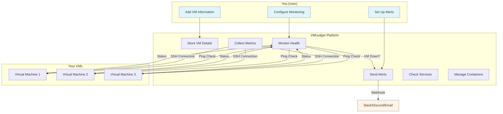

### Step-by-Step Process

<Steps>
  <Step title="Add Your VMs">
    You provide basic information about your VMs:
    - Hostname (a friendly name)
    - IP address
    - SSH credentials (for remote access)
    - Optional tags for organization
  </Step>
  
  <Step title="Automatic Monitoring Starts">
    VMLedger automatically begins monitoring:
    - **Every 60 seconds**: Checks if VM is reachable (ping)
    - **Every 5 minutes**: Collects system metrics (CPU, memory, disk)
  </Step>
  
  <Step title="Get Notified">
    When something goes wrong:
    - VMLedger detects the issue
    - Sends notification to your webhook (Slack, Discord, etc.)
    - Records the event in alert history
  </Step>
  
  <Step title="Track Changes">
    Keep a record of deployments:
    - What was deployed
    - When it was deployed
    - Who deployed it
    - Deployment notes
  </Step>
</Steps>

## Key Concepts Explained

### 1. Virtual Machines (VMs)

<Accordion title="What is a Virtual Machine?">
  A **virtual machine** is like a computer running inside another computer. It has its own:
  - Operating system (Linux, Windows, etc.)
  - CPU and memory allocation
  - Network connection (IP address)
  - Storage space
  
  **Example**: You might have a physical server running 10 virtual machines, each hosting a different application.
</Accordion>

In VMLedger, each VM entry contains:

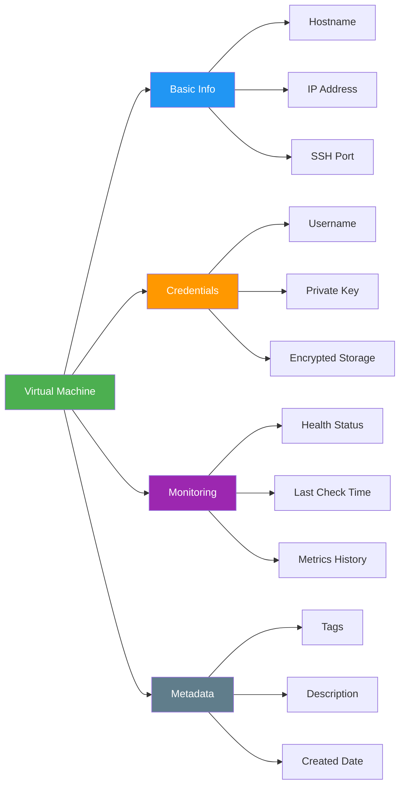

### 2. Health Monitoring

VMLedger continuously checks if your VMs are healthy:

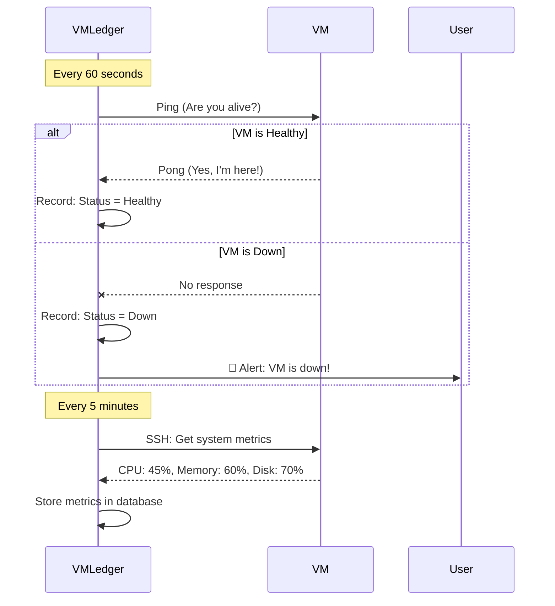

<Info>
  **Ping** is like saying "Hello, are you there?" to your VM. If it responds, it's healthy!
</Info>

### 3. System Metrics

VMLedger collects detailed information about your VMs:

<CardGroup cols={2}>
  <Card title="CPU Usage" icon="microchip">
    How much processing power is being used
    - **0-50%**: Normal
    - **50-80%**: Busy
    - **80-100%**: Overloaded
  </Card>
  
  <Card title="Memory Usage" icon="memory">
    How much RAM is being used
    - **0-60%**: Normal
    - **60-85%**: High
    - **85-100%**: Critical
  </Card>
  
  <Card title="Disk Usage" icon="hard-drive">
    How much storage space is used
    - **0-70%**: Normal
    - **70-90%**: High
    - **90-100%**: Critical
  </Card>
  
  <Card title="Network Traffic" icon="network-wired">
    Data sent and received
    - Bytes sent
    - Bytes received
    - Network errors
  </Card>
</CardGroup>

### 4. Alerts and Notifications

When something goes wrong, VMLedger notifies you:

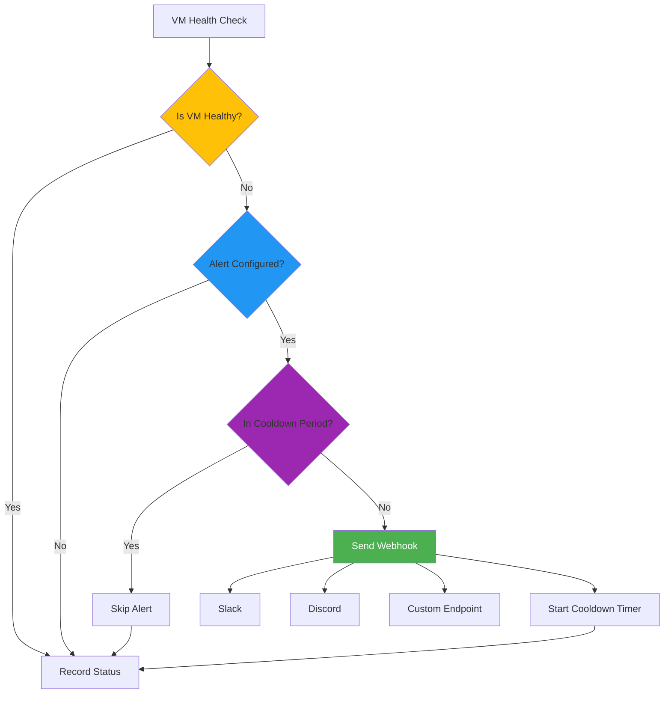

<Accordion title="What is a Cooldown Period?">
  A **cooldown period** prevents alert spam. 
  
  **Example**: If your VM goes down, VMLedger sends an alert. Then it waits 15 minutes (cooldown) before sending another alert about the same VM.
  
  **Why?** Without cooldown, you might get hundreds of alerts for the same issue!
</Accordion>

### 5. Deployments

Track what you deploy to your VMs:

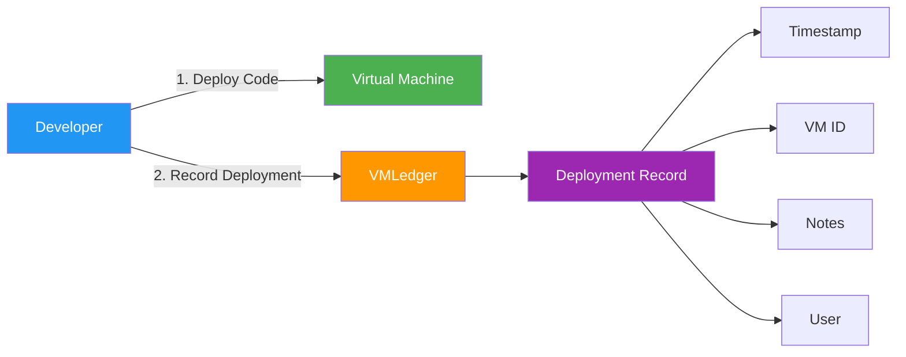

**Example Deployment Record**:
```json
{
  "vm_id": 5,
  "deployed_at": "2026-05-08T10:30:00Z",
  "deployed_by": "john@example.com",
  "notes": "Deployed v2.1.0 with bug fixes for login issue"
}
```

### 6. Search and Filtering

Find VMs quickly using tags and filters:

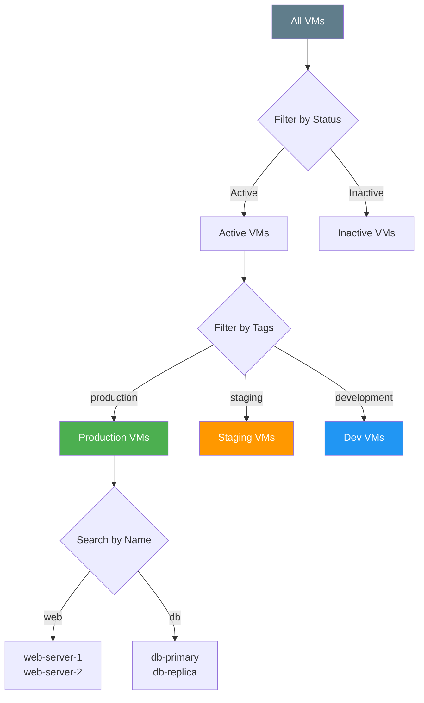

## Data Flow Overview

Here's how data flows through VMLedger:

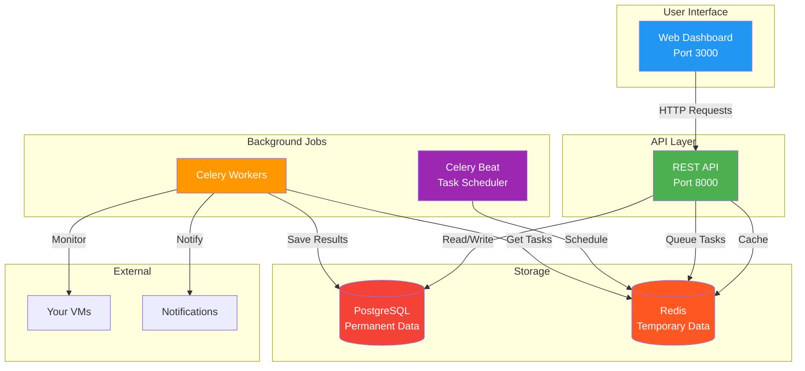

## Security Concepts

VMLedger keeps your data secure:

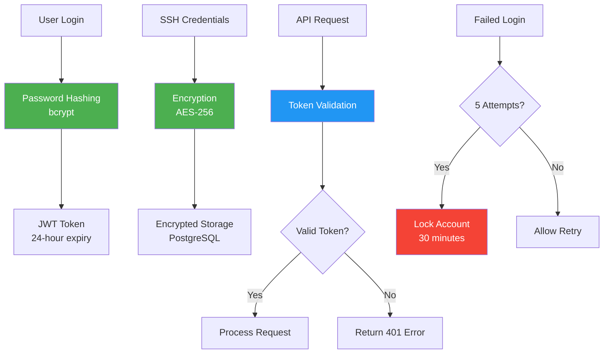

<AccordionGroup>
  <Accordion title="Password Hashing">
    Your password is never stored as plain text. VMLedger uses **bcrypt** to convert it into a scrambled string that can't be reversed.
    
    **Example**:
    - Your password: `MySecurePass123!`
    - Stored in database: `$2b$12$KIXxKj8N9yGmP7vQx.../...`
  </Accordion>
  
  <Accordion title="JWT Tokens">
    After login, you receive a **JWT token** (like a temporary pass). This token:
    - Expires after 24 hours
    - Must be included in every API request
    - Can be invalidated when you logout
  </Accordion>
  
  <Accordion title="Credential Encryption">
    SSH credentials are encrypted before storage:
    - Uses AES-256 encryption (military-grade)
    - Each user has a unique encryption salt
    - Decrypted only when needed for SSH connections
  </Accordion>
</AccordionGroup>

## Common Workflows

### Adding and Monitoring a VM

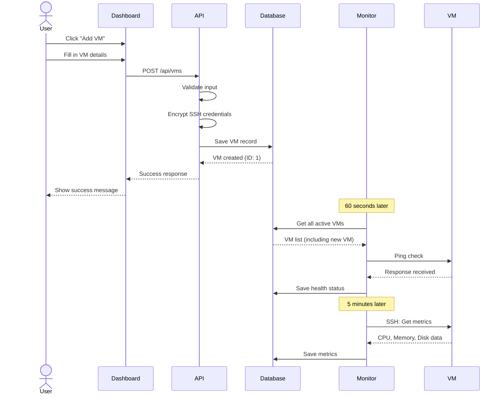

### Receiving an Alert

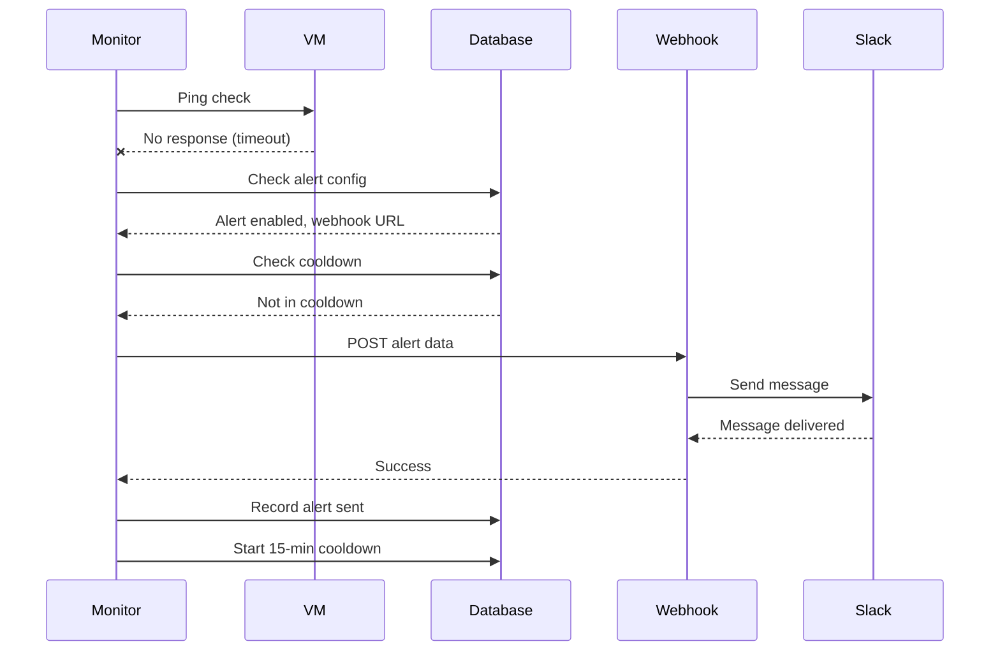

## Next Steps

Now that you understand the core concepts, explore specific features:

<CardGroup cols={2}>
  <Card title="Virtual Machines" icon="server" href="/concepts/virtual-machines">
    Deep dive into VM management
  </Card>
  
  <Card title="Monitoring" icon="heart-pulse" href="/concepts/monitoring">
    Learn about health checks and metrics
  </Card>
  
  <Card title="Authentication" icon="lock" href="/concepts/authentication">
    Understand security and access control
  </Card>
  
  <Card title="Deployments" icon="rocket" href="/concepts/deployments">
    Track changes to your VMs
  </Card>
</CardGroup>

### 7. LXC Container Management

If your VM is a **Proxmox**, **LXD**, or **LXC** host, VMLedger can discover and manage the containers running on it:

```mermaid
flowchart LR
    subgraph Host VM
        A["Container 1<br/>nginx-proxy"]
        B["Container 2<br/>app-backend"]
        C["Container 3<br/>database"]
    end

    D[VMLedger] -->|"SSH + auto-detect"| Host VM
    D -->|"Start / Stop / Restart"| A
    D -->|"Start / Stop / Restart"| B
    D -->|"Start / Stop / Restart"| C

    style D fill:#0d9373,color:#fff
    style A fill:#10b981,color:#fff
    style B fill:#10b981,color:#fff
    style C fill:#10b981,color:#fff
```

<Accordion title="What is LXC?">
  **LXC (Linux Containers)** is a lightweight virtualization technology. Unlike full VMs which run their own kernel, LXC containers share the host's kernel — making them faster and more efficient.

  **Real-world analogy**: VMs are like separate houses, while LXC containers are apartments in the same building — they share the foundation but have their own space.
</Accordion>

### 8. Service Health Monitoring

Beyond checking if a VM is *reachable*, VMLedger can check if specific *services* (like nginx, postgresql) are *running*:

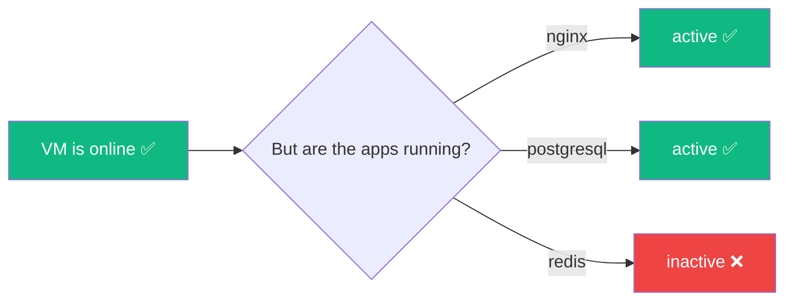

### 9. Live Log Viewer

Watch your VM's system logs in real-time, directly in your browser — read-only, so you can't accidentally break anything:

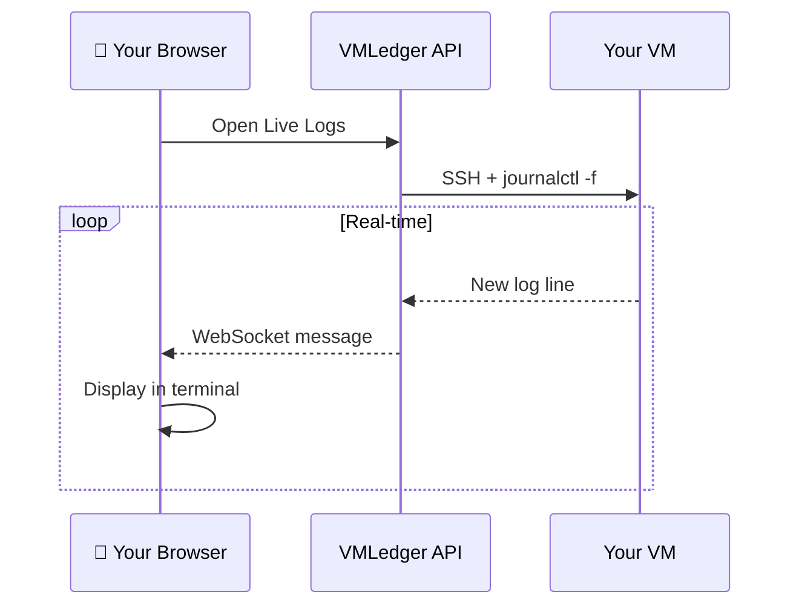

## Glossary

<AccordionGroup>
  <Accordion title="API (Application Programming Interface)">
    A way for programs to talk to each other. VMLedger's API lets you manage VMs programmatically.
  </Accordion>
  
  <Accordion title="SSH (Secure Shell)">
    A secure way to connect to and control remote computers. VMLedger uses SSH to collect metrics from your VMs.
  </Accordion>
  
  <Accordion title="Webhook">
    A way for VMLedger to send notifications to other services (like Slack) when events occur.
  </Accordion>
  
  <Accordion title="JWT (JSON Web Token)">
    A secure token that proves you're logged in. Think of it as a temporary digital ID card.
  </Accordion>
  
  <Accordion title="Ping">
    A simple network test to check if a computer is reachable. Like saying "Hello?" to see if someone's there.
  </Accordion>
  
  <Accordion title="Metrics">
    Measurements of system performance (CPU usage, memory usage, etc.)
  </Accordion>
  
  <Accordion title="Cooldown Period">
    A waiting time before sending another alert for the same issue, preventing alert spam.
  </Accordion>
  
  <Accordion title="LXC (Linux Containers)">
    A lightweight virtualization technology that lets you run multiple isolated Linux systems on a single host. Managed via tools like Proxmox (pct), LXD (lxc), or lxc-utils (lxc-ls).
  </Accordion>
  
  <Accordion title="systemd">
    The service manager used by most modern Linux distributions. VMLedger uses `systemctl is-active` to check if services are running.
  </Accordion>
  
  <Accordion title="journalctl">
    A command to view system logs on Linux. VMLedger's Live Log Viewer streams `journalctl -f` output to your browser.
  </Accordion>
  
  <Accordion title="WebSocket">
    A protocol for real-time, two-way communication between your browser and the server. Used by VMLedger for the SSH terminal and live log streaming.
  </Accordion>
</AccordionGroup>
