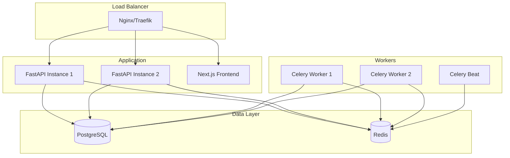

## Deployment Options

<CardGroup cols={2}>
  <Card title="Docker Compose" icon="docker">
    **Best for:** Small to medium deployments (1-100 VMs)
    
    **Pros:**
    - Simple setup
    - All-in-one solution
    - Easy updates
    
    **Cons:**
    - Single server
    - Limited scalability
  </Card>
  
  <Card title="Kubernetes" icon="dharmachakra">
    **Best for:** Large deployments (100+ VMs)
    
    **Pros:**
    - Highly scalable
    - Auto-healing
    - Load balancing
    
    **Cons:**
    - Complex setup
    - Requires K8s knowledge
  </Card>
</CardGroup>

## Architecture

## System Requirements

### Minimum (1-10 VMs)
- **CPU:** 2 cores
- **RAM:** 4 GB
- **Disk:** 20 GB SSD
- **Network:** 10 Mbps

### Recommended (10-50 VMs)
- **CPU:** 4 cores
- **RAM:** 8 GB
- **Disk:** 50 GB SSD
- **Network:** 100 Mbps

### Large Scale (50-100 VMs)
- **CPU:** 8 cores
- **RAM:** 16 GB
- **Disk:** 100 GB SSD
- **Network:** 1 Gbps

## Next Steps

<CardGroup cols={2}>
  <Card title="Docker Compose" icon="docker" href="/deployment/docker-compose">
    Deploy with Docker Compose
  </Card>
  
  <Card title="Production Guide" icon="server" href="/deployment/production">
    Production deployment
  </Card>
  
  <Card title="Environment Variables" icon="gear" href="/deployment/environment-variables">
    Configuration reference
  </Card>
  
  <Card title="Installation" icon="download" href="/installation">
    Installation guide
  </Card>
</CardGroup>
