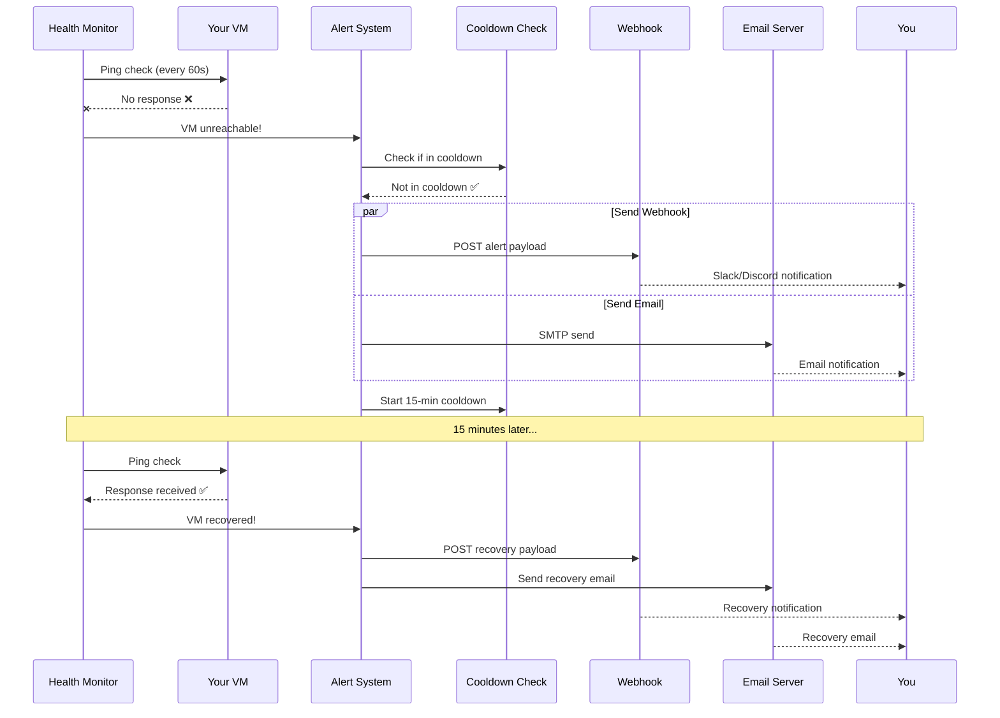

## Overview

The Alerting System is your early warning system for VM failures. It automatically detects when VMs become unreachable and sends notifications via webhooks or email, ensuring you never miss a critical outage.

<Info>
**Real-World Analogy**: Think of alerting like a home security system. Motion sensors (health checks) detect problems, the control panel (alert system) processes the signals, and sirens/notifications (webhooks/emails) alert you immediately. You can configure which sensors trigger alerts and how loud the alarm should be.
</Info>

## Quick Start

### 1. Enable Alerts for a VM

```bash
curl -X PUT http://localhost:8000/api/vms/123/alerts/config \
  -H "Authorization: Bearer YOUR_TOKEN" \
  -H "Content-Type: application/json" \
  -d '{
    "enabled": true,
    "webhook_url": "https://hooks.slack.com/services/YOUR/WEBHOOK/URL",
    "email_recipient": "admin@example.com",
    "cooldown_minutes": 15
  }'
```

### 2. Test the Alert

```bash
# Temporarily shut down the VM or block its SSH port
# VMLedger will detect it within 60 seconds and send an alert

# Check alert was sent
curl http://localhost:8000/api/vms/123/alerts/history \
  -H "Authorization: Bearer YOUR_TOKEN"
```

### 3. Verify Notification

Check your webhook endpoint (Slack, Discord, etc.) or email inbox for the alert notification.

## Alert Flow



## Alert Types

<CardGroup cols={3}>
  <Card title="VM Unreachable" icon="circle-xmark" color="#ef4444">
    **Trigger:** Health check fails (ICMP ping or TCP port check)
    
    **Frequency:** Once, then cooldown
    
    **Action:** Investigate immediately
  </Card>
  
  <Card title="VM Recovered" icon="circle-check" color="#22c55e">
    **Trigger:** Health check succeeds after previous failure
    
    **Frequency:** Once per recovery
    
    **Action:** Verify VM is stable
  </Card>
  
  <Card title="Metrics Unavailable" icon="chart-line-down" color="#f59e0b">
    **Trigger:** SSH connection fails during metric collection
    
    **Frequency:** Once, then cooldown
    
    **Action:** Check SSH credentials
  </Card>
</CardGroup>

## Notification Methods

### Webhook Notifications

Webhooks send HTTP POST requests to any URL you specify. Perfect for:

<CardGroup cols={2}>
  <Card title="Slack" icon="slack">
    Post messages to Slack channels
    
    ```bash
    webhook_url: "https://hooks.slack.com/services/T00/B00/XXX"
    ```
  </Card>
  
  <Card title="Discord" icon="discord">
    Send notifications to Discord servers
    
    ```bash
    webhook_url: "https://discord.com/api/webhooks/123/abc"
    ```
  </Card>
  
  <Card title="PagerDuty" icon="pager">
    Create incidents in PagerDuty
    
    ```bash
    webhook_url: "https://events.pagerduty.com/v2/enqueue"
    ```
  </Card>
  
  <Card title="Custom Systems" icon="code">
    Integrate with your own monitoring dashboard
    
    ```bash
    webhook_url: "https://your-api.com/alerts"
    ```
  </Card>
</CardGroup>

#### Webhook Payload

```json
{
  "event": "vm_unreachable",
  "timestamp": "2026-05-08T10:30:00Z",
  "vm": {
    "id": 123,
    "hostname": "web-server-01",
    "ip_address": "192.168.1.100",
    "ssh_port": 22
  },
  "details": {
    "error_type": "TIMEOUT",
    "last_seen": "2026-05-08T10:25:00Z"
  }
}
```

#### Webhook Requirements

<AccordionGroup>
  <Accordion title="URL Format" icon="link">
    - Must be valid HTTPS URL (HTTP allowed for localhost)
    - Must be publicly accessible from VMLedger server
    - Example: `https://hooks.slack.com/services/T00/B00/XXX`
  </Accordion>
  
  <Accordion title="Response Requirements" icon="check">
    - Must respond within 30 seconds
    - Should return 2xx status code (200, 201, 204)
    - Response body is ignored
  </Accordion>
  
  <Accordion title="Retry Logic" icon="rotate">
    - 3 total attempts
    - Exponential backoff: 2s, 4s, 8s
    - Failures are logged
  </Accordion>
</AccordionGroup>

### Email Notifications

Traditional email alerts sent via SMTP:

#### Email Configuration

```bash
# In .env file
SMTP_HOST=smtp.gmail.com
SMTP_PORT=587
SMTP_USERNAME=your-email@gmail.com
SMTP_PASSWORD=your-app-password
SMTP_FROM=vmledger@example.com
SMTP_USE_TLS=true
```

#### Email Template

```
Subject: [VMLedger Alert] web-server-01 is UNREACHABLE

━━━━━━━━━━━━━━━━━━━━━━━━━━━━━━━━━━━━━━━━
🚨 VMLedger Alert
━━━━━━━━━━━━━━━━━━━━━━━━━━━━━━━━━━━━━━━━

VM Details:
  Hostname:    web-server-01
  IP Address:  192.168.1.100
  SSH Port:    22
  Status:      UNREACHABLE
  Error:       TIMEOUT

Timeline:
  Alert Time:  2026-05-08 10:30:00 UTC
  Last Seen:   2026-05-08 10:25:00 UTC
  Downtime:    5 minutes

Action Required:
  1. Check if VM is powered on
  2. Verify network connectivity
  3. Check firewall rules
  4. Review VM logs

━━━━━━━━━━━━━━━━━━━━━━━━━━━━━━━━━━━━━━━━
View in dashboard:
https://vmledger.example.com/vms/123
━━━━━━━━━━━━━━━━━━━━━━━━━━━━━━━━━━━━━━━━
```

## Alert Configuration

### Per-VM Configuration

Each VM can have its own alert settings:

<CodeGroup>

```bash cURL
curl -X PUT http://localhost:8000/api/vms/123/alerts/config \
  -H "Authorization: Bearer YOUR_TOKEN" \
  -H "Content-Type: application/json" \
  -d '{
    "enabled": true,
    "webhook_url": "https://hooks.slack.com/services/YOUR/WEBHOOK/URL",
    "email_recipient": "admin@example.com",
    "cooldown_minutes": 15
  }'
```

```python Python
import requests

response = requests.put(
    "http://localhost:8000/api/vms/123/alerts/config",
    headers={"Authorization": "Bearer YOUR_TOKEN"},
    json={
        "enabled": True,
        "webhook_url": "https://hooks.slack.com/services/YOUR/WEBHOOK/URL",
        "email_recipient": "admin@example.com",
        "cooldown_minutes": 15
    }
)

config = response.json()
print(f"Alerts configured: {config['data']['enabled']}")
```

```javascript JavaScript
const response = await fetch('http://localhost:8000/api/vms/123/alerts/config', {
  method: 'PUT',
  headers: {
    'Authorization': 'Bearer YOUR_TOKEN',
    'Content-Type': 'application/json'
  },
  body: JSON.stringify({
    enabled: true,
    webhook_url: 'https://hooks.slack.com/services/YOUR/WEBHOOK/URL',
    email_recipient: 'admin@example.com',
    cooldown_minutes: 15
  })
});

const config = await response.json();
console.log(`Alerts configured: ${config.data.enabled}`);
```

</CodeGroup>

### Configuration Options

<AccordionGroup>
  <Accordion title="enabled (boolean)" icon="toggle-on">
    **Purpose:** Turn alerts on or off for this VM
    
    **Default:** `true`
    
    **Use Cases:**
    - Disable during planned maintenance
    - Disable for test/development VMs
    - Temporarily disable while troubleshooting
    
    **Example:**
    ```json
    {
      "enabled": false  // No alerts will be sent
    }
    ```
  </Accordion>
  
  <Accordion title="webhook_url (string)" icon="link">
    **Purpose:** HTTP endpoint for webhook notifications
    
    **Default:** `null` (no webhook)
    
    **Format:** Valid HTTPS URL
    
    **Example:**
    ```json
    {
      "webhook_url": "https://hooks.slack.com/services/T00/B00/XXX"
    }
    ```
  </Accordion>
  
  <Accordion title="email_recipient (string)" icon="envelope">
    **Purpose:** Email address for notifications
    
    **Default:** `null` (no email)
    
    **Format:** Valid email address
    
    **Example:**
    ```json
    {
      "email_recipient": "admin@example.com"
    }
    ```
  </Accordion>
  
  <Accordion title="cooldown_minutes (integer)" icon="clock">
    **Purpose:** Minutes to wait between repeated alerts
    
    **Default:** `15` minutes
    
    **Range:** 1 to 1440 (1 minute to 24 hours)
    
    **Example:**
    ```json
    {
      "cooldown_minutes": 30  // 30-minute cooldown
    }
    ```
  </Accordion>
</AccordionGroup>

### Bulk Configuration

Configure alerts for multiple VMs at once:

```bash
# Bash script to enable alerts for all production VMs
for vm_id in $(curl -s http://localhost:8000/api/vms \
  -H "Authorization: Bearer YOUR_TOKEN" \
  | jq -r '.data[] | select(.tags[] == "production") | .id'); do
  
  curl -X PUT "http://localhost:8000/api/vms/$vm_id/alerts/config" \
    -H "Authorization: Bearer YOUR_TOKEN" \
    -H "Content-Type: application/json" \
    -d '{
      "enabled": true,
      "webhook_url": "https://hooks.slack.com/services/YOUR/WEBHOOK/URL",
      "cooldown_minutes": 15
    }'
done
```

## Cooldown System

The cooldown system prevents alert spam:

```mermaid
gantt
    title Alert Cooldown Timeline
    dateFormat HH:mm
    axisFormat %H:%M
    
    section VM Status
    VM Unreachable     :crit, 10:00, 20m
    VM Recovered       :done, 10:20, 5m
    
    section Alerts
    First Alert        :milestone, 10:00, 0m
    Cooldown Active    :active, 10:00, 15m
    Alerts Suppressed  :10:01, 14m
    Cooldown Expires   :milestone, 10:15, 0m
    Second Alert       :milestone, 10:16, 0m
    Recovery Alert     :milestone, 10:20, 0m
```



### How Cooldown Works

<Steps>
  <Step title="Alert Triggered">
    VM becomes unreachable, first alert is sent immediately
  </Step>
  
  <Step title="Cooldown Starts">
    15-minute cooldown period begins
  </Step>
  
  <Step title="Alerts Suppressed">
    Any additional failures during cooldown are logged but not alerted
  </Step>
  
  <Step title="Cooldown Expires">
    After 15 minutes, alerts can be sent again
  </Step>
  
  <Step title="Recovery Alert">
    Recovery alerts are ALWAYS sent, regardless of cooldown
  </Step>
</Steps>

### Cooldown Scenarios

<Tabs>
  <Tab title="Short Outage">
    ```mermaid
    gantt
        title VM Down for 5 Minutes
        dateFormat HH:mm
        axisFormat %H:%M
        
        section Status
        Unreachable :crit, 10:00, 5m
        Recovered   :done, 10:05, 1m
        
        section Alerts
        Down Alert     :milestone, 10:00, 0m
        Recovery Alert :milestone, 10:05, 0m
    ```
    
    **Result:** 2 alerts (down + recovery)
  </Tab>
  
  <Tab title="Long Outage">
    ```mermaid
    gantt
        title VM Down for 30 Minutes
        dateFormat HH:mm
        axisFormat %H:%M
        
        section Status
        Unreachable :crit, 10:00, 30m
        Recovered   :done, 10:30, 1m
        
        section Alerts
        First Alert    :milestone, 10:00, 0m
        Cooldown       :active, 10:00, 15m
        Second Alert   :milestone, 10:15, 0m
        Cooldown       :active, 10:15, 15m
        Recovery Alert :milestone, 10:30, 0m
    ```
    
    **Result:** 3 alerts (down, down again after cooldown, recovery)
  </Tab>
  
  <Tab title="Flapping">
    ```mermaid
    gantt
        title VM Flapping (Up/Down Repeatedly)
        dateFormat HH:mm
        axisFormat %H:%M
        
        section Status
        Down :crit, 10:00, 2m
        Up   :done, 10:02, 2m
        Down :crit, 10:04, 2m
        Up   :done, 10:06, 2m
        
        section Alerts
        Down Alert     :milestone, 10:00, 0m
        Recovery Alert :milestone, 10:02, 0m
        Down Alert     :milestone, 10:04, 0m
        Recovery Alert :milestone, 10:06, 0m
    ```
    
    **Result:** 4 alerts (recovery alerts bypass cooldown)
  </Tab>
</Tabs>

## Webhook Integrations

### Slack Integration

<Steps>
  <Step title="Create Slack Webhook">
    1. Go to https://api.slack.com/apps
    2. Click "Create New App" → "From scratch"
    3. Name it "VMLedger" and select your workspace
    4. Click "Incoming Webhooks" → Enable
    5. Click "Add New Webhook to Workspace"
    6. Select channel and authorize
    7. Copy the webhook URL
  </Step>
  
  <Step title="Configure VMLedger">
    ```bash
    curl -X PUT http://localhost:8000/api/vms/123/alerts/config \
      -H "Authorization: Bearer YOUR_TOKEN" \
      -d '{
        "enabled": true,
        "webhook_url": "https://hooks.slack.com/services/T00/B00/XXX"
      }'
    ```
  </Step>
  
  <Step title="Test Alert">
    Temporarily shut down the VM to trigger an alert
  </Step>
</Steps>

**Slack Message Example:**
```
🚨 VMLedger Alert

VM: web-server-01 (192.168.1.100)
Status: UNREACHABLE
Time: 2026-05-08 10:30:00 UTC
Error: TIMEOUT

Last seen: 2026-05-08 10:25:00 UTC
Downtime: 5 minutes

View in dashboard: https://vmledger.example.com/vms/123
```

### Discord Integration

<Steps>
  <Step title="Create Discord Webhook">
    1. Open Discord server settings
    2. Go to "Integrations" → "Webhooks"
    3. Click "New Webhook"
    4. Name it "VMLedger"
    5. Select channel
    6. Copy webhook URL
  </Step>
  
  <Step title="Configure VMLedger">
    ```bash
    curl -X PUT http://localhost:8000/api/vms/123/alerts/config \
      -H "Authorization: Bearer YOUR_TOKEN" \
      -d '{
        "enabled": true,
        "webhook_url": "https://discord.com/api/webhooks/123/abc"
      }'
    ```
  </Step>
</Steps>

### PagerDuty Integration

<Steps>
  <Step title="Create PagerDuty Integration">
    1. Go to PagerDuty → Services
    2. Select service → Integrations
    3. Add integration → "Events API V2"
    4. Copy integration key
  </Step>
  
  <Step title="Create Webhook Proxy">
    PagerDuty requires special payload format. Create a proxy:
    
    ```python
    # pagerduty_proxy.py
    from flask import Flask, request
    import requests
    
    app = Flask(__name__)
    
    @app.route('/pagerduty', methods=['POST'])
    def forward_to_pagerduty():
        alert = request.json
        
        payload = {
            "routing_key": "YOUR_INTEGRATION_KEY",
            "event_action": "trigger",
            "payload": {
                "summary": f"{alert['vm']['hostname']} is {alert['event']}",
                "severity": "critical",
                "source": alert['vm']['ip_address'],
                "custom_details": alert['details']
            }
        }
        
        response = requests.post(
            "https://events.pagerduty.com/v2/enqueue",
            json=payload
        )
        
        return response.json()
    
    if __name__ == '__main__':
        app.run(port=5000)
    ```
  </Step>
  
  <Step title="Configure VMLedger">
    ```bash
    curl -X PUT http://localhost:8000/api/vms/123/alerts/config \
      -H "Authorization: Bearer YOUR_TOKEN" \
      -d '{
        "enabled": true,
        "webhook_url": "http://your-proxy:5000/pagerduty"
      }'
    ```
  </Step>
</Steps>

## Alert History

View all alerts sent for a VM:

```bash
curl http://localhost:8000/api/vms/123/alerts/history \
  -H "Authorization: Bearer YOUR_TOKEN"
```

**Response:**
```json
{
  "success": true,
  "data": [
    {
      "id": 456,
      "vm_id": 123,
      "alert_type": "vm_unreachable",
      "sent_at": "2026-05-08T10:30:00Z",
      "notification_method": "webhook",
      "success": true,
      "error_message": null
    },
    {
      "id": 457,
      "vm_id": 123,
      "alert_type": "vm_unreachable",
      "sent_at": "2026-05-08T10:30:00Z",
      "notification_method": "email",
      "success": true,
      "error_message": null
    },
    {
      "id": 458,
      "vm_id": 123,
      "alert_type": "vm_recovered",
      "sent_at": "2026-05-08T10:45:00Z",
      "notification_method": "webhook",
      "success": true,
      "error_message": null
    }
  ]
}
```

### Analyzing Alert History

```bash
# Count alerts by type
curl http://localhost:8000/api/vms/123/alerts/history \
  -H "Authorization: Bearer YOUR_TOKEN" \
  | jq '.data | group_by(.alert_type) | map({type: .[0].alert_type, count: length})'

# Find failed alerts
curl http://localhost:8000/api/vms/123/alerts/history \
  -H "Authorization: Bearer YOUR_TOKEN" \
  | jq '.data[] | select(.success == false)'

# Calculate uptime percentage
curl http://localhost:8000/api/vms/123/alerts/history \
  -H "Authorization: Bearer YOUR_TOKEN" \
  | jq '[.data[] | select(.alert_type == "vm_unreachable")] | length'
```

## Troubleshooting

<AccordionGroup>
  <Accordion title="Not Receiving Alerts" icon="bell-slash">
    **Check these items:**
    
    1. **Alerts enabled?**
       ```bash
       curl http://localhost:8000/api/vms/123/alerts/config \
         -H "Authorization: Bearer YOUR_TOKEN"
       ```
    
    2. **VM actually unreachable?**
       ```bash
       curl http://localhost:8000/api/vms/123/status \
         -H "Authorization: Bearer YOUR_TOKEN"
       ```
    
    3. **In cooldown period?**
       ```bash
       curl http://localhost:8000/api/vms/123/alerts/history \
         -H "Authorization: Bearer YOUR_TOKEN" \
         | jq '.data[0]'
       ```
    
    4. **Webhook URL correct?**
       ```bash
       curl -X POST YOUR_WEBHOOK_URL \
         -H "Content-Type: application/json" \
         -d '{"test": "message"}'
       ```
  </Accordion>
  
  <Accordion title="Webhook Failures" icon="link-slash">
    **Common causes:**
    
    1. **Timeout (30s limit)**
       - Webhook endpoint taking too long
       - Solution: Optimize endpoint or use async processing
    
    2. **Invalid SSL certificate**
       - Self-signed certificates not trusted
       - Solution: Use valid SSL or configure trust
    
    3. **Network connectivity**
       - Endpoint not accessible from VMLedger server
       - Solution: Check firewall rules
    
    **Check error details:**
    ```bash
    curl http://localhost:8000/api/vms/123/alerts/history \
      -H "Authorization: Bearer YOUR_TOKEN" \
      | jq '.data[] | select(.success == false)'
    ```
  </Accordion>
  
  <Accordion title="Email Not Delivered" icon="envelope-open-text">
    **Check SMTP configuration:**
    
    ```bash
    # Test SMTP manually
    docker exec vmledger-api python -c "
    import smtplib
    from email.mime.text import MIMEText
    
    msg = MIMEText('Test from VMLedger')
    msg['Subject'] = 'Test'
    msg['From'] = 'vmledger@example.com'
    msg['To'] = 'admin@example.com'
    
    with smtplib.SMTP('smtp.gmail.com', 587) as server:
        server.starttls()
        server.login('your-email@gmail.com', 'your-app-password')
        server.send_message(msg)
    print('Email sent successfully')
    "
    ```
    
    **Common issues:**
    - Wrong SMTP credentials
    - SMTP port blocked by firewall
    - Email marked as spam
    - SMTP server requires TLS/SSL
  </Accordion>
  
  <Accordion title="Too Many Alerts" icon="bell-exclamation">
    **Solutions:**
    
    1. **Increase cooldown:**
       ```bash
       curl -X PUT http://localhost:8000/api/vms/123/alerts/config \
         -H "Authorization: Bearer YOUR_TOKEN" \
         -d '{"cooldown_minutes": 60}'
       ```
    
    2. **Fix underlying issues:**
       - Check VM network connectivity
       - Verify firewall rules
       - Ensure VM is stable
    
    3. **Disable temporarily:**
       ```bash
       curl -X PUT http://localhost:8000/api/vms/123/alerts/config \
         -H "Authorization: Bearer YOUR_TOKEN" \
         -d '{"enabled": false}'
       ```
  </Accordion>
</AccordionGroup>

## Best Practices

<CardGroup cols={2}>
  <Card title="Use Both Methods" icon="layer-group">
    Configure both webhook and email for critical VMs as backup
  </Card>
  
  <Card title="Test Before Relying" icon="flask">
    Test alerts by temporarily shutting down a VM
  </Card>
  
  <Card title="Adjust Cooldown by Criticality" icon="sliders">
    - Critical VMs: 5-10 minutes
    - Normal VMs: 15-30 minutes
    - Test VMs: 60+ minutes
  </Card>
  
  <Card title="Monitor Alert History" icon="clock-rotate-left">
    Review history weekly to identify flapping VMs
  </Card>
  
  <Card title="Disable During Maintenance" icon="wrench">
    Disable alerts before planned downtime
  </Card>
  
  <Card title="Use Tags for Bulk Config" icon="tags">
    Tag VMs by criticality and configure alerts in bulk
  </Card>
</CardGroup>

## Next Steps

<CardGroup cols={2}>
  <Card title="Configure Alerts" icon="gear" href="/guides/configuring-alerts">
    Step-by-step guide to setting up alerts
  </Card>
  
  <Card title="Webhook Integrations" icon="webhook" href="/guides/webhook-integrations">
    Integrate with Slack, Discord, PagerDuty, and more
  </Card>
  
  <Card title="API Reference" icon="code" href="/api-reference/alerts">
    Complete API documentation for alert endpoints
  </Card>
  
  <Card title="Monitoring" icon="heart-pulse" href="/features/health-monitoring">
    Learn how health checks work
  </Card>
</CardGroup>
