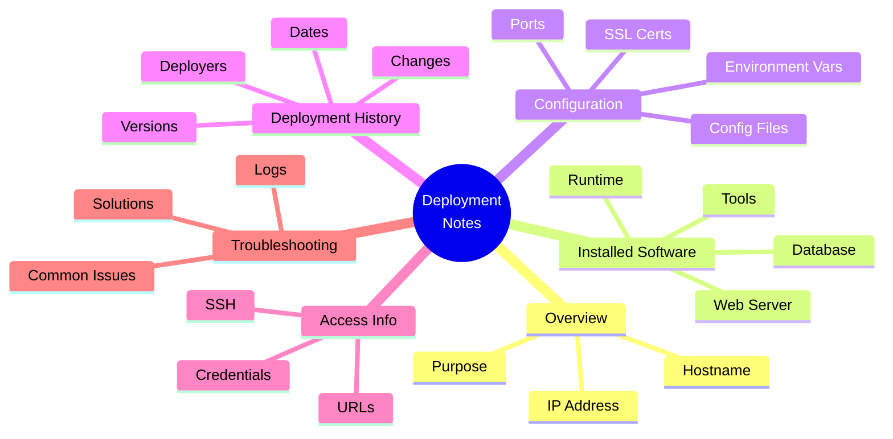

## Overview

Deployment Tracking in VMLedger helps you maintain a living documentation of what's installed on each VM. Using Markdown-formatted deployment notes, you can track software versions, configuration files, deployment history, and troubleshooting guides—all searchable and version-controlled.

<Info>
**Real-World Analogy**: Think of deployment notes like a car's maintenance log. Just as you record oil changes, tire rotations, and repairs in the log, deployment notes record software installations, configuration changes, and system updates. When something breaks, you check the log to see what changed recently.
</Info>

## Quick Start

### Add Deployment Notes

```bash
curl -X PUT http://localhost:8000/api/vms/123 \
  -H "Authorization: Bearer YOUR_TOKEN" \
  -H "Content-Type: application/json" \
  -d '{
    "deployment_notes": "# Web Server\n\n## Installed Software\n- Nginx 1.24.0\n- Node.js 20.11.0\n- PM2 5.3.0\n\n## Last Deployment\n- Date: 2026-05-08\n- Version: v2.5.0\n- Deployed by: john@example.com"
  }'
```

### View Deployment Notes

```bash
curl http://localhost:8000/api/vms/123 \
  -H "Authorization: Bearer YOUR_TOKEN" \
  | jq -r '.data.deployment_notes'
```

## Deployment Notes Structure



## Markdown Features

VMLedger supports full Markdown syntax with 50,000 character limit:

### Headers

```markdown
# Main Title (H1)
## Section (H2)
### Subsection (H3)
#### Detail (H4)
```

### Text Formatting

```markdown
**Bold text** for emphasis
*Italic text* for subtle emphasis
`inline code` for commands and filenames
~~Strikethrough~~ for deprecated info
```

### Lists

```markdown
## Unordered List
- Item 1
- Item 2
  - Nested item
  - Another nested item

## Ordered List
1. First step
2. Second step
3. Third step

## Task List
- [x] Completed task
- [ ] Pending task
- [ ] Another pending task
```

### Code Blocks

````markdown
```bash
# Install Nginx
sudo apt update
sudo apt install nginx

# Start Nginx
sudo systemctl start nginx
sudo systemctl enable nginx
```

```javascript
// PM2 ecosystem file
module.exports = {
  apps: [{
    name: 'api',
    script: './server.js',
    instances: 4,
    exec_mode: 'cluster'
  }]
};
```
````

### Links

```markdown
[VMLedger Documentation](https://docs.vmledger.com)
[Internal Wiki](http://wiki.internal.com/vm-setup)
```

### Tables

```markdown
| Service | Port | Status |
|---------|------|--------|
| Nginx   | 80   | Active |
| Node.js | 3000 | Active |
| PostgreSQL | 5432 | Active |
```

### Blockquotes

```markdown
> **Important:** Always backup database before major updates
>
> **Note:** SSL certificate expires on 2026-12-31
```

## Deployment Note Templates

### Template 1: Web Server

```markdown
# Web Server - Production

## Overview
- **Purpose:** Frontend web server
- **Environment:** Production
- **Location:** US-East datacenter
- **Owner:** DevOps Team

## Installed Software

### Web Server
- **Nginx 1.24.0**
  - Installed: 2026-05-01
  - Config: `/etc/nginx/sites-available/myapp`
  - SSL: Let's Encrypt (expires 2026-08-01)

### Application Runtime
- **Node.js 20.11.0**
  - Installed via nvm
  - Location: `/home/deploy/.nvm/versions/node/v20.11.0`

### Process Manager
- **PM2 5.3.0**
  - Ecosystem file: `/home/deploy/ecosystem.config.js`
  - Logs: `/home/deploy/.pm2/logs/`

## Configuration

### Nginx Configuration
```nginx
server {
    listen 80;
    server_name example.com;
    return 301 https://$server_name$request_uri;
}

server {
    listen 443 ssl http2;
    server_name example.com;
    
    ssl_certificate /etc/letsencrypt/live/example.com/fullchain.pem;
    ssl_certificate_key /etc/letsencrypt/live/example.com/privkey.pem;
    
    location / {
        proxy_pass http://localhost:3000;
        proxy_http_version 1.1;
        proxy_set_header Upgrade $http_upgrade;
        proxy_set_header Connection 'upgrade';
        proxy_set_header Host $host;
        proxy_cache_bypass $http_upgrade;
    }
}
```

### Environment Variables
- Location: `/home/deploy/.env`
- **DO NOT** commit to git
- Backup location: `/home/deploy/.env.backup`

### Ports
| Service | Port | Purpose |
|---------|------|---------|
| Nginx   | 80   | HTTP redirect |
| Nginx   | 443  | HTTPS |
| Node.js | 3000 | Application |

## Deployment History

### v2.5.0 - 2026-05-08
- **Deployed by:** john@example.com
- **Changes:**
  - Added SSL certificate
  - Updated Node.js to 20.11.0
  - Enabled HTTP/2
- **Rollback:** `git checkout v2.4.0 && pm2 restart all`

### v2.4.0 - 2026-05-01
- **Deployed by:** jane@example.com
- **Changes:**
  - Migrated to PostgreSQL 15
  - Added Redis caching
  - Updated dependencies

## Access Information

### SSH Access
```bash
ssh deploy@192.168.1.100
```

### Web Access
- **Production:** https://example.com
- **Admin Panel:** https://example.com/admin

### Database Access
```bash
psql -h localhost -U myapp -d myapp_production
```

## Monitoring

### Health Check
```bash
curl https://example.com/health
# Expected: {"status":"ok","uptime":12345}
```

### Logs
```bash
# Nginx access logs
tail -f /var/log/nginx/access.log

# Nginx error logs
tail -f /var/log/nginx/error.log

# PM2 logs
pm2 logs

# Application logs
tail -f /home/deploy/logs/app.log
```

## Troubleshooting

### High CPU Usage
1. Check PM2 processes: `pm2 list`
2. Check application logs: `pm2 logs`
3. Restart if needed: `pm2 restart all`

### Nginx Not Starting
1. Check configuration: `nginx -t`
2. Check error logs: `tail -f /var/log/nginx/error.log`
3. Check port conflicts: `netstat -tlnp | grep :80`

### SSL Certificate Issues
1. Check expiry: `openssl x509 -in /etc/letsencrypt/live/example.com/fullchain.pem -noout -dates`
2. Renew: `certbot renew`
3. Reload Nginx: `systemctl reload nginx`

### Database Connection Errors
1. Check PostgreSQL status: `systemctl status postgresql`
2. Check connection: `psql -h localhost -U myapp -d myapp_production`
3. Check credentials in `.env` file

## Maintenance Schedule

- **Daily:** Automated backups at 2 AM
- **Weekly:** Log rotation on Sundays
- **Monthly:** Security updates (first Monday)
- **Quarterly:** SSL certificate renewal check

## Contacts

- **Primary:** DevOps Team (devops@example.com)
- **Secondary:** John Doe (john@example.com)
- **On-Call:** PagerDuty rotation

---

**Last Updated:** 2026-05-08
**Next Review:** 2026-06-08
```

### Template 2: Database Server

```markdown
# Database Server - Production

## Overview
- **Purpose:** Primary PostgreSQL database
- **Environment:** Production
- **Location:** US-East datacenter
- **Owner:** Database Team

## Installed Software

### Database
- **PostgreSQL 15.5**
  - Installed: 2026-04-15
  - Data directory: `/var/lib/postgresql/15/main`
  - Config: `/etc/postgresql/15/main/postgresql.conf`

### Backup Tools
- **pg_dump** (built-in)
- **pgBackRest 2.48**
  - Config: `/etc/pgbackrest/pgbackrest.conf`
  - Backups: `/var/lib/pgbackrest`

### Monitoring
- **pg_stat_statements** extension
- **pgBadger** for log analysis

## Configuration

### PostgreSQL Settings
```conf
# Memory
shared_buffers = 4GB
effective_cache_size = 12GB
work_mem = 64MB
maintenance_work_mem = 1GB

# Connections
max_connections = 200
superuser_reserved_connections = 3

# WAL
wal_level = replica
max_wal_size = 2GB
min_wal_size = 1GB

# Replication
hot_standby = on
max_wal_senders = 5
wal_keep_size = 1GB
```

### Databases
| Database | Owner | Size | Purpose |
|----------|-------|------|---------|
| myapp_production | myapp | 15 GB | Main application |
| analytics | analytics | 50 GB | Analytics data |
| logs | logger | 10 GB | Application logs |

## Backup Strategy

### Full Backups
- **Frequency:** Daily at 2 AM
- **Retention:** 30 days
- **Location:** `/var/lib/pgbackrest/backup`
- **Command:**
  ```bash
  pgbackrest --stanza=main backup --type=full
  ```

### Incremental Backups
- **Frequency:** Every 6 hours
- **Retention:** 7 days
- **Command:**
  ```bash
  pgbackrest --stanza=main backup --type=incr
  ```

### Restore Procedure
```bash
# Stop PostgreSQL
systemctl stop postgresql

# Restore from backup
pgbackrest --stanza=main restore

# Start PostgreSQL
systemctl start postgresql
```

## Performance Tuning

### Indexes
```sql
-- Check missing indexes
SELECT schemaname, tablename, attname, n_distinct, correlation
FROM pg_stats
WHERE schemaname = 'public'
ORDER BY n_distinct DESC;

-- Check index usage
SELECT schemaname, tablename, indexname, idx_scan, idx_tup_read, idx_tup_fetch
FROM pg_stat_user_indexes
ORDER BY idx_scan ASC;
```

### Vacuum Schedule
```sql
-- Manual vacuum
VACUUM ANALYZE;

-- Check last vacuum
SELECT schemaname, tablename, last_vacuum, last_autovacuum
FROM pg_stat_user_tables;
```

## Monitoring Queries

### Active Connections
```sql
SELECT count(*) FROM pg_stat_activity WHERE state = 'active';
```

### Long Running Queries
```sql
SELECT pid, now() - pg_stat_activity.query_start AS duration, query
FROM pg_stat_activity
WHERE state = 'active' AND now() - pg_stat_activity.query_start > interval '5 minutes';
```

### Database Size
```sql
SELECT pg_database.datname, pg_size_pretty(pg_database_size(pg_database.datname))
FROM pg_database
ORDER BY pg_database_size(pg_database.datname) DESC;
```

## Troubleshooting

### Connection Limit Reached
```sql
-- Check current connections
SELECT count(*) FROM pg_stat_activity;

-- Kill idle connections
SELECT pg_terminate_backend(pid)
FROM pg_stat_activity
WHERE state = 'idle' AND state_change < now() - interval '1 hour';
```

### Slow Queries
```sql
-- Enable slow query logging
ALTER SYSTEM SET log_min_duration_statement = 1000; -- 1 second
SELECT pg_reload_conf();

-- Check slow queries
SELECT query, calls, total_time, mean_time
FROM pg_stat_statements
ORDER BY mean_time DESC
LIMIT 10;
```

### Disk Space Issues
```bash
# Check disk usage
df -h /var/lib/postgresql

# Check database sizes
du -sh /var/lib/postgresql/15/main/base/*

# Clean old WAL files
pg_archivecleanup /var/lib/postgresql/15/main/pg_wal 000000010000000000000010
```

---

**Last Updated:** 2026-05-08
**Next Review:** 2026-06-08
```

### Template 3: Application Server

```markdown
# Application Server - Staging

## Overview
- **Purpose:** Staging environment for testing
- **Environment:** Staging
- **Location:** US-West datacenter
- **Owner:** Development Team

## Installed Software

### Runtime
- **Python 3.11.7**
  - Installed via pyenv
  - Location: `/home/deploy/.pyenv/versions/3.11.7`
  - Virtual env: `/home/deploy/venv`

### Web Framework
- **Django 5.0.1**
  - Project: `/home/deploy/myapp`
  - Settings: `/home/deploy/myapp/settings/staging.py`

### Web Server
- **Gunicorn 21.2.0**
  - Workers: 4
  - Config: `/home/deploy/gunicorn.conf.py`
  - Socket: `/home/deploy/gunicorn.sock`

### Reverse Proxy
- **Nginx 1.24.0**
  - Config: `/etc/nginx/sites-available/staging`

## Configuration

### Django Settings
```python
# settings/staging.py
DEBUG = False
ALLOWED_HOSTS = ['staging.example.com']

DATABASES = {
    'default': {
        'ENGINE': 'django.db.backends.postgresql',
        'NAME': 'myapp_staging',
        'USER': 'myapp',
        'PASSWORD': os.environ.get('DB_PASSWORD'),
        'HOST': 'localhost',
        'PORT': '5432',
    }
}

CACHES = {
    'default': {
        'BACKEND': 'django.core.cache.backends.redis.RedisCache',
        'LOCATION': 'redis://127.0.0.1:6379/1',
    }
}
```

### Gunicorn Configuration
```python
# gunicorn.conf.py
bind = 'unix:/home/deploy/gunicorn.sock'
workers = 4
worker_class = 'sync'
worker_connections = 1000
timeout = 30
keepalive = 2

accesslog = '/home/deploy/logs/gunicorn-access.log'
errorlog = '/home/deploy/logs/gunicorn-error.log'
loglevel = 'info'
```

## Deployment Process

### 1. Pull Latest Code
```bash
cd /home/deploy/myapp
git pull origin staging
```

### 2. Install Dependencies
```bash
source /home/deploy/venv/bin/activate
pip install -r requirements.txt
```

### 3. Run Migrations
```bash
python manage.py migrate
```

### 4. Collect Static Files
```bash
python manage.py collectstatic --noinput
```

### 5. Restart Gunicorn
```bash
sudo systemctl restart gunicorn
```

### 6. Verify Deployment
```bash
curl https://staging.example.com/health
```

## Testing Checklist

- [ ] Homepage loads
- [ ] User login works
- [ ] API endpoints respond
- [ ] Database queries execute
- [ ] Static files load
- [ ] Email sending works
- [ ] Background jobs run

## Rollback Procedure

```bash
# 1. Checkout previous version
cd /home/deploy/myapp
git checkout <previous-commit>

# 2. Rollback migrations (if needed)
python manage.py migrate <app> <previous-migration>

# 3. Restart Gunicorn
sudo systemctl restart gunicorn
```

---

**Last Updated:** 2026-05-08
**Next Deployment:** 2026-05-15
```

## Best Practices

<CardGroup cols={2}>
  <Card title="Keep Notes Updated" icon="clock-rotate-left">
    Update deployment notes immediately after changes
    
    **Why:** Fresh memory = accurate documentation
  </Card>
  
  <Card title="Use Consistent Format" icon="align-left">
    Follow the same structure across all VMs
    
    **Why:** Easy to find information quickly
  </Card>
  
  <Card title="Document Everything" icon="list-check">
    Include software, configs, and troubleshooting
    
    **Why:** Future you will thank present you
  </Card>
  
  <Card title="Add Deployment History" icon="timeline">
    Track what changed, when, and by whom
    
    **Why:** Essential for debugging issues
  </Card>
  
  <Card title="Include Rollback Steps" icon="rotate-left">
    Document how to undo deployments
    
    **Why:** Critical during incidents
  </Card>
  
  <Card title="Link to External Docs" icon="link">
    Reference wikis, runbooks, and guides
    
    **Why:** Centralize knowledge
  </Card>
  
  <Card title="Use Code Blocks" icon="code">
    Format commands and configs properly
    
    **Why:** Easy to copy-paste
  </Card>
  
  <Card title="Review Regularly" icon="calendar">
    Update notes monthly or after major changes
    
    **Why:** Keep documentation accurate
  </Card>
</CardGroup>

## Searchability

Deployment notes are fully searchable via VMLedger's search engine:

```bash
# Find all VMs with Nginx
curl "http://localhost:8000/api/vms/search?q=nginx" \
  -H "Authorization: Bearer YOUR_TOKEN"

# Find VMs with specific version
curl "http://localhost:8000/api/vms/search?q=postgresql 15" \
  -H "Authorization: Bearer YOUR_TOKEN"

# Find VMs with SSL certificates
curl "http://localhost:8000/api/vms/search?q=ssl certificate" \
  -H "Authorization: Bearer YOUR_TOKEN"
```

**Search highlights matching text:**
```json
{
  "hostname": "web-server-01",
  "highlights": [
    "...Installed Software\n- <mark>Nginx</mark> 1.24.0...",
    "...<mark>SSL</mark> certificate expires on 2026-08-01..."
  ]
}
```

## Version Control Integration

While VMLedger doesn't have built-in version control, you can integrate with Git:

### Option 1: Manual Git Sync

```bash
# Export all deployment notes
for vm_id in $(curl -s http://localhost:8000/api/vms \
  -H "Authorization: Bearer YOUR_TOKEN" \
  | jq -r '.data[].id'); do
  
  curl -s "http://localhost:8000/api/vms/$vm_id" \
    -H "Authorization: Bearer YOUR_TOKEN" \
    | jq -r '.data.deployment_notes' \
    > "docs/vm-$vm_id.md"
done

# Commit to Git
git add docs/
git commit -m "Update deployment notes"
git push
```

### Option 2: Automated Sync Script

```python
#!/usr/bin/env python3
import requests
import os
from datetime import datetime

API_URL = "http://localhost:8000"
TOKEN = os.environ.get("VMLEDGER_TOKEN")
GIT_REPO = "/path/to/git/repo"

# Fetch all VMs
response = requests.get(
    f"{API_URL}/api/vms",
    headers={"Authorization": f"Bearer {TOKEN}"}
)
vms = response.json()['data']

# Export deployment notes
for vm in vms:
    filename = f"{GIT_REPO}/vms/{vm['hostname']}.md"
    with open(filename, 'w') as f:
        f.write(vm['deployment_notes'] or "# No deployment notes")

# Commit to Git
os.chdir(GIT_REPO)
os.system("git add vms/")
os.system(f"git commit -m 'Update deployment notes - {datetime.now()}'")
os.system("git push")
```

## Troubleshooting

<AccordionGroup>
  <Accordion title="Notes Not Saving" icon="floppy-disk-circle-xmark">
    **Possible Causes:**
    1. Notes exceed 50,000 character limit
    2. Invalid JSON in API request
    3. Authentication token expired
    
    **Solutions:**
    ```bash
    # Check note length
    echo -n "$NOTES" | wc -c
    
    # Validate JSON
    echo "$JSON" | jq .
    
    # Refresh token
    curl -X POST http://localhost:8000/api/auth/refresh \
      -H "Authorization: Bearer YOUR_TOKEN"
    ```
  </Accordion>
  
  <Accordion title="Markdown Not Rendering" icon="markdown">
    **Possible Causes:**
    1. Invalid Markdown syntax
    2. Frontend not rendering HTML
    
    **Solutions:**
    ```bash
    # Test Markdown rendering
    echo "**Bold** *Italic* \`Code\`" | markdown
    
    # Check frontend rendering
    # Ensure using dangerouslySetInnerHTML or similar
    ```
  </Accordion>
  
  <Accordion title="Notes Not Searchable" icon="magnifying-glass-minus">
    **Possible Causes:**
    1. Search vector not updated
    2. GIN index missing
    
    **Solutions:**
    ```bash
    # Update search vectors
    docker exec vmledger-postgres psql -U vmledger -c "
      UPDATE vms SET search_vector = 
        to_tsvector('english', coalesce(deployment_notes, ''));
    "
    
    # Verify index exists
    docker exec vmledger-postgres psql -U vmledger -c "
      SELECT indexname FROM pg_indexes 
      WHERE tablename = 'vms' AND indexname = 'idx_vms_search';
    "
    ```
  </Accordion>
</AccordionGroup>

## Next Steps

<CardGroup cols={2}>
  <Card title="Search Engine" icon="magnifying-glass" href="/features/search-engine">
    Learn how to search deployment notes
  </Card>
  
  <Card title="VM Management" icon="server" href="/features/vm-management">
    Learn how to update deployment notes
  </Card>
  
  <Card title="API Reference" icon="code" href="/api-reference/deployments">
    Complete API documentation for deployment endpoints
  </Card>
  
  <Card title="Best Practices" icon="lightbulb" href="/guides/documentation-best-practices">
    Documentation best practices guide
  </Card>
</CardGroup>
