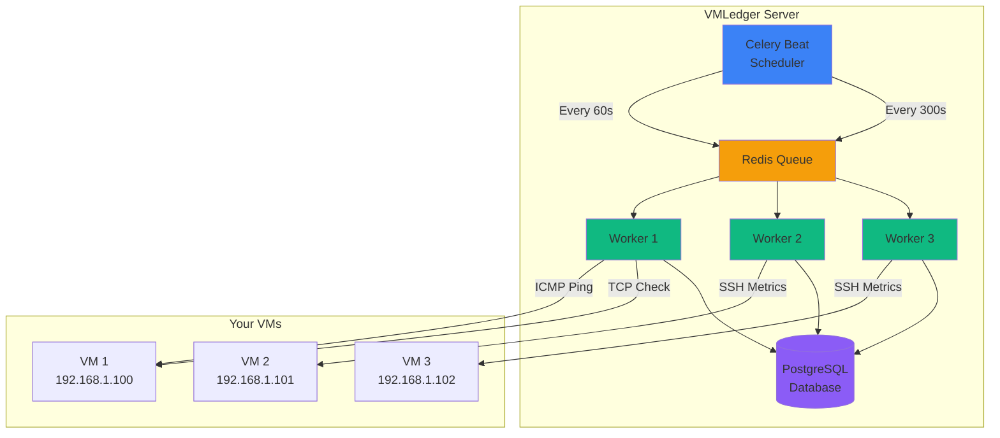
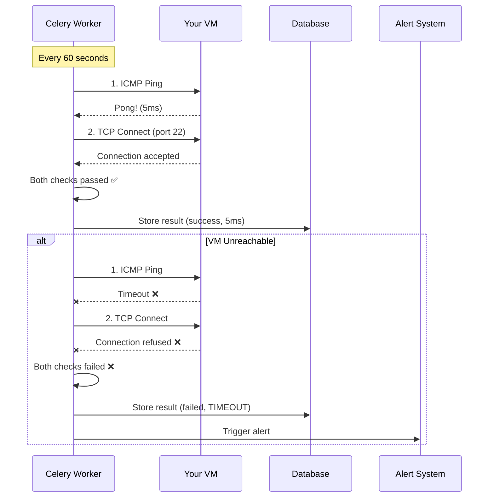
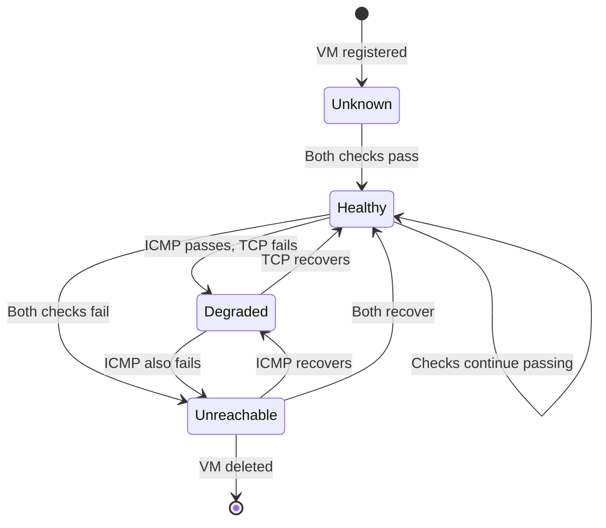
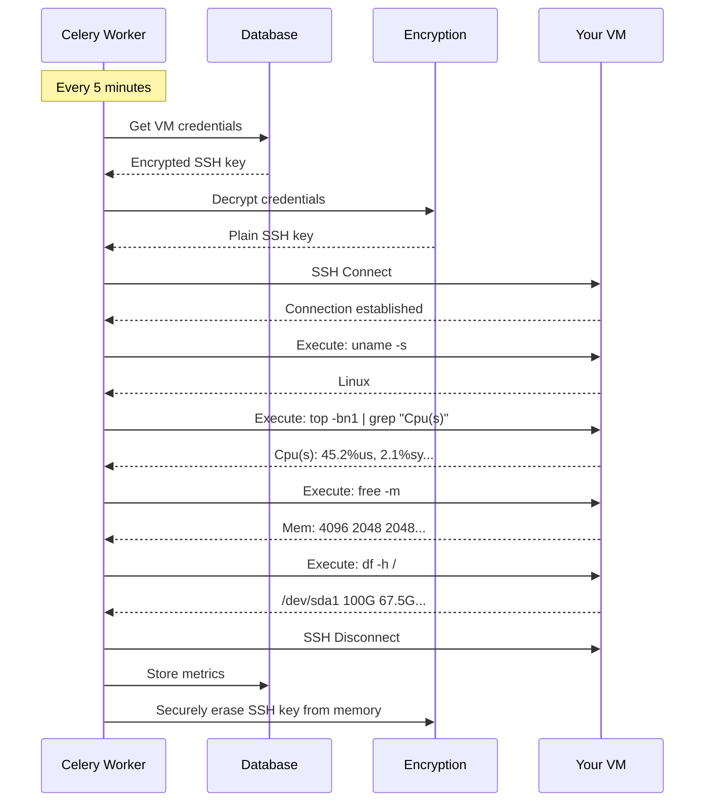
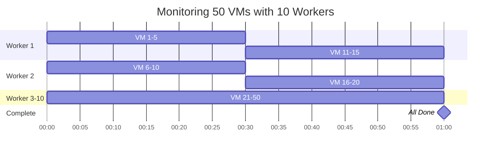
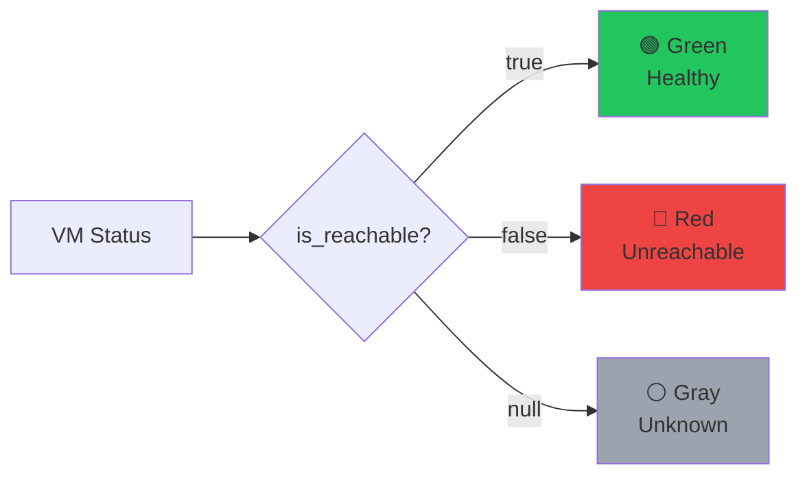
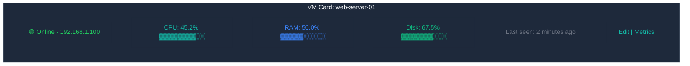
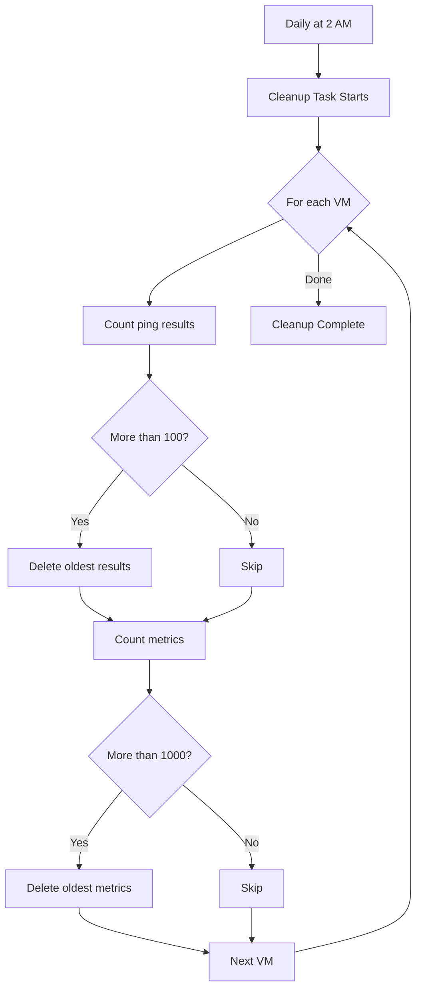

## Overview

Health Monitoring is VMLedger's continuous surveillance system that watches your VMs 24/7. It combines three powerful monitoring techniques:
1. **Health Checks** - Quick connectivity tests every 60 seconds
2. **Metrics Collection** - Detailed resource usage every 5 minutes
3. **DNS Drift Detection** - Continuous hostname resolution checks every 6 hours

<Info>
**Real-World Analogy**: Think of health monitoring like a hospital's patient monitoring system. The heart rate monitor (health checks) beeps every second to confirm the patient is alive, the nurse (metrics collection) comes by every few minutes to check vitals, and the administration checks ID badges (DNS drift detection) daily to ensure everyone is who they say they are.
</Info>

## Monitoring Architecture



## Health Checks (Custom Ping)

Health checks verify that your VMs are reachable using a two-step process:

### How It Works



### Check Components

<CardGroup cols={2}>
  <Card title="ICMP Ping" icon="signal">
    Tests network-level connectivity using ICMP echo request/reply
    
    **What it checks:**
    - VM is powered on
    - Network route exists
    - Firewall allows ICMP
    
    **Timeout:** 5 seconds
  </Card>
  
  <Card title="TCP Port Check" icon="door-open">
    Tests application-level connectivity by connecting to SSH port
    
    **What it checks:**
    - SSH service is running
    - Port is accessible
    - Firewall allows SSH
    
    **Timeout:** 5 seconds
  </Card>
</CardGroup>

### Health Check Results



### Error Types

<AccordionGroup>
  <Accordion title="ICMP_TIMEOUT" icon="clock">
    **Meaning:** ICMP ping packet was sent but no response received within 5 seconds.
    
    **Common Causes:**
    - VM is powered off
    - Network route doesn't exist
    - Firewall blocks ICMP
    - VM is overloaded and can't respond
    
    **Troubleshooting:**
    ```bash
    # Test ping manually
    ping -c 4 192.168.1.100
    
    # Check if VM is powered on (if you have access to hypervisor)
    # For VMware:
    vim-cmd vmsvc/power.getstate <vm-id>
    
    # For VirtualBox:
    VBoxManage showvminfo "VM Name" | grep State
    ```
  </Accordion>
  
  <Accordion title="TCP_REFUSED" icon="ban">
    **Meaning:** TCP connection to SSH port was actively refused.
    
    **Common Causes:**
    - SSH service is not running
    - SSH is listening on different port
    - Firewall blocks the port
    
    **Troubleshooting:**
    ```bash
    # Test TCP connection manually
    nc -zv 192.168.1.100 22
    
    # Check if SSH is running (if you have console access)
    systemctl status sshd
    
    # Check which port SSH is listening on
    ss -tlnp | grep sshd
    ```
  </Accordion>
  
  <Accordion title="HOST_UNREACHABLE" icon="route">
    **Meaning:** Network routing failed—no route to host.
    
    **Common Causes:**
    - VM's network interface is down
    - Network switch/router is down
    - IP address changed
    - VLAN misconfiguration
    
    **Troubleshooting:**
    ```bash
    # Check routing table
    ip route get 192.168.1.100
    
    # Trace route to VM
    traceroute 192.168.1.100
    
    # Check ARP table
    arp -a | grep 192.168.1.100
    ```
  </Accordion>
  
  <Accordion title="TIMEOUT" icon="hourglass">
    **Meaning:** Both ICMP and TCP checks timed out.
    
    **Common Causes:**
    - VM is completely unreachable
    - Network is down
    - VM is severely overloaded
    
    **Troubleshooting:**
    ```bash
    # Check if other VMs on same network are reachable
    ping 192.168.1.1  # Gateway
    ping 192.168.1.101  # Another VM
    
    # Check VMLedger server's network
    ip addr show
    ip route show
    ```
  </Accordion>
</AccordionGroup>

## Metrics Collection

Metrics collection gathers detailed resource usage data via SSH:

### Collected Metrics

<CardGroup cols={3}>
  <Card title="CPU Usage" icon="microchip">
    **What:** Percentage of CPU in use
    
    **Range:** 0% to 100%
    
    **Example:** 45.2% means CPU is 45% busy
  </Card>
  
  <Card title="RAM Usage" icon="memory">
    **What:** Memory used vs total
    
    **Units:** Megabytes (MB)
    
    **Example:** 2048 MB used / 4096 MB total
  </Card>
  
  <Card title="Disk Usage" icon="hard-drive">
    **What:** Disk space used vs total
    
    **Units:** Gigabytes (GB) and percentage
    
    **Example:** 67.5 GB used / 100 GB total (67.5%)
  </Card>
</CardGroup>

### Collection Process



### SSH Commands by OS

VMLedger automatically detects the operating system and uses appropriate commands:

<Tabs>
  <Tab title="Linux">
    ```bash
    # OS Detection
    uname -s  # Returns: Linux
    
    # CPU Usage
    top -bn1 | grep "Cpu(s)" | awk '{print $2}' | cut -d'%' -f1
    # Example output: 45.2
    
    # RAM Usage
    free -m | grep Mem | awk '{print $3,$2}'
    # Example output: 2048 4096
    
    # Disk Usage
    df -h / | tail -1 | awk '{print $3,$2,$5}'
    # Example output: 67.5G 100G 68%
    ```
  </Tab>
  
  <Tab title="macOS">
    ```bash
    # OS Detection
    uname -s  # Returns: Darwin
    
    # CPU Usage
    top -l 1 | grep "CPU usage" | awk '{print $3}' | cut -d'%' -f1
    # Example output: 45.2
    
    # RAM Usage
    vm_stat | awk '/Pages active/ {active=$3} /Pages wired/ {wired=$4} END {print (active+wired)*4096/1048576}'
    # Example output: 2048
    
    # Disk Usage
    df -h / | tail -1 | awk '{print $3,$2,$5}'
    # Example output: 67.5Gi 100Gi 68%
    ```
  </Tab>
  
  <Tab title="BSD">
    ```bash
    # OS Detection
    uname -s  # Returns: FreeBSD
    
    # CPU Usage
    top -d 1 | grep "CPU" | awk '{print $2}' | cut -d'%' -f1
    # Example output: 45.2
    
    # RAM Usage
    sysctl hw.physmem hw.usermem | awk '{sum+=$2} END {print sum/1048576}'
    # Example output: 2048
    
    # Disk Usage
    df -h / | tail -1 | awk '{print $3,$2,$5}'
    # Example output: 67.5G 100G 68%
    ```
  </Tab>
</Tabs>

### Metric History

VMLedger stores the last **1000 metric data points** per VM:

```bash
# Get metric history
curl http://localhost:8000/api/vms/123/metrics \
  -H "Authorization: Bearer YOUR_TOKEN"
```

**Response:**
```json
{
  "success": true,
  "data": [
    {
      "id": 1001,
      "vm_id": 123,
      "timestamp": "2026-05-08T10:30:00Z",
      "cpu_usage_percent": 45.2,
      "ram_used_mb": 2048,
      "ram_total_mb": 4096,
      "disk_used_gb": 67.5,
      "disk_total_gb": 100.0,
      "disk_usage_percent": 67.5,
      "collection_success": true,
      "error_message": null
    }
  ]
}
```

## Monitoring Intervals

<CardGroup cols={2}>
  <Card title="Health Checks" icon="clock">
    **Default:** Every 5 minutes (300 seconds)
    
    **Configurable:** Yes, individually per VM
    
    **Recommended:** 1-5 minutes
  </Card>
  
  <Card title="DNS Drift Detection" icon="clock">
    **Default:** Every 6 hours
    
    **Configurable:** Yes, individually per VM
    
    **Recommended:** 1-24 hours
  </Card>
  
  <Card title="Metrics Collection" icon="clock">
    **Default:** Every 300 seconds (5 minutes)
    
    **Configurable:** Yes (via `METRICS_INTERVAL` env var)
    
    **Recommended:** 180-600 seconds
  </Card>
</CardGroup>

You can configure the Ping Check interval and DNS Check interval individually for each Virtual Machine during VM registration or by editing the VM settings from the dashboard. This allows you to check critical production servers more frequently and development servers less frequently.

The Metrics Collection interval is global and configured via the environment variables:

```bash
# In .env file
METRICS_INTERVAL=300      # Metrics every 5 minutes
```

<Warning>
**Performance Impact**: Shorter intervals provide more real-time data but increase:
- Database storage requirements
- Network traffic
- CPU usage on VMLedger server
- SSH connections to VMs

For 50+ VMs, keep intervals at default values or longer.
</Warning>

## Concurrent Monitoring

VMLedger uses **10 concurrent workers** by default to monitor multiple VMs simultaneously:



**Performance Characteristics:**
- **50 VMs**: Complete cycle in ~60 seconds
- **100 VMs**: Complete cycle in ~120 seconds
- **200 VMs**: Complete cycle in ~240 seconds

### Scaling Workers

```bash
# In docker-compose.yml
services:
  celery-worker:
    command: celery -A vmledger.celery_app worker --concurrency=20
    #                                                            ^^
    #                                                    Increase to 20 workers
```

## Dashboard Visualization

The dashboard shows real-time monitoring data:

### VM Status Indicators



### Metrics Display

```json
{
  "hostname": "web-server-01",
  "ip_address": "192.168.1.100",
  "is_reachable": true,
  "last_seen": "2026-05-08T10:35:00Z",
  "latest_cpu": 45.2,
  "latest_ram_used": 2048,
  "latest_ram_total": 4096,
  "latest_disk_percent": 67.5
}
```

**Dashboard Display:**



### Dashboard View Modes

The dashboard supports **6 different visualization modes** to suit different operational workflows:

<CardGroup cols={3}>
  <Card title="Grid View" icon="grid-2">
    Standard card layout with full metrics (CPU, RAM, Disk), tags, and action buttons. Best for monitoring a small-to-medium fleet.
  </Card>
  
  <Card title="List View" icon="list">
    Compact horizontal rows with inline progress bars. Best for scanning many VMs quickly.
  </Card>
  
  <Card title="Table View" icon="table">
    Dense data table with sortable columns (Status, Hostname, IP, CPU, Memory, Disk). Best for large fleets and data exports.
  </Card>
  
  <Card title="Status Board (Kanban)" icon="columns-3">
    Groups VMs into columns by status: Online, Offline, and Unknown. Best for incident response and triage.
  </Card>
  
  <Card title="Minimal View" icon="minus">
    Stripped-down list showing only hostname, IP, and status dot. Best for ultra-clean dashboards.
  </Card>
  
  <Card title="Analytics Summary" icon="chart-pie">
    Fleet-level aggregated statistics: total VM counts, online/offline ratio, average CPU, and top consumers. Best for management reporting.
  </Card>
</CardGroup>

### Auto-Refresh

The dashboard automatically refreshes every **30 seconds** without page reload:

```javascript
// Frontend code (React Query)
const { data: vms } = useQuery({
  queryKey: ['vms'],
  queryFn: fetchVMs,
  refetchInterval: 30000  // 30 seconds
});
```

## Data Retention

VMLedger automatically cleans up old monitoring data:

<CardGroup cols={2}>
  <Card title="Ping Results" icon="broom">
    **Retention:** Last 100 results per VM
    
    **Cleanup:** Daily at 2 AM
    
    **Storage:** ~10 KB per VM
  </Card>
  
  <Card title="Metrics" icon="broom">
    **Retention:** Last 1000 data points per VM
    
    **Cleanup:** Daily at 2 AM
    
    **Storage:** ~100 KB per VM
  </Card>
</CardGroup>

### Cleanup Process



## Troubleshooting

<AccordionGroup>
  <Accordion title="Health Checks Not Running" icon="circle-xmark">
    **Symptom:** `last_seen` stays `null` or doesn't update
    
    **Possible Causes:**
    1. Celery Beat not running
    2. Celery workers not running
    3. Redis connection failed
    
    **Troubleshooting:**
    ```bash
    # Check Celery Beat status
    docker ps | grep celery-beat
    docker logs vmledger-celery-beat
    
    # Check Celery workers status
    docker ps | grep celery-worker
    docker logs vmledger-celery-worker
    
    # Check Redis connection
    docker exec vmledger-redis redis-cli ping
    # Should return: PONG
    
    # Check scheduled tasks
    docker exec vmledger-celery-beat celery -A vmledger.celery_app inspect scheduled
    ```
  </Accordion>
  
  <Accordion title="Metrics Collection Failing" icon="chart-line-down">
    **Symptom:** `latest_cpu`, `latest_ram_used` stay `null`
    
    **Possible Causes:**
    1. SSH authentication failed
    2. SSH commands not found on VM
    3. SSH user lacks permissions
    4. Firewall blocks SSH
    
    **Troubleshooting:**
    ```bash
    # Check metric collection errors
    curl http://localhost:8000/api/vms/123/metrics \
      -H "Authorization: Bearer YOUR_TOKEN" \
      | jq '.data[] | select(.collection_success == false)'
    
    # Test SSH connection manually
    ssh -i ~/.ssh/vmledger_key root@192.168.1.100
    
    # Test commands manually
    ssh root@192.168.1.100 "top -bn1 | grep 'Cpu(s)'"
    ssh root@192.168.1.100 "free -m"
    ssh root@192.168.1.100 "df -h /"
    
    # Check Celery worker logs
    docker logs vmledger-celery-worker | grep "SSH"
    ```
  </Accordion>
  
  <Accordion title="Slow Monitoring Cycles" icon="hourglass">
    **Symptom:** Monitoring takes longer than expected
    
    **Possible Causes:**
    1. Too many VMs for current worker count
    2. SSH connections timing out
    3. VMs responding slowly
    
    **Troubleshooting:**
    ```bash
    # Check monitoring cycle time
    docker logs vmledger-celery-worker | grep "Task.*succeeded"
    
    # Increase worker concurrency
    # Edit docker-compose.yml:
    services:
      celery-worker:
        command: celery -A vmledger.celery_app worker --concurrency=20
    
    # Restart workers
    docker-compose restart celery-worker
    
    # Check VM response times
    curl http://localhost:8000/api/vms/123/ping \
      -H "Authorization: Bearer YOUR_TOKEN" \
      | jq '.data[] | {timestamp, response_time_ms}'
    ```
  </Accordion>
  
  <Accordion title="High Database Storage" icon="database">
    **Symptom:** PostgreSQL database growing too large
    
    **Possible Causes:**
    1. Too many VMs
    2. Retention limits too high
    3. Cleanup task not running
    
    **Troubleshooting:**
    ```bash
    # Check database size
    docker exec vmledger-postgres psql -U vmledger -c "
      SELECT pg_size_pretty(pg_database_size('vmledger'));
    "
    
    # Check table sizes
    docker exec vmledger-postgres psql -U vmledger -c "
      SELECT 
        tablename,
        pg_size_pretty(pg_total_relation_size(schemaname||'.'||tablename))
      FROM pg_tables
      WHERE schemaname = 'public'
      ORDER BY pg_total_relation_size(schemaname||'.'||tablename) DESC;
    "
    
    # Manually run cleanup
    docker exec vmledger-api python -c "
      from vmledger.tasks import cleanup_historical_data
      cleanup_historical_data.delay()
    "
    
    # Check cleanup task schedule
    docker exec vmledger-celery-beat celery -A vmledger.celery_app inspect scheduled
    ```
  </Accordion>
</AccordionGroup>

## Best Practices

<CardGroup cols={2}>
  <Card title="Monitor Critical VMs More Frequently" icon="gauge-high">
    For production VMs, use shorter intervals:
    - Ping Interval: 1 minute
    - DNS Interval: 1 hour
  </Card>
  
  <Card title="Use Longer Intervals for Many VMs" icon="gauge-low">
    For 100+ VMs, use longer intervals:
    - Ping Interval: 5-10 minutes
    - DNS Interval: 12-24 hours
  </Card>
  
  <Card title="Scale Workers with VM Count" icon="users">
    Rule of thumb: 1 worker per 5-10 VMs
    ```bash
    # For 50 VMs: 10 workers (default)
    # For 100 VMs: 20 workers
    # For 200 VMs: 40 workers
    ```
  </Card>
  
  <Card title="Monitor Worker Performance" icon="chart-line">
    Regularly check worker logs for slow tasks:
    ```bash
    docker logs vmledger-celery-worker \
      | grep "Task.*succeeded" \
      | grep -E "runtime=[0-9]{2,}"
    ```
  </Card>
</CardGroup>

## Next Steps

<CardGroup cols={2}>
  <Card title="Alerting" icon="bell" href="/features/alerting">
    Set up alerts to get notified when VMs go down
  </Card>
  
  <Card title="API Reference" icon="code" href="/api-reference/monitoring">
    Complete API documentation for monitoring endpoints
  </Card>
  
  <Card title="Dashboard" icon="gauge" href="/guides/dashboard-usage">
    Learn how to use the monitoring dashboard
  </Card>
  
  <Card title="Performance Tuning" icon="sliders" href="/guides/performance-tuning">
    Optimize monitoring for large VM fleets
  </Card>
</CardGroup>
