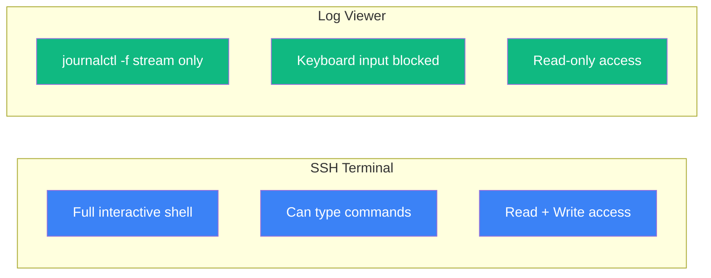
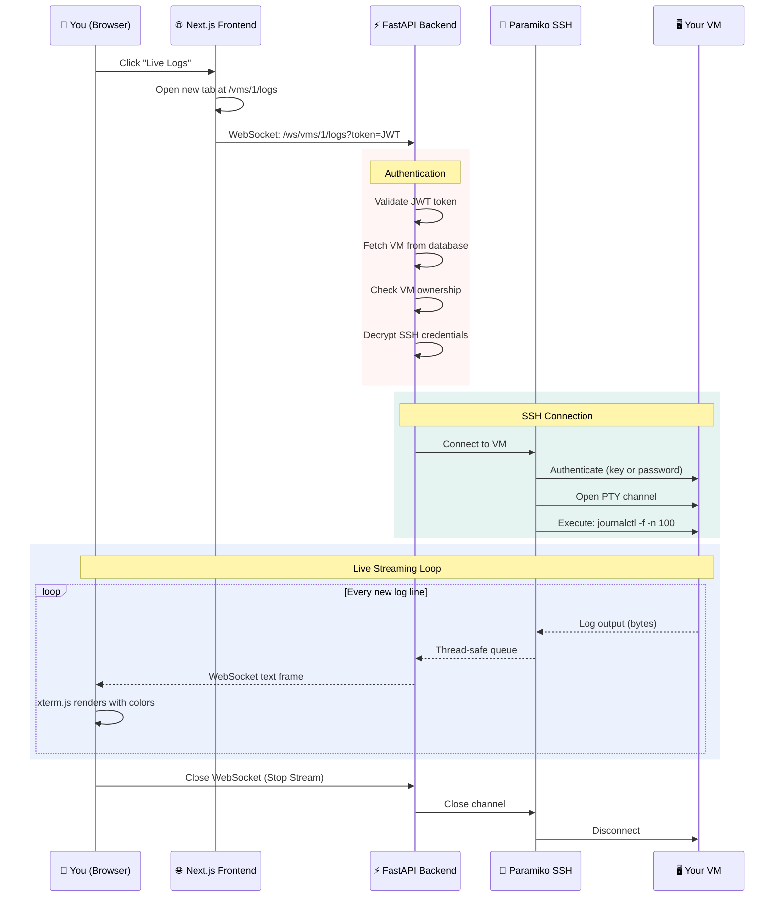
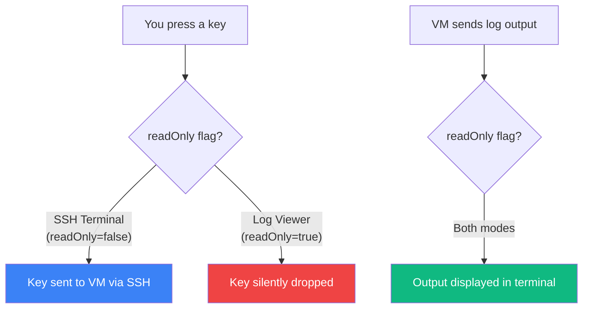
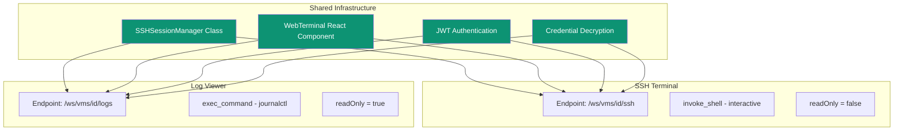

## Overview

The Live Log Viewer lets you watch your VM's system logs **in real-time**, directly from your browser. It's like running `journalctl -f` over SSH, but wrapped in a beautiful, color-coded terminal widget — and completely **read-only** so you can't accidentally type commands.

<Info>
**In Plain English**: Imagine watching a live security camera feed. You can see everything happening, but you can't interact with it. That's exactly what the Log Viewer does for your server logs — you watch, but you can't accidentally break anything.
</Info>

### What It Shows

When you open the Log Viewer for a VM, you'll see:
- The **last 100 log entries** from the system journal (instant context)
- **New log entries appearing in real-time** as they happen
- Full **color coding** — errors in red, warnings in yellow, info in white
- Log entries from **all services** — nginx, postgresql, ssh, cron, and everything else

### How It Compares to the SSH Terminal



| Feature | SSH Terminal | Log Viewer |
|---------|------------|------------|
| **Purpose** | Run commands, debug issues | Watch logs passively |
| **Keyboard** | Full input forwarded to VM | Input silently dropped |
| **Command** | Interactive shell (`bash`) | `journalctl -f -n 100` |
| **Safety** | Can modify the system | Can only read — zero risk |
| **URL** | `/vms/{id}/terminal` | `/vms/{id}/logs` |

## Getting Started

### Step 1: Open the Log Viewer

1. Go to your **Dashboard**
2. Click on any VM
3. Click the **Live Logs** button (next to the Terminal button)
4. A new browser tab opens with the log stream

That's it! Logs start flowing immediately.

### Step 2: Read Your Logs

The terminal will show something like:

```
Connecting to web-server-01 to stream logs...
Jun 18 10:30:01 web-server-01 CRON[1234]: (root) CMD (test -x /usr/sbin/anacron)
Jun 18 10:30:15 web-server-01 nginx[567]: 192.168.1.50 - - [18/Jun/2026:10:30:15] "GET / HTTP/1.1" 200
Jun 18 10:30:22 web-server-01 sshd[890]: Accepted publickey for root from 10.0.0.5
Jun 18 10:31:00 web-server-01 postgresql[111]: LOG: checkpoint complete
```

### Step 3: Stop the Stream

Click **Stop Stream** (or just close the tab) to disconnect.

## How It Works

### The Full Connection Flow



### Read-Only Mode Explained

The Log Viewer uses the same `WebTerminal` component as the SSH Terminal, but with a critical safety flag:



Even if someone opens browser dev tools and tries to send WebSocket messages, the backend will silently discard them. The SSH channel only runs `journalctl -f` — there's no shell to inject commands into.

### Architecture: Reusing Existing Infrastructure

The Log Viewer doesn't reinvent the wheel. It reuses VMLedger's existing components:



## Security

<AccordionGroup>
  <Accordion title="Is it really read-only?" icon="eye">
    **Yes, guaranteed at two levels:**
    1. **Frontend**: The `WebTerminal` component's `readOnly` prop prevents `term.onData()` from sending keystrokes
    2. **Backend**: The `SSHSessionManager` checks `self.read_only` and silently drops any non-JSON input

    Even if someone bypasses the frontend, the backend enforces read-only.
  </Accordion>

  <Accordion title="Who can view my logs?" icon="lock">
    Only the authenticated user who registered the VM. The WebSocket endpoint validates the JWT token and checks `vm.user_id == user.id` before connecting.
  </Accordion>

  <Accordion title="Are credentials exposed?" icon="key">
    Never. SSH credentials are decrypted in-memory on the server, used to establish the connection, and never sent to the browser. The database session is closed immediately after credential retrieval.
  </Accordion>

  <Accordion title="Can someone hijack the WebSocket?" icon="shield">
    The WebSocket requires a valid JWT token passed as a query parameter. Without a valid token, the connection is immediately rejected with `WS_1008_POLICY_VIOLATION`.
  </Accordion>
</AccordionGroup>

## Troubleshooting

<AccordionGroup>
  <Accordion title="Authentication Failed error" icon="circle-xmark">
    **Symptom:** `[Error: Authentication failed]`

    **Cause:** Your login session expired (JWT tokens last 24 hours).

    **Fix:** Log out and log back in to get a fresh token, then try again.
  </Accordion>

  <Accordion title="Blank screen / no logs appearing" icon="eye-slash">
    **Symptom:** Terminal connects but shows no output.

    **Possible Causes:**
    1. The VM's journal is empty (freshly installed system)
    2. `journalctl` isn't available (non-systemd distro like Alpine)
    3. The SSH user doesn't have permission to read journals

    **Fix:**
    ```bash
    # Test manually via SSH
    ssh root@your-vm "journalctl -f -n 100"

    # If using Alpine or another non-systemd distro:
    ssh root@your-vm "tail -f /var/log/messages"
    # (Note: VMLedger currently runs journalctl specifically)
    ```
  </Accordion>

  <Accordion title="Connection drops after a few minutes" icon="plug-circle-xmark">
    **Symptom:** Log stream disconnects after some time of inactivity.

    **Cause:** Network timeouts from firewalls, load balancers, or proxy servers along the path.

    **Fix:** This is normal for long-lived WebSocket connections through intermediaries. Simply refresh the page to reconnect. If it happens frequently, check your reverse proxy's timeout settings.
  </Accordion>

  <Accordion title="Colors not showing properly" icon="palette">
    **Symptom:** Logs appear as plain text without color coding.

    **Cause:** The VM's `journalctl` may not be outputting ANSI color codes.

    **Fix:** This is usually because the PTY isn't being detected. VMLedger requests a PTY with `xterm-256color`, so colors should work automatically. If not, check:
    ```bash
    ssh root@your-vm "journalctl -f -n 10 --output=short-iso"
    ```
  </Accordion>
</AccordionGroup>

## Next Steps

<CardGroup cols={2}>
  <Card title="SSH Terminal" icon="terminal" href="/features/vm-management">
    Use the full interactive SSH terminal for running commands
  </Card>

  <Card title="LXC Containers" icon="cubes" href="/features/lxc-containers">
    Manage LXC containers on your Proxmox/LXD hosts
  </Card>

  <Card title="Service Health" icon="stethoscope" href="/features/service-health">
    Monitor systemd services running inside your VMs
  </Card>

  <Card title="Health Monitoring" icon="heart-pulse" href="/features/health-monitoring">
    Learn about automated ping and metric collection
  </Card>
</CardGroup>
