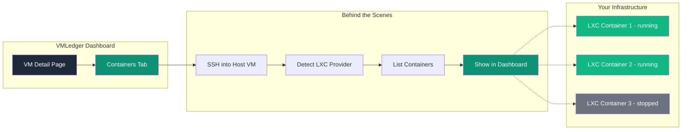
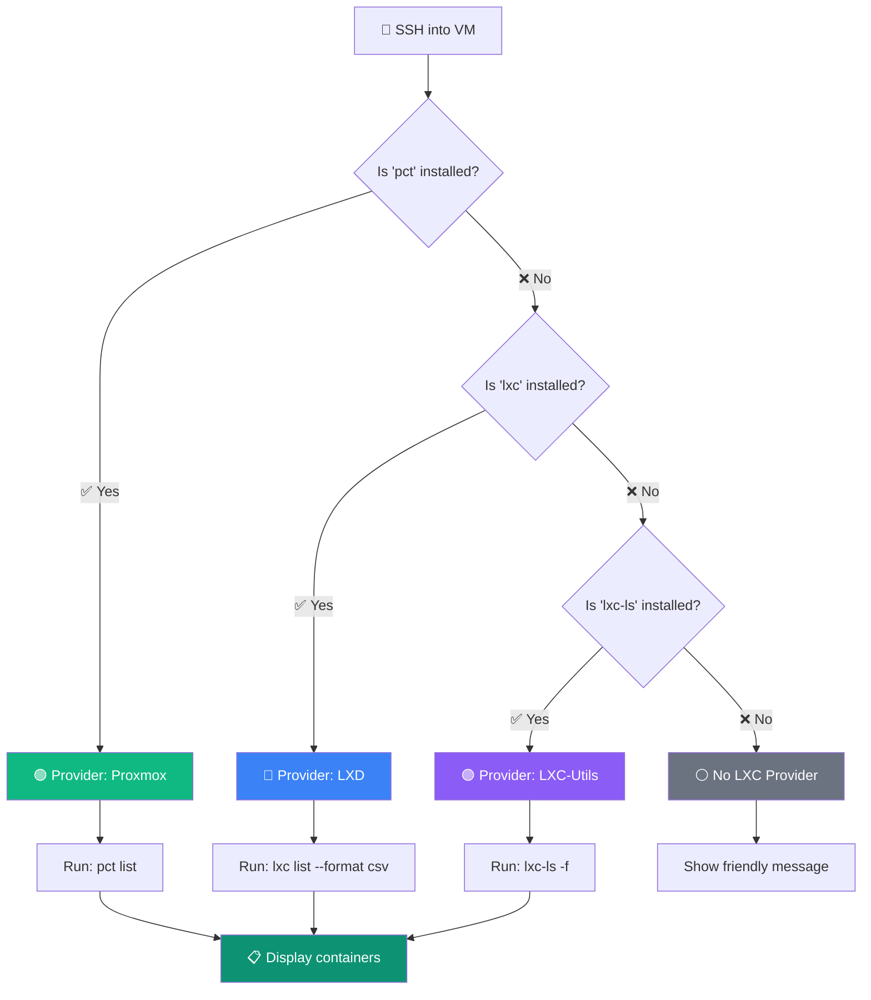
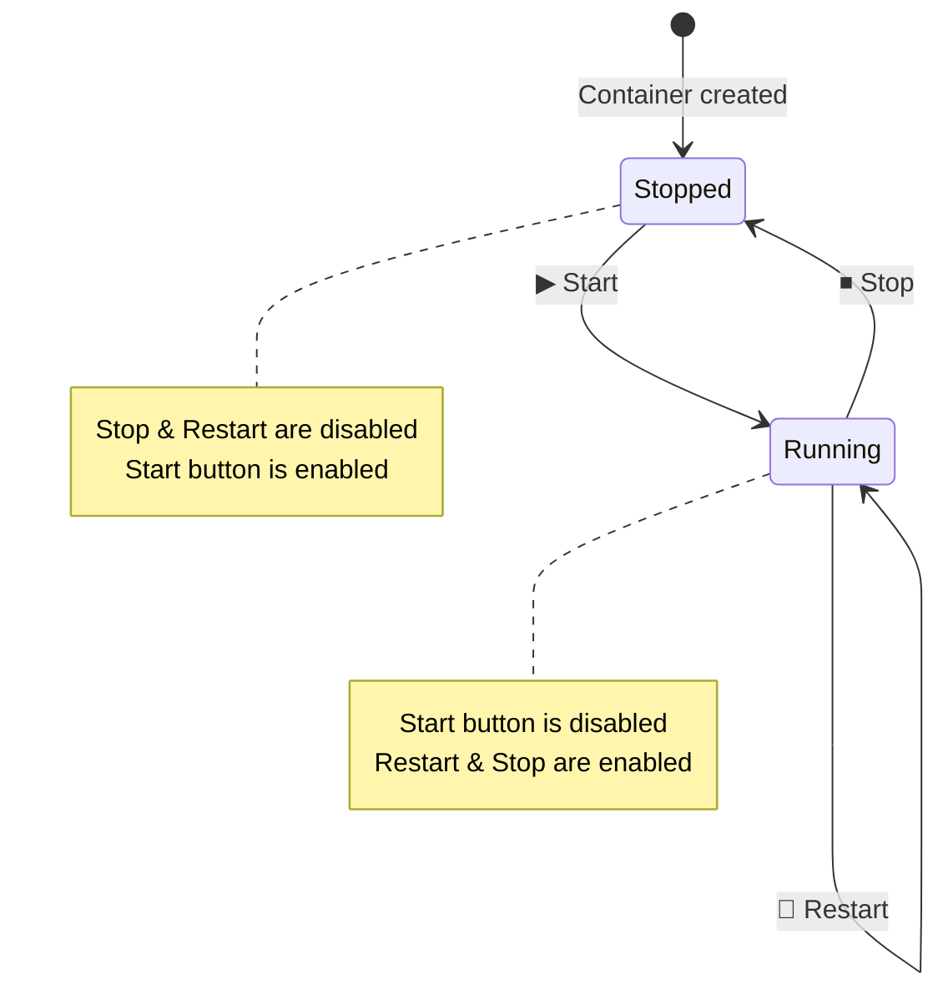
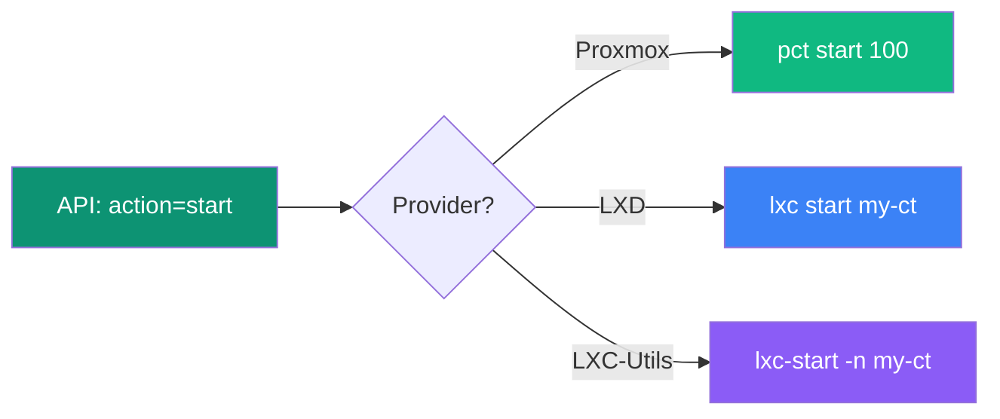
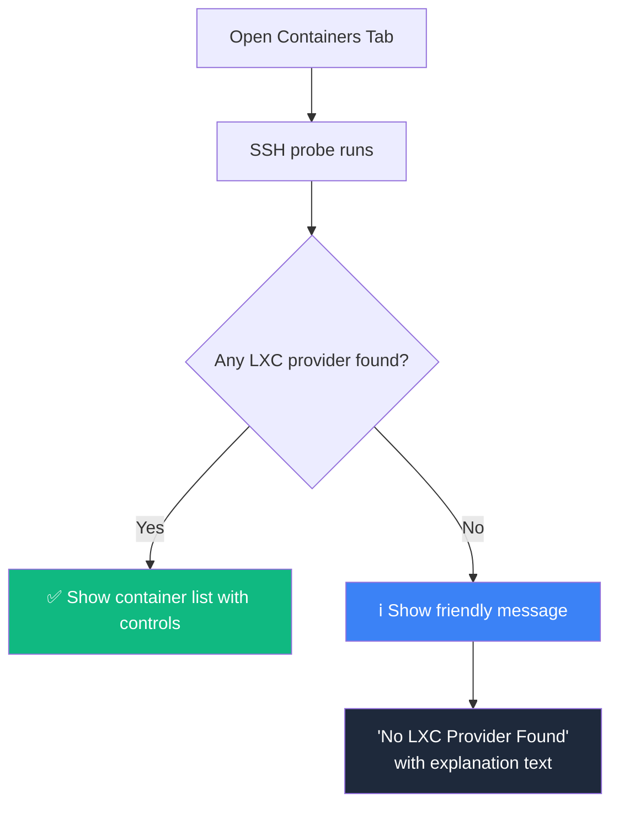

## Overview

If you run your applications inside **LXC containers** (lightweight Linux containers), VMLedger can automatically discover and manage them — right from your browser.

<Info>
**What is LXC?** LXC (Linux Containers) is a lightweight virtualization technology. Unlike full VMs, containers share the host's kernel, making them faster and more efficient. Think of them as isolated apartments in the same building, rather than separate buildings. Tools like **Proxmox**, **LXD**, and **lxc-utils** are popular ways to manage LXC containers.
</Info>

### What Can You Do?

- **See all containers** running on a host VM — names, IDs, and live status
- **Real-Time Telemetry** — Live CPU, Memory, and Disk usage via direct SSH probes inside the containers
- **Process Management** — View running processes with live CPU overlay utilizing `ps` and `top -bn1`
- **Start, Stop, and Restart** containers with one click
- **Zero setup** — VMLedger auto-detects your LXC provider
- **Non-LXC VMs are safe** — they just show a friendly message, no errors

### How It Fits Into VMLedger



## Supported Providers

VMLedger supports three LXC providers out of the box. **You don't need to tell VMLedger which one you use** — it figures it out automatically.

<CardGroup cols={3}>
  <Card title="Proxmox (pct)" icon="server">
    Full support for Proxmox VE hosts using `pct list`, `pct start`, `pct stop`, and `pct reboot`
  </Card>

  <Card title="LXD (lxc)" icon="box">
    Support for Canonical LXD hosts using `lxc list`, `lxc start`, `lxc stop`, and `lxc restart`
  </Card>

  <Card title="LXC-Utils (lxc-ls)" icon="terminal">
    Support for standard Linux LXC utilities using `lxc-ls`, `lxc-start`, `lxc-stop`
  </Card>
</CardGroup>

### How Auto-Detection Works

When you open the Containers tab, VMLedger SSHes into the VM and checks for tools in this order:



<Tip>
**Speed**: The entire detection process takes less than 1 second. VMLedger uses `command -v` (a lightweight shell check) instead of running the actual tools, so non-LXC VMs aren't slowed down at all.
</Tip>

## Getting Started

### Step 1: Open the Containers Tab

1. Go to your **Dashboard**
2. Click on any VM that's a Proxmox/LXD/LXC host
3. Click the **Containers** tab in the detail page

That's it! VMLedger handles the rest.

### Step 2: View Your Containers

Each container is shown as a card with:

| Element | What It Shows |
|---------|--------------|
| **Title** | Container name (e.g., `nginx-proxy`) |
| **Badge** | Live status — `RUNNING` (green) or `STOPPED` (gray) |
| **VMID** | The container's numeric ID (Proxmox) or name (LXD) |
| **Action Buttons** | Start, Restart, and Stop controls |
| **Telemetry Panels** | Expandable views for `Processes` and `Resources` metrics |

### Real-Time Telemetry

When you click the **Resources** or **Processes** buttons on a container card, VMLedger fetches live data directly from within the container context via SSH:

- **Resources**: Executes `nproc`, `free -m`, and `df -BG` inside the container to provide accurate CPU core counts, memory usage, and disk space limits.
- **Processes**: Layers standard `ps aux` enumeration with live CPU percentages mapped from `top -bn1`, ensuring process telemetry isn't skewed by lifetime averages.

### Step 3: Control Your Containers



| Button | When Available | What It Does | Confirmation? |
|--------|---------------|--------------|---------------|
| **▶ Start** | Container is stopped | Boots the container | No |
| **🔄 Restart** | Container is running | Reboots the container | Yes |
| **⏹ Stop** | Container is running | Shuts down the container | Yes |

<Warning>
**Be Careful with Stop & Restart**: These actions interrupt all running processes inside the container. VMLedger always asks for confirmation before executing them.
</Warning>

## Using the API

If you prefer to automate container management, you can use the REST API directly.

### List All Containers

<CodeGroup>

```bash cURL
curl http://localhost:8000/api/vms/1/lxc \
  -H "Authorization: Bearer YOUR_TOKEN"
```

```python Python
import requests

response = requests.get(
    "http://localhost:8000/api/vms/1/lxc",
    headers={"Authorization": "Bearer YOUR_TOKEN"}
)

data = response.json()
if data["is_proxmox"]:
    print(f"Provider: {data['provider']}")
    for c in data["containers"]:
        print(f"  {c['name']} (VMID: {c['vmid']}) - {c['status']}")
else:
    print("This VM is not an LXC host")
```

```javascript JavaScript
const response = await fetch('http://localhost:8000/api/vms/1/lxc', {
  headers: { 'Authorization': 'Bearer YOUR_TOKEN' }
});

const data = await response.json();
if (data.is_proxmox) {
  console.log(`Provider: ${data.provider}`);
  data.containers.forEach(c => {
    console.log(`  ${c.name} (VMID: ${c.vmid}) - ${c.status}`);
  });
}
```

</CodeGroup>

**Response (LXC Host):**
```json
{
  "is_proxmox": true,
  "provider": "pct",
  "containers": [
    { "vmid": "100", "status": "running", "name": "nginx-proxy" },
    { "vmid": "101", "status": "running", "name": "app-backend" },
    { "vmid": "102", "status": "stopped", "name": "test-container" }
  ]
}
```

**Response (Non-LXC VM):**
```json
{
  "is_proxmox": false,
  "provider": "none",
  "containers": []
}
```

### Perform an Action

<CodeGroup>

```bash Start a container
curl -X POST http://localhost:8000/api/vms/1/lxc/100/action \
  -H "Authorization: Bearer YOUR_TOKEN" \
  -H "Content-Type: application/json" \
  -d '{"action": "start"}'
```

```bash Stop a container
curl -X POST http://localhost:8000/api/vms/1/lxc/100/action \
  -H "Authorization: Bearer YOUR_TOKEN" \
  -H "Content-Type: application/json" \
  -d '{"action": "stop"}'
```

```bash Restart a container
curl -X POST http://localhost:8000/api/vms/1/lxc/100/action \
  -H "Authorization: Bearer YOUR_TOKEN" \
  -H "Content-Type: application/json" \
  -d '{"action": "restart"}'
```

</CodeGroup>

### Provider Command Mapping

Under the hood, VMLedger translates your action into the correct command for your provider:



| Action | Proxmox (`pct`) | LXD (`lxc`) | LXC-Utils |
|--------|----------------|-------------|-----------|
| Start | `pct start <id>` | `lxc start <name>` | `lxc-start -n <name>` |
| Stop | `pct stop <id>` | `lxc stop <name>` | `lxc-stop -n <name>` |
| Restart | `pct reboot <id>` | `lxc restart <name>` | `lxc-stop + lxc-start` |

## Security

<AccordionGroup>
  <Accordion title="How are commands protected from injection?" icon="shield">
    All container IDs and names are validated against the pattern `^[a-zA-Z0-9_-]+$` before being used in any SSH command. This means an attacker can't sneak in a command like `100; rm -rf /` — VMLedger will reject it with a `400 Bad Request`.
  </Accordion>

  <Accordion title="Who can manage containers?" icon="lock">
    Only the user who registered the host VM can manage its containers. The API checks `vm.user_id == authenticated_user.id` before executing any action.
  </Accordion>

  <Accordion title="Does it need separate credentials?" icon="key">
    No. Container commands are executed using the same encrypted SSH credentials you stored when you registered the host VM. No additional credentials are needed.
  </Accordion>
</AccordionGroup>

## What If My VM Isn't an LXC Host?

No problem! VMLedger handles non-LXC VMs gracefully:



- **Dashboard**: Shows a clean "No LXC Provider Found" card with an explanation
- **API**: Returns `{"is_proxmox": false, "provider": "none", "containers": []}`
- **No errors or crashes**: The detection uses `command -v` which always exits cleanly
- **No performance impact**: Detection adds < 1 second (3 quick, lightweight checks)

## Troubleshooting

<AccordionGroup>
  <Accordion title="Containers Not Showing" icon="eye-slash">
    **Symptom:** The Containers tab shows "No LXC Provider Found" even though the VM has containers.

    **Possible Causes:**
    1. The LXC tools are not in the SSH user's `PATH`
    2. The SSH user doesn't have permission to run container commands

    **Solution:**
    ```bash
    # Check if tools are accessible via SSH
    ssh root@your-vm "command -v pct && pct list"
    ssh root@your-vm "command -v lxc && lxc list"
    ssh root@your-vm "command -v lxc-ls && lxc-ls -f"

    # Ensure you're connecting as root or a user in the lxd/lxc group
    ssh root@your-vm "id"
    ```
  </Accordion>

  <Accordion title="Action Failed Error" icon="circle-xmark">
    **Symptom:** Start/Stop/Restart returns an error.

    **Possible Causes:**
    1. The container is in a locked state (Proxmox)
    2. Insufficient permissions for the SSH user
    3. Resource conflicts (e.g., port already in use by another container)

    **Solution:**
    ```bash
    # Check container status directly
    ssh root@your-vm "pct status 100"

    # Check for locks (Proxmox only)
    ssh root@your-vm "pct unlock 100"

    # Check VMLedger API logs for details
    docker logs vmledger-api --tail 50
    ```
  </Accordion>

  <Accordion title="Slow Container Detection" icon="clock">
    **Symptom:** The Containers tab takes a long time to load.

    **Cause:** SSH connection to the VM is slow (high latency, slow auth).

    **Solution:** This is the same SSH connection used for metrics. If your terminal works fast, containers should too. Check:
    ```bash
    # Test SSH speed manually
    time ssh root@your-vm "echo ok"
    ```
  </Accordion>
</AccordionGroup>

## Next Steps

<CardGroup cols={2}>
  <Card title="Service Health Monitor" icon="stethoscope" href="/features/service-health">
    Monitor individual systemd services running inside your VMs
  </Card>

  <Card title="Live Log Viewer" icon="scroll" href="/features/log-viewer">
    Stream real-time journalctl logs from your VMs
  </Card>

  <Card title="VM Management" icon="server" href="/features/vm-management">
    Learn about core VM registration and management
  </Card>

  <Card title="LXC API Reference" icon="code" href="/api-reference/lxc">
    Complete API documentation for LXC endpoints
  </Card>
</CardGroup>
