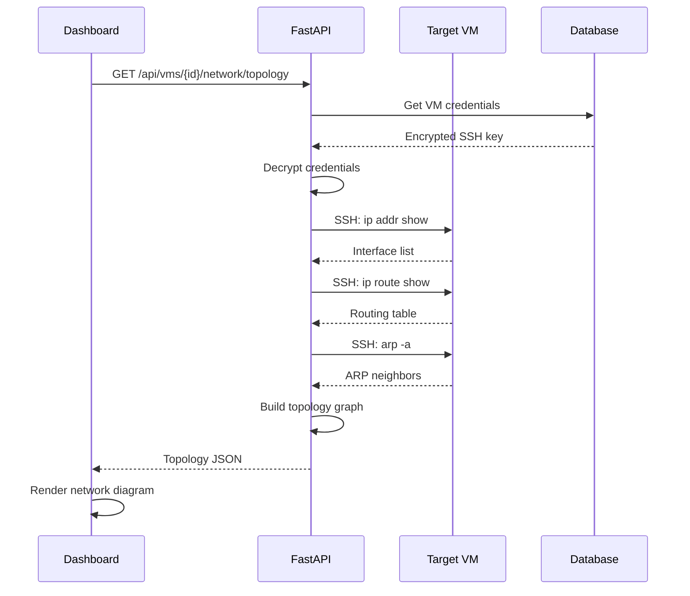
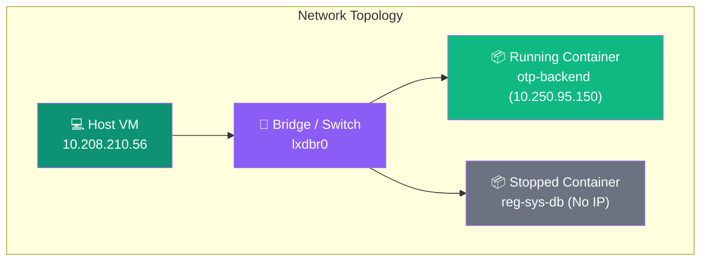

## Overview

The Network Topology feature provides a visual map of how your VMs are connected across subnets and gateways. VMLedger automatically discovers network interfaces, routing tables, and ARP neighbors via SSH, then renders an interactive topology diagram on each VM's detail page.

<Info>
**Real-World Analogy**: Think of network topology like a transit map. Each VM is a "station," subnets are "lines," and gateways are "interchange stations" where different lines connect. The topology view lets you see the entire transit system at a glance.
</Info>

## How It Works



## Collected Data

<CardGroup cols={3}>
  <Card title="Network Interfaces" icon="ethernet">
    **Command:** `ip addr show`
    
    Discovers all network interfaces (eth0, ens3, etc.), their IP addresses, MAC addresses, and link status.
  </Card>
  
  <Card title="Routing Table" icon="route">
    **Command:** `ip route show`
    
    Maps default gateways, subnet routes, and static routes to build the network graph edges.
  </Card>
  
  <Card title="ARP Neighbors" icon="users">
    **Command:** `arp -a`
    
    Identifies other devices on the same subnet, revealing peer VMs and network equipment.
  </Card>
</CardGroup>

## API Endpoint

### Get Network Topology

```bash
curl http://localhost:8000/api/vms/5/network/topology \
  -H "Authorization: Bearer YOUR_TOKEN"
```

**Response:**
```json
{
  "success": true,
  "data": {
    "vm_id": 5,
    "hostname": "hpcie-harbornode",
    "interfaces": [
      {
        "name": "eth0",
        "ip_address": "10.208.210.56",
        "mac_address": "bc:24:11:ab:cd:ef",
        "subnet": "10.208.210.0/24",
        "status": "UP"
      }
    ],
    "routes": [
      {
        "destination": "default",
        "gateway": "10.208.210.1",
        "interface": "eth0",
        "metric": 100
      },
      {
        "destination": "10.208.210.0/24",
        "gateway": null,
        "interface": "eth0",
        "metric": 0
      }
    ],
    "neighbors": [
      {
        "ip_address": "10.208.210.1",
        "mac_address": "00:1a:2b:3c:4d:5e",
        "interface": "eth0",
        "state": "REACHABLE"
      }
    ]
  }
}
```

## Dashboard Visualization

The Network tab on each VM's detail page renders an advanced, interactive topology diagram built with React Flow. The visualization now includes:

- **Immersive Fullscreen Mode:** Pop out the network map into a full-screen view with a blurred dark-mode backdrop (`backdrop-blur-xl`), escaping dashboard layout constraints for maximum screen real estate.
- **Auto-Centering & Fit View:** The diagram perfectly re-centers and scales to fit your screen automatically when toggling fullscreen.
- **Custom Dark Theme:** The visualization controls (zoom in/out, fit view) and nodes are deeply integrated with VMLedger's dark theme aesthetics.
- **Real-Time Indicators:** Containers show live status indicators (running/stopped) and their allocated IPs directly on the node.

### Topology Node Types



## Use Cases

<AccordionGroup>
  <Accordion title="Troubleshooting Connectivity" icon="magnifying-glass">
    When a VM can't reach another service, the network topology shows:
    - Is the gateway reachable?
    - Are there route entries for the destination subnet?
    - Are ARP entries stale or missing?
  </Accordion>
  
  <Accordion title="Security Auditing" icon="shield">
    Review which VMs are on the same subnet and can communicate directly. Identify unexpected network neighbors that may indicate misconfiguration.
  </Accordion>
  
  <Accordion title="Migration Planning" icon="arrows-turn-to-dots">
    Before migrating a VM, understand its network dependencies — which gateways it uses, which peers it communicates with, and which subnets it belongs to.
  </Accordion>
</AccordionGroup>

## Next Steps

<CardGroup cols={2}>
  <Card title="VM Management" icon="server" href="/features/vm-management">
    Learn how to register and manage VMs
  </Card>
  
  <Card title="Health Monitoring" icon="heart-pulse" href="/features/health-monitoring">
    Understand how VMLedger monitors VM connectivity
  </Card>
</CardGroup>
