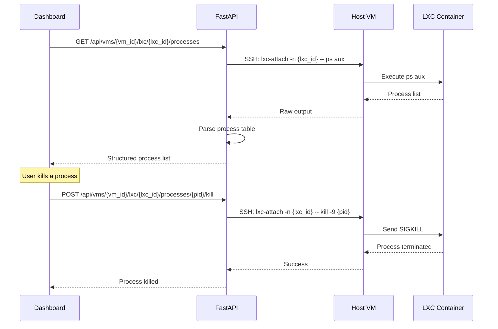

## Overview

The Process Management feature extends VMLedger's LXC container support by providing visibility into the processes running inside each container. You can list all running processes, view resource consumption per process, and send kill signals to unresponsive processes — all from the dashboard.

<Info>
**Real-World Analogy**: If LXC containers are apartments in a building, Process Management is like a building manager who can check which appliances are running in each apartment, see their power consumption, and turn off anything that's causing problems.
</Info>

## How It Works



## API Endpoints

### List Processes

```bash
# List all processes in LXC container 101 on VM 5
curl http://localhost:8000/api/vms/5/lxc/101/processes \
  -H "Authorization: Bearer YOUR_TOKEN"
```

**Response:**
```json
{
  "success": true,
  "data": {
    "container_id": "101",
    "processes": [
      {
        "pid": 1,
        "user": "root",
        "cpu_percent": 0.0,
        "mem_percent": 0.1,
        "vsz_kb": 16972,
        "rss_kb": 3456,
        "tty": "?",
        "stat": "Ss",
        "start": "Jun22",
        "time": "0:01",
        "command": "/sbin/init"
      },
      {
        "pid": 245,
        "user": "www-data",
        "cpu_percent": 2.3,
        "mem_percent": 4.5,
        "vsz_kb": 142560,
        "rss_kb": 45320,
        "tty": "?",
        "stat": "Sl",
        "start": "Jun22",
        "time": "12:45",
        "command": "nginx: worker process"
      }
    ],
    "total_count": 42
  }
}
```

### Kill Process

```bash
# Kill process 245 in LXC container 101 on VM 5
curl -X POST http://localhost:8000/api/vms/5/lxc/101/processes/245/kill \
  -H "Authorization: Bearer YOUR_TOKEN"
```

**Response:**
```json
{
  "success": true,
  "message": "Process 245 killed successfully"
}
```

<Warning>
**Use with caution**: Killing processes like `init` (PID 1) or critical system services can cause the container to become unstable. Always verify the process you're killing.
</Warning>

## Dashboard UI

The Processes tab within the LXC container detail view shows:

- **Process table** with sortable columns (PID, User, CPU%, MEM%, Command)
- **Color-coded resource usage** — high CPU/memory processes highlighted in red/yellow
- **Kill button** for each process (requires confirmation)
- **Auto-refresh** to keep the process list current

## Provider Support

Process management works across all supported LXC providers:

| Provider | List Processes | Kill Process | Command Used |
|----------|---------------|-------------|--------------|
| **Proxmox (pct)** | ✅ | ✅ | `pct exec {id} -- ps aux` |
| **LXD (lxc)** | ✅ | ✅ | `lxc exec {name} -- ps aux` |
| **Standard LXC** | ✅ | ✅ | `lxc-attach -n {name} -- ps aux` |

## Next Steps

<CardGroup cols={2}>
  <Card title="LXC Containers" icon="cubes" href="/features/lxc-containers">
    Learn about LXC container discovery and management
  </Card>
  
  <Card title="Service Health" icon="stethoscope" href="/features/service-health">
    Monitor systemd services running on your VMs
  </Card>
</CardGroup>
