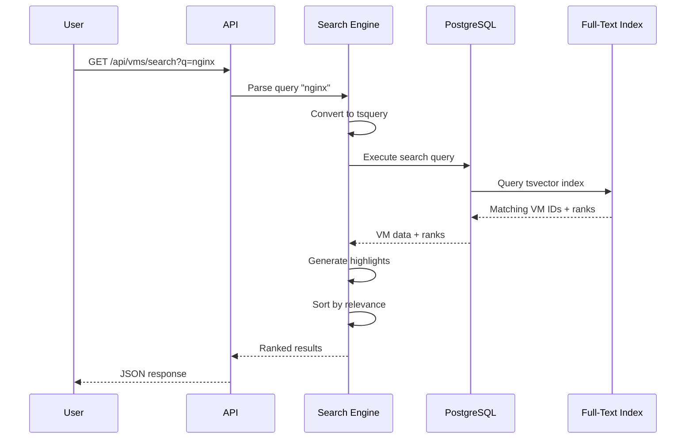
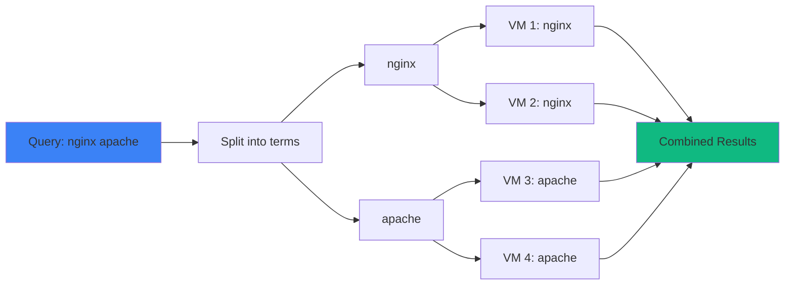
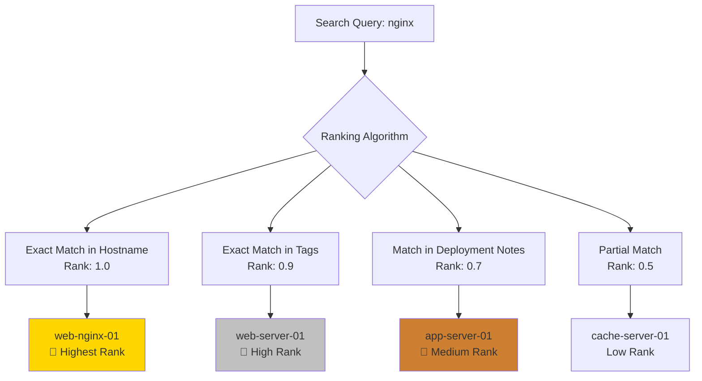

## Overview

VMLedger's Search Engine is your instant VM finder—a powerful full-text search system that indexes every piece of VM information and lets you find what you need in milliseconds. Search across IP addresses, hostnames, tags, and even deployment notes.

<Info>
**Real-World Analogy**: Think of the search engine like Google for your VMs. Just as Google indexes billions of web pages and finds results in milliseconds, VMLedger indexes all your VM data and returns relevant results instantly—even searching through thousands of lines of deployment notes.
</Info>

## Quick Start

### Basic Search

```bash
# Search for "nginx"
curl "http://localhost:8000/api/vms/search?q=nginx" \
  -H "Authorization: Bearer YOUR_TOKEN"
```

**Response:**
```json
{
  "success": true,
  "data": [
    {
      "id": 123,
      "hostname": "web-server-01",
      "ip_address": "192.168.1.100",
      "tags": ["production", "web-server", "nginx"],
      "deployment_notes": "# Web Server\n\n## Installed Software\n- **Nginx 1.24**...",
      "rank": 0.95,
      "highlights": [
        "...Installed Software\n- <mark>Nginx</mark> 1.24...",
        "...reverse proxy using <mark>Nginx</mark>..."
      ]
    }
  ]
}
```

## How Search Works



## Search Architecture

VMLedger uses **PostgreSQL Full-Text Search** with GIN indexes for lightning-fast queries:

```mermaid
graph TB
    subgraph "VM Data"
        IP[IP Address<br/>192.168.1.100]
        Host[Hostname<br/>web-server-01]
        Domain[Domain<br/>web.example.com]
        Tags[Tags<br/>production, nginx]
        Notes[Deployment Notes<br/>5000+ words]
    end
    
    subgraph "Indexing"
        Vector[tsvector<br/>Search Vector]
        GIN[GIN Index<br/>Fast Lookup]
    end
    
    subgraph "Search Query"
        Query[User Query<br/>"nginx production"]
        TSQuery[tsquery<br/>nginx | production]
        Rank[Ranking<br/>ts_rank]
    end
    
    IP --> Vector
    Host --> Vector
    Domain --> Vector
    Tags --> Vector
    Notes --> Vector
    
    Vector --> GIN
    
    Query --> TSQuery
    TSQuery --> GIN
    GIN --> Rank
    Rank --> Results[Ranked Results]
    
    style Vector fill:#3b82f6
    style GIN fill:#10b981
    style Rank fill:#f59e0b
```

### Indexed Fields

<CardGroup cols={3}>
  <Card title="IP Address" icon="network-wired">
    Full and partial IP matching
    
    **Example:** `192.168` matches `192.168.1.100`
  </Card>
  
  <Card title="Hostname" icon="server">
    Full and partial hostname matching
    
    **Example:** `web` matches `web-server-01`
  </Card>
  
  <Card title="Domain" icon="globe">
    Full and partial domain matching
    
    **Example:** `example` matches `web.example.com`
  </Card>
  
  <Card title="Tags" icon="tags">
    Exact and partial tag matching
    
    **Example:** `prod` matches `production`
  </Card>
  
  <Card title="Deployment Notes" icon="file-lines">
    Full-text search through all notes
    
    **Example:** `nginx 1.24` finds version info
  </Card>
  
  <Card title="All Fields" icon="asterisk">
    Search across all fields at once
    
    **Example:** `nginx` finds in tags AND notes
  </Card>
</CardGroup>

## Search Features

### 1. Partial Matching

Search for partial words—no need to type the full term:

<CodeGroup>

```bash cURL
# Search for "ngin" (matches "nginx")
curl "http://localhost:8000/api/vms/search?q=ngin" \
  -H "Authorization: Bearer YOUR_TOKEN"

# Search for "192.168" (matches all IPs in that subnet)
curl "http://localhost:8000/api/vms/search?q=192.168" \
  -H "Authorization: Bearer YOUR_TOKEN"

# Search for "prod" (matches "production" tag)
curl "http://localhost:8000/api/vms/search?q=prod" \
  -H "Authorization: Bearer YOUR_TOKEN"
```

```python Python
import requests

# Search for partial hostname
response = requests.get(
    "http://localhost:8000/api/vms/search",
    params={"q": "web"},
    headers={"Authorization": "Bearer YOUR_TOKEN"}
)

vms = response.json()
for vm in vms['data']:
    print(f"{vm['hostname']} - Rank: {vm['rank']}")
```

```javascript JavaScript
// Search for partial IP
const response = await fetch(
  'http://localhost:8000/api/vms/search?q=192.168',
  {
    headers: {
      'Authorization': 'Bearer YOUR_TOKEN'
    }
  }
);

const vms = await response.json();
vms.data.forEach(vm => {
  console.log(`${vm.hostname} (${vm.ip_address}) - Rank: ${vm.rank}`);
});
```

</CodeGroup>

### 2. Multi-Term Search (OR Logic)

Search for multiple terms—results include VMs matching **any** term:

```bash
# Find VMs with "nginx" OR "apache"
curl "http://localhost:8000/api/vms/search?q=nginx apache" \
  -H "Authorization: Bearer YOUR_TOKEN"

# Find VMs with "production" OR "staging"
curl "http://localhost:8000/api/vms/search?q=production staging" \
  -H "Authorization: Bearer YOUR_TOKEN"
```

**How OR Logic Works:**


### 3. Relevance Ranking

Results are automatically sorted by relevance using `ts_rank`:



**Ranking Factors:**
- **Exact matches** rank higher than partial matches
- **Matches in hostname/tags** rank higher than matches in notes
- **Multiple matches** increase rank
- **Term frequency** affects rank

### 4. Highlighting

Search results include highlighted snippets showing where matches were found:

```json
{
  "hostname": "web-server-01",
  "highlights": [
    "...Installed Software\n- <mark>Nginx</mark> 1.24.0 (reverse proxy)...",
    "...Configuration\n- <mark>Nginx</mark> config: /etc/nginx/sites-available/myapp..."
  ]
}
```

**Highlighting Features:**
- Maximum 3 snippets per result
- 200 characters per snippet
- Context around matches
- `<mark>` tags for highlighting

### 5. Fast Performance

Search is optimized for speed:

<CardGroup cols={3}>
  <Card title="< 100ms" icon="gauge-high" color="#22c55e">
    **10 VMs**
    
    Instant results
  </Card>
  
  <Card title="< 200ms" icon="gauge-high" color="#22c55e">
    **100 VMs**
    
    Very fast
  </Card>
  
  <Card title="< 500ms" icon="gauge" color="#f59e0b">
    **1000 VMs**
    
    Still fast
  </Card>
</CardGroup>

**Performance Optimization:**
- GIN index for instant lookups
- Efficient query planning
- Result limit (50 VMs max)
- Cached query plans

## Search Examples

### Search by IP Address

```bash
# Find specific IP
curl "http://localhost:8000/api/vms/search?q=192.168.1.100" \
  -H "Authorization: Bearer YOUR_TOKEN"

# Find all VMs in subnet
curl "http://localhost:8000/api/vms/search?q=192.168.1" \
  -H "Authorization: Bearer YOUR_TOKEN"

# Find all VMs in 192.168.x.x
curl "http://localhost:8000/api/vms/search?q=192.168" \
  -H "Authorization: Bearer YOUR_TOKEN"
```

### Search by Hostname

```bash
# Find exact hostname
curl "http://localhost:8000/api/vms/search?q=web-server-01" \
  -H "Authorization: Bearer YOUR_TOKEN"

# Find all web servers
curl "http://localhost:8000/api/vms/search?q=web-server" \
  -H "Authorization: Bearer YOUR_TOKEN"

# Find all servers with "web" in name
curl "http://localhost:8000/api/vms/search?q=web" \
  -H "Authorization: Bearer YOUR_TOKEN"
```

### Search by Tags

```bash
# Find production VMs
curl "http://localhost:8000/api/vms/search?q=production" \
  -H "Authorization: Bearer YOUR_TOKEN"

# Find web servers
curl "http://localhost:8000/api/vms/search?q=web-server" \
  -H "Authorization: Bearer YOUR_TOKEN"

# Find nginx servers
curl "http://localhost:8000/api/vms/search?q=nginx" \
  -H "Authorization: Bearer YOUR_TOKEN"
```

### Search Deployment Notes

```bash
# Find VMs with specific software
curl "http://localhost:8000/api/vms/search?q=postgresql" \
  -H "Authorization: Bearer YOUR_TOKEN"

# Find VMs with specific version
curl "http://localhost:8000/api/vms/search?q=node.js 20" \
  -H "Authorization: Bearer YOUR_TOKEN"

# Find VMs with configuration details
curl "http://localhost:8000/api/vms/search?q=ssl certificate" \
  -H "Authorization: Bearer YOUR_TOKEN"
```

### Complex Searches

```bash
# Find production nginx servers
curl "http://localhost:8000/api/vms/search?q=production nginx" \
  -H "Authorization: Bearer YOUR_TOKEN"

# Find VMs in specific subnet with specific software
curl "http://localhost:8000/api/vms/search?q=192.168.1 postgresql" \
  -H "Authorization: Bearer YOUR_TOKEN"

# Find staging or development VMs
curl "http://localhost:8000/api/vms/search?q=staging development" \
  -H "Authorization: Bearer YOUR_TOKEN"
```

## Search Response Format

```json
{
  "success": true,
  "data": [
    {
      "id": 123,
      "ip_address": "192.168.1.100",
      "hostname": "web-server-01",
      "domain": "web-server-01.example.com",
      "ssh_port": 22,
      "tags": ["production", "web-server", "nginx"],
      "deployment_notes": "# Web Server\n\n## Installed Software\n- Nginx 1.24.0...",
      "created_at": "2026-05-08T10:30:00Z",
      "updated_at": "2026-05-08T10:30:00Z",
      "last_seen": "2026-05-08T10:35:00Z",
      "is_reachable": true,
      "latest_cpu": 45.2,
      "latest_ram_used": 2048,
      "latest_ram_total": 4096,
      "latest_disk_percent": 67.5,
      "rank": 0.95,
      "highlights": [
        "...Installed Software\n- <mark>Nginx</mark> 1.24.0 (reverse proxy)...",
        "...Configuration\n- <mark>Nginx</mark> config: /etc/nginx/sites-available/myapp..."
      ]
    }
  ],
  "timestamp": "2026-05-08T10:36:00Z"
}
```

**Response Fields:**
- **rank**: Relevance score (0.0 to 1.0, higher is more relevant)
- **highlights**: Array of text snippets with `<mark>` tags around matches
- All standard VM fields included

## Frontend Integration

### React Example

```jsx
import { useState, useEffect } from 'react';
import { useDebounce } from 'use-debounce';

function VMSearch() {
  const [query, setQuery] = useState('');
  const [debouncedQuery] = useDebounce(query, 300); // 300ms delay
  const [results, setResults] = useState([]);
  const [loading, setLoading] = useState(false);

  useEffect(() => {
    if (debouncedQuery.length < 2) {
      setResults([]);
      return;
    }

    setLoading(true);
    fetch(`http://localhost:8000/api/vms/search?q=${debouncedQuery}`, {
      headers: {
        'Authorization': `Bearer ${localStorage.getItem('token')}`
      }
    })
      .then(res => res.json())
      .then(data => {
        setResults(data.data);
        setLoading(false);
      });
  }, [debouncedQuery]);

  return (
    <div>
      <input
        type="text"
        placeholder="Search VMs..."
        value={query}
        onChange={(e) => setQuery(e.target.value)}
      />
      
      {loading && <div>Searching...</div>}
      
      <div>
        {results.map(vm => (
          <div key={vm.id}>
            <h3>{vm.hostname} ({vm.ip_address})</h3>
            <div>Rank: {vm.rank.toFixed(2)}</div>
            {vm.highlights.map((highlight, i) => (
              <div 
                key={i}
                dangerouslySetInnerHTML={{ __html: highlight }}
              />
            ))}
          </div>
        ))}
      </div>
    </div>
  );
}
```

### Vue Example

```vue
<template>
  <div>
    <input
      v-model="query"
      type="text"
      placeholder="Search VMs..."
    />
    
    <div v-if="loading">Searching...</div>
    
    <div v-for="vm in results" :key="vm.id">
      <h3>{{ vm.hostname }} ({{ vm.ip_address }})</h3>
      <div>Rank: {{ vm.rank.toFixed(2) }}</div>
      <div
        v-for="(highlight, i) in vm.highlights"
        :key="i"
        v-html="highlight"
      />
    </div>
  </div>
</template>

<script>
import { ref, watch } from 'vue';
import { useDebounceFn } from '@vueuse/core';

export default {
  setup() {
    const query = ref('');
    const results = ref([]);
    const loading = ref(false);

    const search = useDebounceFn(async (q) => {
      if (q.length < 2) {
        results.value = [];
        return;
      }

      loading.value = true;
      const response = await fetch(
        `http://localhost:8000/api/vms/search?q=${q}`,
        {
          headers: {
            'Authorization': `Bearer ${localStorage.getItem('token')}`
          }
        }
      );
      const data = await response.json();
      results.value = data.data;
      loading.value = false;
    }, 300);

    watch(query, (newQuery) => {
      search(newQuery);
    });

    return { query, results, loading };
  }
};
</script>
```

## Search Best Practices

<CardGroup cols={2}>
  <Card title="Use Debouncing" icon="clock">
    Wait 300ms after user stops typing before searching
    
    ```javascript
    const [debouncedQuery] = useDebounce(query, 300);
    ```
  </Card>
  
  <Card title="Minimum Query Length" icon="text-width">
    Only search when query is 2+ characters
    
    ```javascript
    if (query.length < 2) return;
    ```
  </Card>
  
  <Card title="Show Loading State" icon="spinner">
    Display loading indicator during search
    
    ```jsx
    {loading && <Spinner />}
    ```
  </Card>
  
  <Card title="Highlight Matches" icon="highlighter">
    Use `dangerouslySetInnerHTML` to render highlights
    
    ```jsx
    <div dangerouslySetInnerHTML={{ __html: highlight }} />
    ```
  </Card>
  
  <Card title="Limit Results" icon="list">
    Display top 10-20 results, add "Show More" button
    
    ```javascript
    results.slice(0, 20)
    ```
  </Card>
  
  <Card title="Cache Results" icon="database">
    Cache search results to avoid duplicate queries
    
    ```javascript
    const cache = new Map();
    ```
  </Card>
</CardGroup>

## Advanced Search Techniques

### Search Operators

While VMLedger uses OR logic by default, you can simulate other operators:

<AccordionGroup>
  <Accordion title="AND Logic (Multiple Terms)" icon="ampersand">
    To find VMs matching ALL terms, filter results client-side:
    
    ```javascript
    // Search for "nginx production"
    const results = await searchVMs("nginx production");
    
    // Filter to only VMs matching BOTH terms
    const filtered = results.filter(vm => {
      const text = `${vm.hostname} ${vm.tags.join(' ')} ${vm.deployment_notes}`.toLowerCase();
      return text.includes('nginx') && text.includes('production');
    });
    ```
  </Accordion>
  
  <Accordion title="NOT Logic (Exclusion)" icon="ban">
    To exclude VMs with certain terms, filter results client-side:
    
    ```javascript
    // Search for "web-server"
    const results = await searchVMs("web-server");
    
    // Exclude VMs with "staging" tag
    const filtered = results.filter(vm => 
      !vm.tags.includes('staging')
    );
    ```
  </Accordion>
  
  <Accordion title="Exact Phrase" icon="quotes">
    For exact phrase matching, filter results client-side:
    
    ```javascript
    // Search for "nginx 1.24"
    const results = await searchVMs("nginx 1.24");
    
    // Filter to exact phrase
    const filtered = results.filter(vm =>
      vm.deployment_notes.includes('nginx 1.24')
    );
    ```
  </Accordion>
</AccordionGroup>

### Search Filters

Combine search with filters for more precise results:

```javascript
// Search + filter by tags
async function searchWithTags(query, tags) {
  const results = await searchVMs(query);
  return results.filter(vm =>
    tags.every(tag => vm.tags.includes(tag))
  );
}

// Usage
const prodNginxVMs = await searchWithTags('nginx', ['production']);

// Search + filter by reachability
async function searchReachableVMs(query) {
  const results = await searchVMs(query);
  return results.filter(vm => vm.is_reachable === true);
}

// Search + filter by IP subnet
async function searchInSubnet(query, subnet) {
  const results = await searchVMs(query);
  return results.filter(vm => vm.ip_address.startsWith(subnet));
}
```

## Troubleshooting

<AccordionGroup>
  <Accordion title="No Results Found" icon="circle-xmark">
    **Possible Causes:**
    1. Query too specific
    2. Typo in search term
    3. VM not indexed yet
    
    **Solutions:**
    ```bash
    # Try partial search
    curl "http://localhost:8000/api/vms/search?q=ngin" \
      -H "Authorization: Bearer YOUR_TOKEN"
    
    # Try broader search
    curl "http://localhost:8000/api/vms/search?q=web" \
      -H "Authorization: Bearer YOUR_TOKEN"
    
    # Check if VM exists
    curl "http://localhost:8000/api/vms" \
      -H "Authorization: Bearer YOUR_TOKEN"
    ```
  </Accordion>
  
  <Accordion title="Slow Search Performance" icon="hourglass">
    **Possible Causes:**
    1. Too many VMs (1000+)
    2. GIN index not created
    3. Database needs optimization
    
    **Solutions:**
    ```bash
    # Check if GIN index exists
    docker exec vmledger-postgres psql -U vmledger -c "
      SELECT indexname, indexdef 
      FROM pg_indexes 
      WHERE tablename = 'vms' AND indexname = 'idx_vms_search';
    "
    
    # Recreate index if missing
    docker exec vmledger-postgres psql -U vmledger -c "
      CREATE INDEX IF NOT EXISTS idx_vms_search 
      ON vms USING GIN(search_vector);
    "
    
    # Analyze table for better query planning
    docker exec vmledger-postgres psql -U vmledger -c "
      ANALYZE vms;
    "
    ```
  </Accordion>
  
  <Accordion title="Incorrect Rankings" icon="ranking-star">
    **Possible Causes:**
    1. Search vector not updated
    2. Stale statistics
    
    **Solutions:**
    ```bash
    # Update search vectors
    docker exec vmledger-postgres psql -U vmledger -c "
      UPDATE vms SET search_vector = 
        to_tsvector('english', 
          coalesce(ip_address, '') || ' ' ||
          coalesce(hostname, '') || ' ' ||
          coalesce(domain, '') || ' ' ||
          coalesce(array_to_string(tags, ' '), '') || ' ' ||
          coalesce(deployment_notes, '')
        );
    "
    
    # Update statistics
    docker exec vmledger-postgres psql -U vmledger -c "
      ANALYZE vms;
    "
    ```
  </Accordion>
  
  <Accordion title="Missing Highlights" icon="highlighter">
    **Possible Causes:**
    1. Match in non-text field (IP, tags)
    2. Deployment notes empty
    
    **Solution:**
    Highlights only show for deployment notes matches. For other fields, check the VM data directly:
    
    ```javascript
    // Check where match occurred
    const vm = results[0];
    if (vm.hostname.includes(query)) {
      console.log('Match in hostname');
    }
    if (vm.tags.some(tag => tag.includes(query))) {
      console.log('Match in tags');
    }
    if (vm.highlights.length > 0) {
      console.log('Match in deployment notes');
    }
    ```
  </Accordion>
</AccordionGroup>

## Search Limitations

<Warning>
**Current Limitations:**

1. **Result Limit**: Maximum 50 results per query
2. **No Wildcards**: `*` and `?` not supported
3. **No Regex**: Regular expressions not supported
4. **OR Logic Only**: AND/NOT logic requires client-side filtering
5. **English Only**: Search optimized for English text
6. **No Fuzzy Search**: Typo tolerance not built-in

**Workarounds:**
- For more results: Use more specific queries
- For AND logic: Filter results client-side
- For fuzzy search: Try partial terms (e.g., "ngin" instead of "nginx")
</Warning>

## Performance Optimization

### Database Optimization

```sql
-- Ensure GIN index exists
CREATE INDEX IF NOT EXISTS idx_vms_search 
ON vms USING GIN(search_vector);

-- Update statistics for better query planning
ANALYZE vms;

-- Vacuum to reclaim space
VACUUM ANALYZE vms;
```

### Application Optimization

```javascript
// 1. Debounce search queries
const debouncedSearch = debounce(searchVMs, 300);

// 2. Cache search results
const searchCache = new Map();

async function cachedSearch(query) {
  if (searchCache.has(query)) {
    return searchCache.get(query);
  }
  
  const results = await searchVMs(query);
  searchCache.set(query, results);
  
  // Clear cache after 5 minutes
  setTimeout(() => searchCache.delete(query), 300000);
  
  return results;
}

// 3. Limit result rendering
const displayedResults = results.slice(0, 20);
```

## Next Steps

<CardGroup cols={2}>
  <Card title="API Reference" icon="code" href="/api-reference/search">
    Complete API documentation for search endpoints
  </Card>
  
  <Card title="VM Management" icon="server" href="/features/vm-management">
    Learn how to organize VMs with tags
  </Card>
  
  <Card title="Deployment Notes" icon="file-lines" href="/features/deployment-tracking">
    Document VMs for better searchability
  </Card>
  
  <Card title="Dashboard" icon="gauge" href="/guides/dashboard-usage">
    Use search in the web dashboard
  </Card>
</CardGroup>
