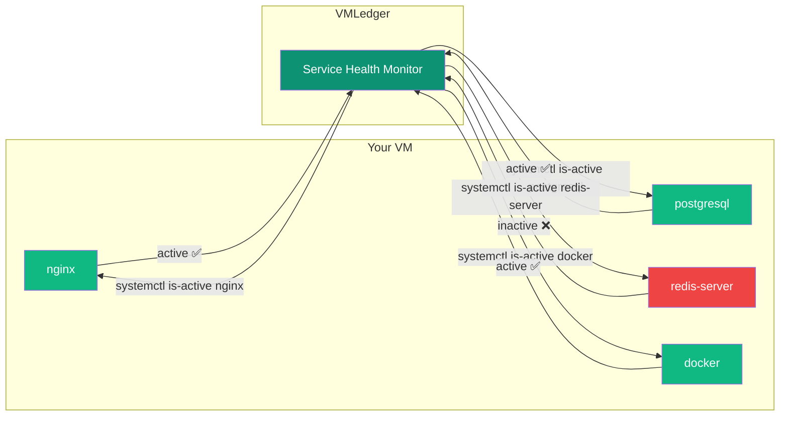
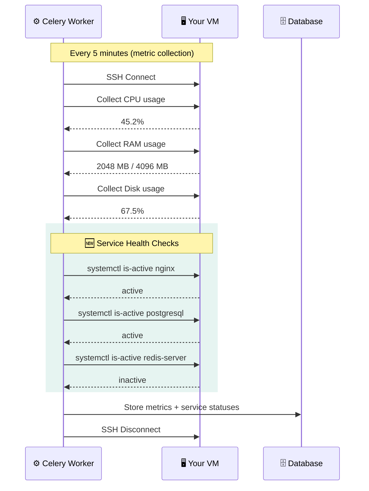
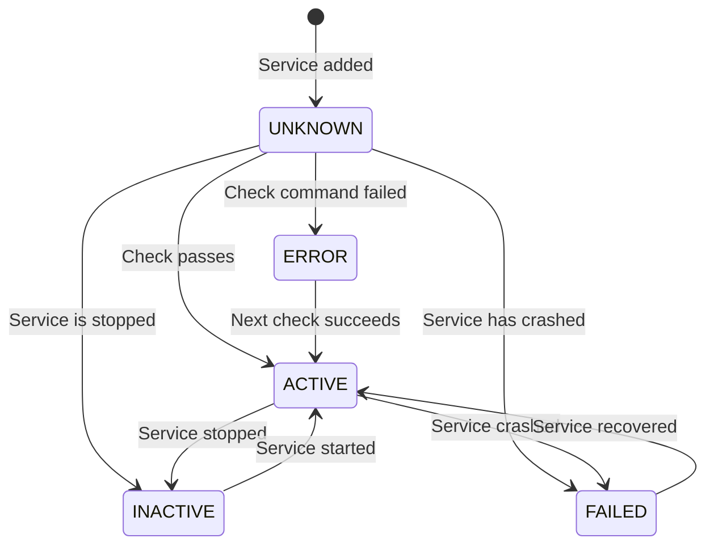
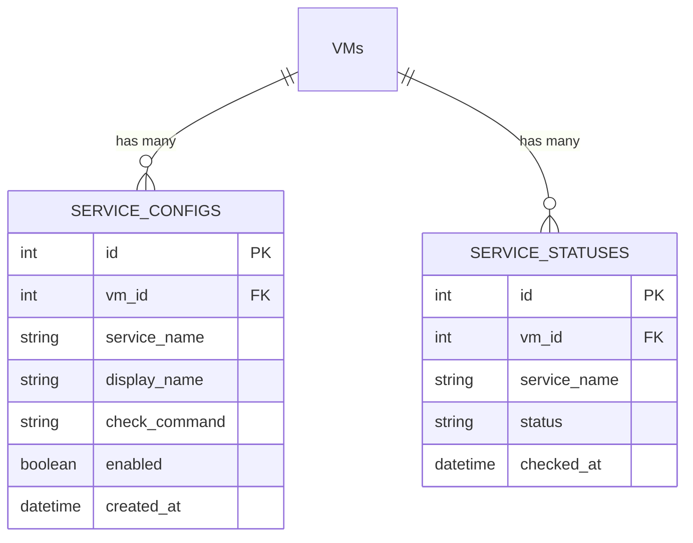

## Overview

Knowing that a VM is "online" is only half the story. What if the server is up, but **Nginx crashed**? Or **PostgreSQL stopped**? The Service Health Monitor answers the question: _"Are the actual applications on my VM still running?"_

<Info>
**Real-World Analogy**: Think of ping checks like checking if a building has electricity. Service Health checks are like walking inside and making sure the elevators, heating, and water are all actually working.
</Info>

### What Does It Do?



## Key Features

<CardGroup cols={2}>
  <Card title="Per-VM Configuration" icon="sliders">
    Choose exactly which services to monitor on each VM — fully customizable per server
  </Card>

  <Card title="Custom Check Commands" icon="terminal">
    Override the default `systemctl is-active` with any custom health check command
  </Card>

  <Card title="Zero Extra Overhead" icon="bolt">
    Service checks piggyback on existing SSH metric collection — no extra connections
  </Card>

  <Card title="On-Demand Checks" icon="rotate">
    Don't want to wait 5 minutes? Click "Check Now" for instant results
  </Card>
</CardGroup>

## How It Works (Behind the Scenes)

VMLedger doesn't open a separate SSH connection for service checks. Instead, it cleverly piggybacks on the existing **metric collection cycle** that already SSHes into your VMs every 5 minutes.



<Tip>
**Why piggyback?** Opening SSH connections is expensive (authentication, key exchange, etc). By reusing the same connection that's already open for metrics, service checks add virtually zero overhead — just a few extra `systemctl` commands on an already-open channel.
</Tip>

## Getting Started

### Step 1: Navigate to the Services Tab

1. Go to your **Dashboard**
2. Click on any VM
3. Click the **Services** tab

You'll see an empty state prompting you to add your first service.

### Step 2: Add a Service

1. Click **Add Service**
2. Enter the **Service Name** — this is the systemd unit name (e.g., `nginx`, `postgresql`, `docker`)
3. Optionally enter a **Display Name** (e.g., "Web Server") for readability
4. Click **Add Service**


### Step 3: Wait or Check Now

The service will show as `UNKNOWN` initially. You have two options:
- **Wait** for the next metric collection cycle (~5 minutes)
- **Click "Check Now"** to trigger an immediate check

### Step 4: Monitor Your Services

Each service is displayed as a card showing its current status:

## Understanding Statuses



| Status | Color | What It Means | What To Do |
|--------|-------|---------------|------------|
| `ACTIVE` | 🟢 Green | Service is running normally | Nothing — everything is fine! |
| `INACTIVE` | ⚪ Gray | Service is stopped | Start it with `systemctl start <service>` |
| `FAILED` | 🔴 Red | Service crashed or failed to start | Check logs with `journalctl -u <service>` |
| `UNKNOWN` | 🟡 Yellow | Not yet checked | Click "Check Now" or wait for next cycle |
| `ERROR` | 🟡 Yellow | The check command itself failed | Verify SSH access and permissions |

## Using the API

### Add a Service to Monitor

<CodeGroup>

```bash Basic service
curl -X POST http://localhost:8000/api/vms/1/services \
  -H "Authorization: Bearer YOUR_TOKEN" \
  -H "Content-Type: application/json" \
  -d '{
    "service_name": "nginx",
    "display_name": "Web Server"
  }'
```

```bash With custom check command
curl -X POST http://localhost:8000/api/vms/1/services \
  -H "Authorization: Bearer YOUR_TOKEN" \
  -H "Content-Type: application/json" \
  -d '{
    "service_name": "myapp",
    "display_name": "My Application",
    "check_command": "curl -sf http://localhost:3000/health || echo inactive"
  }'
```

</CodeGroup>

### List All Services

```bash
curl http://localhost:8000/api/vms/1/services \
  -H "Authorization: Bearer YOUR_TOKEN"
```

**Response:**
```json
[
  {
    "id": 1,
    "vm_id": 1,
    "service_name": "nginx",
    "display_name": "Web Server",
    "check_command": null,
    "enabled": true,
    "status": "active"
  },
  {
    "id": 2,
    "vm_id": 1,
    "service_name": "postgresql",
    "display_name": "Database",
    "check_command": null,
    "enabled": true,
    "status": "active"
  }
]
```

### Trigger On-Demand Check

```bash
curl -X POST http://localhost:8000/api/vms/1/services/check \
  -H "Authorization: Bearer YOUR_TOKEN"
```

<Info>
**Asynchronous**: This queues a Celery task and returns immediately. Poll `GET /api/vms/{id}/services` after ~3 seconds to see updated statuses.
</Info>

### Remove a Service

```bash
curl -X DELETE http://localhost:8000/api/vms/1/services/3 \
  -H "Authorization: Bearer YOUR_TOKEN"
```

## Database Schema

Two tables power the Service Health Monitor:



- **`service_configs`**: What you want to monitor (your configuration)
- **`service_statuses`**: The latest check result for each service (auto-updated)

## Common Services to Monitor

Here's a quick reference of popular systemd services:

<AccordionGroup>
  <Accordion title="Web Servers" icon="globe">
    | Service Name | Description |
    |-------------|-------------|
    | `nginx` | Nginx web server / reverse proxy |
    | `apache2` | Apache HTTP server |
    | `caddy` | Caddy web server |
  </Accordion>

  <Accordion title="Databases" icon="database">
    | Service Name | Description |
    |-------------|-------------|
    | `postgresql` | PostgreSQL database |
    | `mysql` | MySQL / MariaDB database |
    | `mongod` | MongoDB database |
    | `redis-server` | Redis in-memory cache |
  </Accordion>

  <Accordion title="Infrastructure" icon="server">
    | Service Name | Description |
    |-------------|-------------|
    | `docker` | Docker container daemon |
    | `ssh` or `sshd` | SSH server |
    | `cron` | Cron job scheduler |
    | `ufw` | Uncomplicated Firewall |
    | `fail2ban` | Intrusion prevention |
  </Accordion>

  <Accordion title="Application Runtimes" icon="code">
    | Service Name | Description |
    |-------------|-------------|
    | `pm2-root` | PM2 process manager (Node.js) |
    | `gunicorn` | Gunicorn WSGI server (Python) |
    | `supervisor` | Supervisor process manager |
  </Accordion>
</AccordionGroup>

## Troubleshooting

<AccordionGroup>
  <Accordion title="Service shows ERROR status" icon="circle-xmark">
    **Cause:** The `systemctl is-active` command itself failed to execute.

    **Check:**
    ```bash
    # Test manually via SSH
    ssh root@your-vm "systemctl is-active nginx"
    # Should print: active, inactive, or failed
    ```

    **Common fixes:**
    - Ensure the SSH user has permission to run `systemctl`
    - Verify the service name is spelled correctly (it's case-sensitive)
  </Accordion>

  <Accordion title="Status stuck on UNKNOWN" icon="question">
    **Cause:** No metric collection cycle has run since the service was added.

    **Fix:** Click **Check Now** on the Services tab, or wait for the next cycle (~5 minutes).
  </Accordion>

  <Accordion title="Custom check command not working" icon="wrench">
    **Cause:** The custom command may have syntax errors or dependencies not available on the VM.

    **Fix:**
    ```bash
    # Test your command manually
    ssh root@your-vm "curl -sf http://localhost:3000/health || echo inactive"
    ```
  </Accordion>
</AccordionGroup>

## Next Steps

<CardGroup cols={2}>
  <Card title="LXC Container Management" icon="cubes" href="/features/lxc-containers">
    Discover and manage LXC containers on your Proxmox/LXD hosts
  </Card>

  <Card title="Live Log Viewer" icon="scroll" href="/features/log-viewer">
    Stream real-time journalctl logs from your VMs
  </Card>

  <Card title="Health Monitoring" icon="heart-pulse" href="/features/health-monitoring">
    Learn about ping checks and metric collection
  </Card>

  <Card title="Services API Reference" icon="code" href="/api-reference/services">
    Complete API documentation for service endpoints
  </Card>
</CardGroup>
