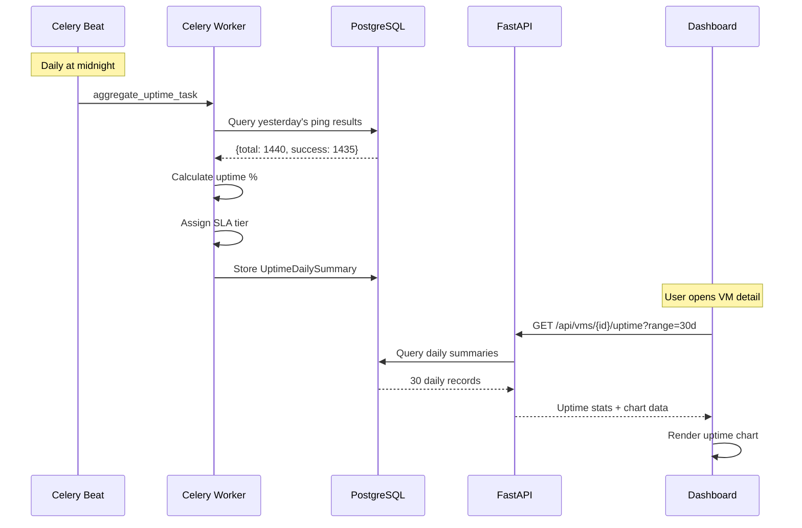

## Overview

VMLedger automatically calculates uptime percentages for every VM based on health check results. The Uptime & SLA system aggregates ping data into daily summaries, assigns SLA tier classifications, and displays historical uptime trends directly on each VM's detail page.

<Info>
**Real-World Analogy**: Think of uptime tracking like a school attendance register. Each day, VMLedger records how many "classes" (health checks) each VM attended. At the end of the period, it calculates a percentage and assigns a "grade" (SLA tier) — just like a report card for your infrastructure.
</Info>

## How It Works


### Data Pipeline



## SLA Tiers

VMLedger classifies each VM's uptime into industry-standard SLA tiers:

<CardGroup cols={3}>
  <Card title="Five Nines (99.99%+)" icon="star">
    **Elite Tier** — Less than 52 seconds of downtime per day
    
    Badge: 🟢 Emerald
  </Card>
  
  <Card title="Four Nines (99.95%+)" icon="medal">
    **Premium Tier** — Less than 43 seconds of downtime per day
    
    Badge: 🟢 Green
  </Card>
  
  <Card title="High Availability (99.9%+)" icon="shield-check">
    **Standard HA** — Less than 86 seconds of downtime per day
    
    Badge: 🔵 Blue
  </Card>
  
  <Card title="Standard (99.5%+)" icon="check">
    **Acceptable** — Less than 7 minutes of downtime per day
    
    Badge: 🟡 Yellow
  </Card>
  
  <Card title="Basic (99.0%+)" icon="circle-check">
    **Minimum** — Less than 14 minutes of downtime per day
    
    Badge: 🟠 Orange
  </Card>
  
  <Card title="Below SLA (<99.0%)" icon="triangle-exclamation">
    **Critical** — More than 14 minutes of downtime per day
    
    Badge: 🔴 Red
  </Card>
</CardGroup>

### SLA Classification Logic

```python
def classify_sla_tier(uptime_percent: float) -> str:
    if uptime_percent >= 99.99:
        return "five_nines"    # 99.99%+
    elif uptime_percent >= 99.95:
        return "four_nines"    # 99.95%+
    elif uptime_percent >= 99.9:
        return "high_availability"  # 99.9%+
    elif uptime_percent >= 99.5:
        return "standard"      # 99.5%+
    elif uptime_percent >= 99.0:
        return "basic"         # 99.0%+
    else:
        return "below_sla"     # <99.0%
```

## API Endpoints

### Get VM Uptime Stats

Retrieve uptime statistics for a specific VM over a configurable time range.

```bash
# Get 30-day uptime for VM 5
curl http://localhost:8000/api/vms/5/uptime?range=30d \
  -H "Authorization: Bearer YOUR_TOKEN"
```

**Response:**
```json
{
  "vm_id": 5,
  "range": "30d",
  "uptime_percent": 99.02,
  "total_checks": 43200,
  "successful_checks": 42777,
  "failed_checks": 423,
  "sla_tier": "basic",
  "daily_breakdown": [
    {
      "date": "2026-06-23",
      "uptime_percent": 100.0,
      "total_checks": 1440,
      "successful_checks": 1440,
      "failed_checks": 0
    }
  ]
}
```

**Supported Ranges:** `7d`, `14d`, `30d`, `90d`

### Batch Uptime Summary

Retrieve uptime summaries for all VMs in a single request (used by the dashboard for uptime badges).

```bash
# Get fleet-wide uptime summary
curl http://localhost:8000/api/vms/uptime/summary?range=30d \
  -H "Authorization: Bearer YOUR_TOKEN"
```

**Response:**
```json
[
  {
    "vm_id": 5,
    "uptime_percent": 94.64,
    "sla_tier": "below_sla",
    "total_checks": 43200,
    "successful_checks": 40886
  },
  {
    "vm_id": 6,
    "uptime_percent": 93.62,
    "sla_tier": "below_sla",
    "total_checks": 43200,
    "successful_checks": 40444
  }
]
```

## Dashboard Visualization

### Uptime Card

Each VM detail page shows a compact Uptime & SLA card with:

- **Total checks** performed in the period
- **Failed checks** count (highlighted in red if > 0)
- **Average latency** across all successful pings
- **Maximum latency** recorded
- **Uptime line chart** showing daily uptime percentage trends

### Uptime Badge

The dashboard homepage displays a color-coded uptime badge next to each VM's status indicator:

```
┌─────────────────────────────────┐
│  hpcie-harbornode  ● Online  ● 94.64%  │
│  10.208.210.56                          │
└─────────────────────────────────┘
```

The badge color corresponds to the SLA tier classification, providing an at-a-glance infrastructure health overview.

## Database Schema

### UptimeDailySummary Table

```sql
CREATE TABLE uptime_daily_summary (
    id SERIAL PRIMARY KEY,
    vm_id INTEGER NOT NULL REFERENCES vms(id) ON DELETE CASCADE,
    date DATE NOT NULL,
    total_checks INTEGER NOT NULL DEFAULT 0,
    successful_checks INTEGER NOT NULL DEFAULT 0,
    failed_checks INTEGER NOT NULL DEFAULT 0,
    uptime_percent FLOAT NOT NULL DEFAULT 0.0,
    avg_latency_ms FLOAT,
    max_latency_ms FLOAT,
    min_latency_ms FLOAT,
    created_at TIMESTAMP DEFAULT NOW(),
    UNIQUE(vm_id, date)
);
```

## Best Practices

<CardGroup cols={2}>
  <Card title="Set Realistic SLA Targets" icon="bullseye">
    For internal infrastructure, 99.5% (Standard tier) is a reasonable target. Five Nines (99.99%) requires redundancy and automated failover.
  </Card>
  
  <Card title="Monitor Trends, Not Snapshots" icon="chart-line">
    A single bad day shouldn't trigger panic. Use the 30-day trend chart to identify patterns — gradual degradation is more concerning than a one-off outage.
  </Card>
  
  <Card title="Correlate with Deployments" icon="code-merge">
    Cross-reference uptime dips with your deployment history. Many outages trace back to recent changes.
  </Card>
  
  <Card title="Use Alerts for SLA Breaches" icon="bell">
    Combine uptime tracking with the alerting system to get notified before SLA targets are breached.
  </Card>
</CardGroup>

## Next Steps

<CardGroup cols={2}>
  <Card title="Health Monitoring" icon="heart-pulse" href="/features/health-monitoring">
    Understand the health checks that feed uptime calculations
  </Card>
  
  <Card title="Alerting" icon="bell" href="/features/alerting">
    Set up alerts based on uptime thresholds
  </Card>
</CardGroup>
