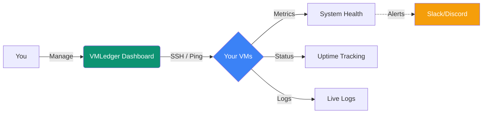

## What is VMLedger?

VMLedger is a comprehensive virtual machine management platform designed to help infrastructure teams monitor, manage, and track their VM deployments across multiple environments.

<CardGroup cols={2}>
  <Card
    title="VM Management"
    icon="server"
    href="/features/vm-management"
  >
    Centralized management of all your virtual machines with SSH connectivity
  </Card>
  <Card
    title="Health Monitoring"
    icon="heart-pulse"
    href="/features/health-monitoring"
  >
    Real-time health checks with automated ping monitoring and metrics collection
  </Card>
  <Card
    title="Smart Alerting"
    icon="bell"
    href="/features/alerting"
  >
    Intelligent alerting system with webhook notifications and cooldown periods
  </Card>
  <Card
    title="Deployment Tracking"
    icon="rocket"
    href="/features/deployment-tracking"
  >
    Track deployments with detailed notes and historical records
  </Card>
  <Card
    title="LXC Containers"
    icon="cubes"
    href="/features/lxc-containers"
  >
    Discover and manage LXC containers on Proxmox, LXD, or standard LXC hosts
  </Card>
  <Card
    title="Service Health"
    icon="stethoscope"
    href="/features/service-health"
  >
    Monitor systemd service status with automatic checks during metric collection
  </Card>
  <Card
    title="Live Log Viewer"
    icon="scroll"
    href="/features/log-viewer"
  >
    Stream real-time journalctl logs via WebSocket in a read-only terminal
  </Card>
</CardGroup>

## Key Features

### 🖥️ Virtual Machine Management
- Add and manage VMs with IP addresses, SSH credentials, and metadata
- Secure credential storage with encryption
- Tag-based organization and filtering
- Bulk operations support

### 📊 Real-Time Monitoring
- Automated ping checks every 60 seconds
- System metrics collection (CPU, memory, disk) every 5 minutes via SSH
- Historical data tracking and visualization with time range filtering (1H / 6H / 24H / 7D / All)
- **DNS drift detection** checking hostname vs IP discrepancies every 6 hours
- On-demand triggers with animated radar feedback (no page reload)
- SVG ring gauges for CPU, Memory, Disk with color-coded thresholds
- Combined/individual chart modes with clickable metric toggles

### 🔔 Intelligent Alerting
- Webhook-based notifications (Slack, Discord, custom endpoints)
- Configurable cooldown periods to prevent alert fatigue
- Alert history and acknowledgment tracking
- Multiple alert channels per VM

### 🚀 VM Specs & Hardware Info
- One-click hardware spec fetch via SSH (`lscpu`, `free`, `df`, `/etc/os-release`)
- Displays OS name, kernel version, CPU model & cores, total RAM, storage partitions
- Dedicated Specs tab on each VM's detail page

### 🔍 Advanced Search
- Partial/prefix matching: typing `harbor` finds `harbornode`
- Full-text search with PostgreSQL tsquery + ILIKE fallback
- Search results display full resource metrics (CPU, RAM, Disk)
- Relevance ranking with highlighted matches in deployment notes

### 🔐 Security First
- JWT-based authentication with 24-hour sessions
- Bcrypt password hashing (cost factor 12)
- Rate limiting and account lockout protection
- Encrypted credential storage
- Comprehensive audit logging

### 📦 LXC Container Management
- Auto-detect Proxmox (`pct`), LXD (`lxc`), or standard LXC (`lxc-ls`) providers
- List all containers with live status (running/stopped)
- Start, stop, and restart containers from the dashboard
- Graceful handling of non-LXC VMs (shows friendly message)

### 🩺 Service Health Monitor
- Track systemd services (nginx, postgresql, docker, etc.) per VM
- Automatic checks during metric collection cycle (zero extra SSH connections)
- Custom check commands for non-systemd services
- On-demand "Check Now" trigger from the dashboard

### 📜 Live Log Viewer
- Real-time `journalctl -f` stream in a browser-based terminal
- Read-only mode — keyboard input silently dropped
- Color-coded ANSI output via xterm.js
- Same auth and credential flow as SSH Terminal

## Technology Stack

<CardGroup cols={3}>
  <Card title="Backend" icon="python">
    FastAPI, SQLAlchemy, Celery
  </Card>
  <Card title="Frontend" icon="react">
    Next.js 14, React, TailwindCSS
  </Card>
  <Card title="Database" icon="database">
    PostgreSQL, Redis
  </Card>
</CardGroup>

### Backend
- **Framework**: FastAPI (Python 3.11+)
- **ORM**: SQLAlchemy 2.0
- **Task Queue**: Celery with Redis broker
- **Authentication**: JWT with python-jose
- **SSH**: Paramiko for remote connections

### Frontend
- **Framework**: Next.js 14 with App Router
- **UI Library**: React 18
- **Styling**: TailwindCSS
- **State Management**: React Query (TanStack Query)
- **API Client**: Axios

### Infrastructure
- **Database**: PostgreSQL 15
- **Cache**: Redis 7
- **Deployment**: Docker Compose
- **Monitoring**: Celery Beat for scheduled tasks

## Quick Links

<CardGroup cols={2}>
  <Card
    title="Quick Start"
    icon="rocket"
    href="/quickstart"
  >
    Get VMLedger up and running in 5 minutes
  </Card>
  <Card
    title="Installation Guide"
    icon="download"
    href="/installation"
  >
    Detailed installation instructions for all environments
  </Card>
  <Card
    title="API Reference"
    icon="code"
    href="/api-reference/introduction"
  >
    Complete API documentation with examples
  </Card>
  <Card
    title="Architecture"
    icon="diagram-project"
    href="/architecture/overview"
  >
    Learn about VMLedger's architecture and design
  </Card>
</CardGroup>

## Use Cases

### Infrastructure Teams
- Monitor health of production VMs
- Track deployments across environments
- Receive alerts for VM failures
- Maintain SSH credential inventory

### DevOps Engineers
- Automate VM health checks
- Integrate with CI/CD pipelines
- Track deployment history
- Monitor system metrics

### System Administrators
- Centralized VM management
- Quick SSH access to VMs
- Alert management and acknowledgment
- Search and filter VM inventory

## Getting Started

Ready to get started? Check out our [Quick Start Guide](/quickstart) to set up VMLedger in minutes.

<Card
  title="Quick Start →"
  icon="play"
  href="/quickstart"
>
  Follow our step-by-step guide to deploy VMLedger
</Card>
